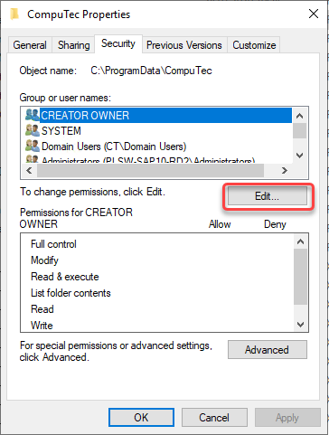
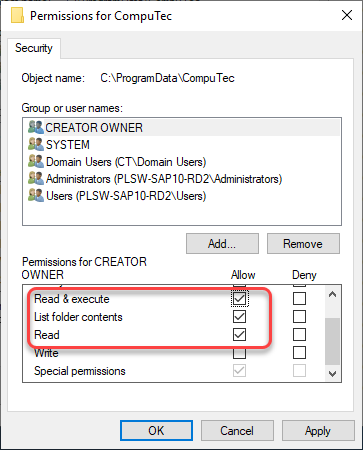

# Security Settings

:::info

The security settings described below apply to an installation on machines that support custom security settings. In standard system security settings, there is no need to make any changes.

:::

1. In a file explorer, navigate to the below location (the ProgramData folder is hidden by default): ```C:\ProgramData\```

2. Right-click on the CompuTec folder, select Properties, switch to the Security tab, and press the Edit... button:

  
3. In the Permissions for CompuTec window, make sure all SAP Business One users with installed ProcessForce have the **Read & execute**, **List folder contents** and **Read** permissions for the folder and ***all descendant folders and files** of it:

  