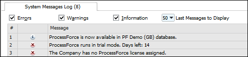
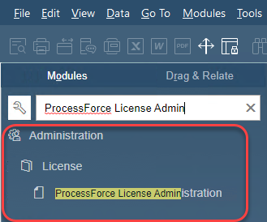
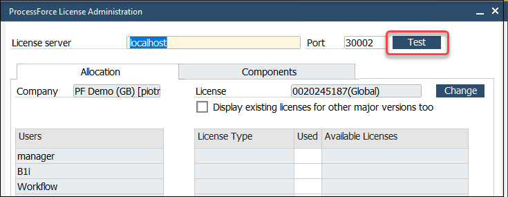
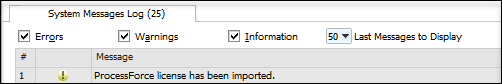
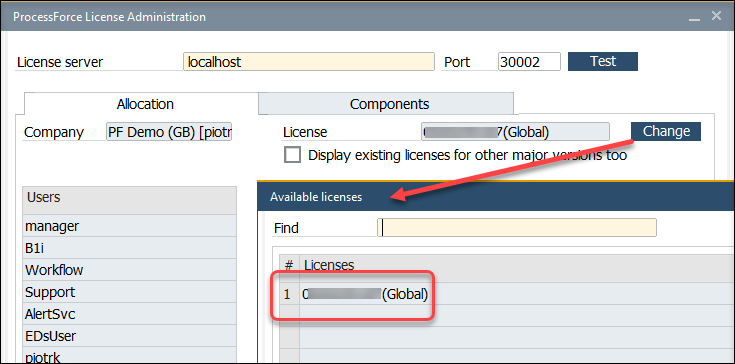
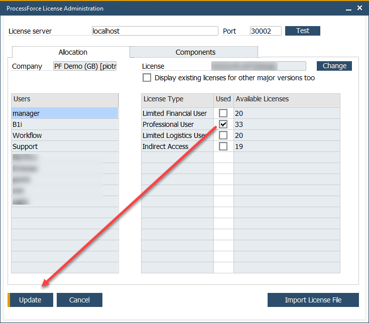

# License import and assignment

:::info

Assigning the ProcessForce license works similarly to the SAP Business One license assignment.

:::

1. After successful installation, the system message appears:

  
2. Ask your ProcessForce provider for a license file.

:::info

All information required for generating a license key is described on [the Request for a license page](./license-request.md).

:::
3. Open the ProcessForce License Administration form:

  
4. To test whether CompuTec License Service is up and running, click the Test button:

  
5. If it is OK – click the Import License File button to load a valid license. You will be asked for a license file.

  :::caution

  Note that a license file should have a .xml extension. In some cases, a file downloaded from a license request issue ([support.computec.pl](https://support.computec.pl)) can have changed its type (e.g., on downloading the file by Safari browser), which may cause an error when trying to load it.

  :::
  6. After the successful importation of a license, the message: ProcessForce license has been imported appears:
  
  
  7. Press the Change button to assign/change the license to/in the company. You will be asked to select a proper row from imported licenses. Select a license row and click the Select button:

  
  8. Assign users to the appropriate license type and click the Update button to save the changes:

  
