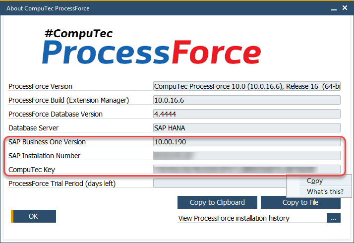
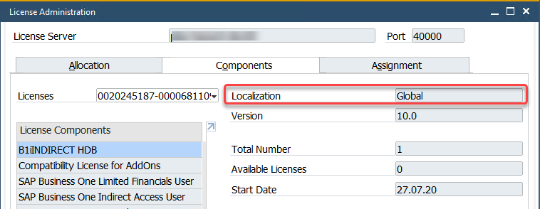

# Request for a license

To obtain a license file, please create a support ticket at [the CompuTec support portal](support.computec.pl) (Type: Information, Component: License request) and provide the following information:

## License type

The destined environment:

- a customer server
- a partner internal server

and the license purpose:

- an official purchase
- a demo/test license

:::info

We generate demo/test licenses for 1 Professional user by default.

:::

## System information

The information needed for generating the license placed on:

- the About CompuTec ProcessForce form

  :::info

  The SAP Business One application (with CompuTec ProcessForce installed) → upper menu → Help → About CompuTec ProcessForce.

  :::

  - **SAP Business One major version** (9.3, 10.0, etc.)

  :::note

  Please note that each ProcessForce license is issued for a specific major SAP Business One version. Therefore, requesting a new file on the planned upgrade between these versions is required.

  :::

- SAP Business One Installation Number (10 signs)

- **CompuTec Key** (40 signs)

  :::note

  Please copy CompuTec Key using the Copy function available in a field context menu and paste it into the support issue.

  Alternatively please use the buttons on the lower right corner of the form: Copy to Clipboard / Copy to File.

  :::

  

- License Administration form

  :::info Location

  SAP Business One application → upper menu → Modules → Administration → License → License Administration (Components tab)

  :::

  - SAP Business One license localization

  

:::info

Click [here](./../licensing/license-import-assignment.md) to check how to load a license file after getting it from the CompuTec support.

:::
