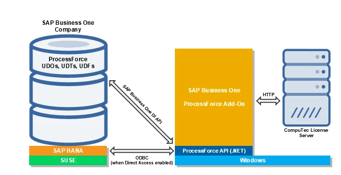

# ProcessForce Architecture

ProcessForce is a 64-bit .NET application that can be run inside SAP Business One as an extension (add-on) through the deployment of its lightweight package.

ProcessForce is developed in C# and runs on top of the .NET Framework on Windows operating system.

It consists of ProcessForce API, a dynamic-link library stored within its installation folder where data model and business logic are defined, along with a UI built using the SAP Business One UI API.

Some new functionalities like Serialization, MRP 2.5, Batch Traceability 360, or Mass BOM Change Tool have an HTML user interface and are built with SAPUI5.

ProcessForce API uses SAP Business One DI API and has direct access to the company database (schema) through the ADO.NET interface when the Direct Access mode is enabled.

The application runs as ProcessForce.exe process started from SAP Business One.

Almost all ProcessForce objects use SAP Business One User-Defined Objects (UDOs). We also utilize User-Defined Tables (UDTs) and User-Defined Fields (UDFs).

Reporting utilizes calculation views (when operating on SAP HANA), as well as stored procedures, functions, views, and user queries, each serving their respective purposes.

Print layouts are defined in Crystal Reports and run by Crystal Reports Engine built into SAP Business One.

We support the same functionalities for both SAP HANA and Microsoft SQL Server. The only difference lies in the ProcessForce Semantic model (calculation views), exclusively accessible on SAP HANA.

Here is the overview of ProcessForce Architecture:

