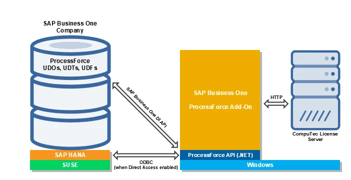

# ProcessForce Architecture

ProcessForce is a 64-bit .NET application that can be run inside SAP Business One as an extension (add-on) by publishing the lightweight deployment package.

ProcessForce is developed in C# and runs on top of the .NET Framework on Windows operating system.

It consists of ProcessForce API, which is a dynamic-link library stored in its installation folder where data model and business logic are defined, and UI built with SAP Business One UI API.

Some new functionalities like Serialization, MRP 2.5, Batch Traceability 360, or Mass BOM Change Tool have an HTML user interface and are built with SAPUI5.

ProcessForce API uses SAP Business One DI API and direct access to the company database (schema) through the ADO.NET interface when Direct Access mode is enabled.

The application runs as ProcessForce.exe process started from SAP Business One.

Almost all ProcessForce objects use SAP Business One User-Defined Objects (UDOs). We also utilize User-Defined Tables (UDTs) and User-Defined Fields (UDFs).

Reporting use respectively calculation views (when runs on SAP HANA), stored procedures, functions, views, and user queries.

Print layouts are defined in Crystal Reports and run by Crystal Reports engine built into SAP Business One.

We support the same functionalities both SAP HANA and Microsoft SQL Server. The only difference is ProcessForce Semantic model (calculations views) which is only available for SAP HANA.

Here is the overview of ProcessForce architecture:

