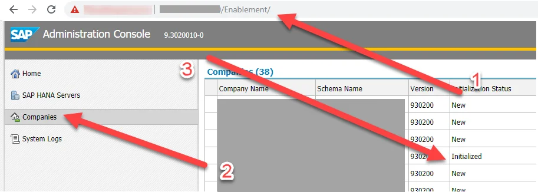
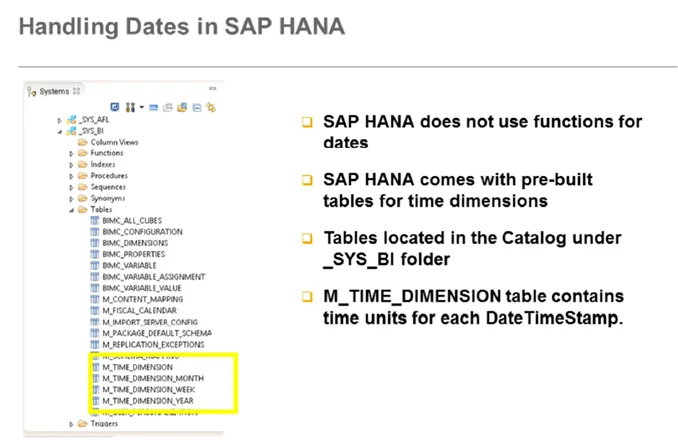
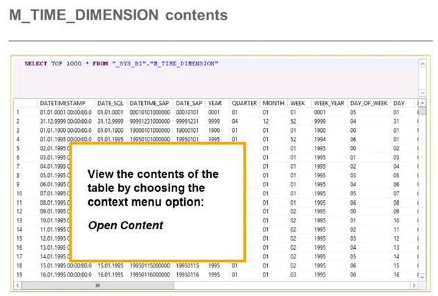
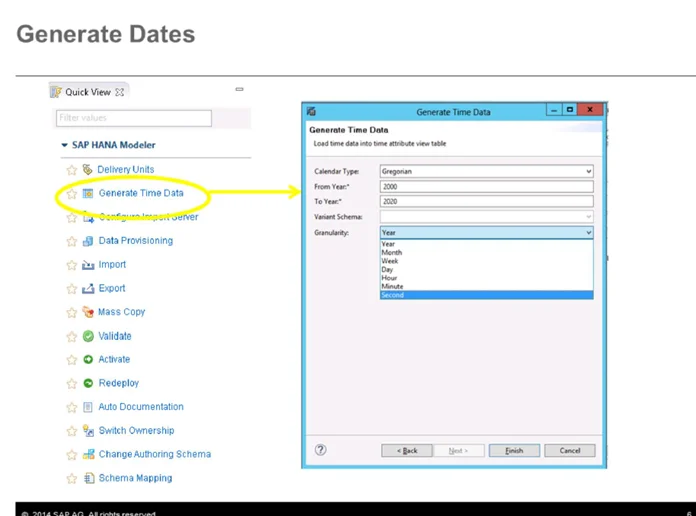
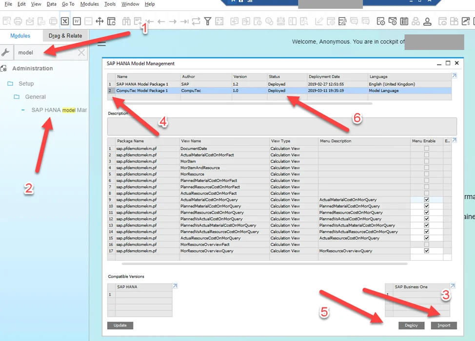
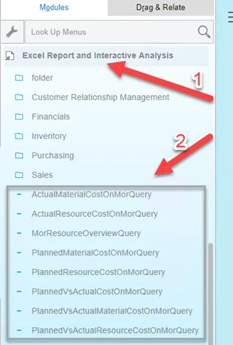
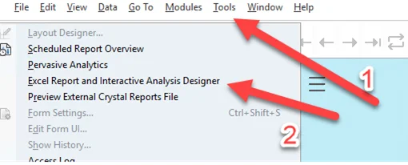
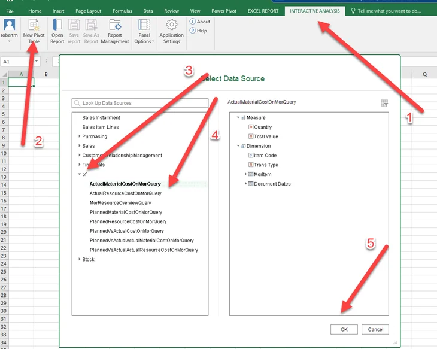
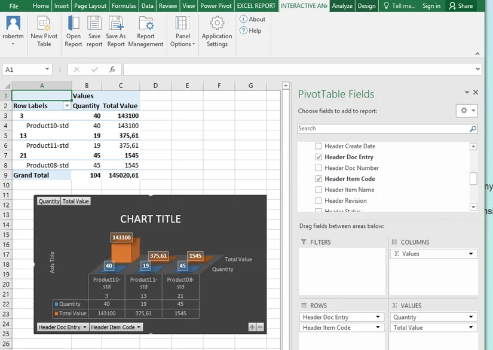

# Prerequisites and Installation

Here, you can check the prerequisites and installation notes.

---

## Prerequisites

### Initialize Analytics

It is required to initialize analytics for a specific database. You can check if the administrator console does it: `https://<Server Address>:<Port>/Enablement` (swap `<Server Address>` and `<Port>` for your data). Follow the steps in the screenshot below:



You can find more information on the subject in [Administrator's Guide for SAP Business One 10.0, version for SAP HANA](https://help.sap.com/doc/4e7c047f2c9e4cbe97800ffaf7b68f8e/10.0/en-US/B1_for_SAP_HANA_Admin_Guide.pdf), in the following chapters:

- 7.3 Initializing and Maintaining Company Schemas for Analytical Features
- 7.3.1 Starting the Administration Console
- 7.3.2 Initializing and Updating Company Schemas

### Microsoft Excel, Excel Report, and Interactive

To fully use the features of the data model and to create own reports based on the provided views, it is required to have installed Microsoft Excel and Excel Report and Interactive, which is an addition to Excel Analysis. You can check these application requirements in the Administrator's Guide for SAP Business One 10.0, version for SAP HANA (chapters: 1. Introduction and 3.4 Installing Client Components).

How to work with the features you can find in the [official SAP Business One How-to Guide](https://help.sap.com/http.svc/rc/d70ddaf3fc8341bbb7ea62d0742bdd88/9.3/en-US/How%20to%20Work%20with%20Excel%20Report%20and%20Interactive%20Analysis.pdf).

### Run script.sql

Before importing the data model, it is required to run the script from the HANA Studio level: [script.sql](../data-model/data-model-download.md). Running the script creates some of the views on the database level. These objects are not present in the ProcessForce installer. Since they will be present in the future ProcessForce versions, running the script is required.

### _SYS_BI"."M_TIME_DIMENSION table

Some dates were joined with a time dictionary view ("DocumentDate"). This view uses the `_SYS_BI"."M_TIME_DIMENSION` table.



You can check with the following query if the data in this table are initialized:

```sql
select *
from _SYS_BI."M_TIME_DIMENSION"
```



If data is not present there, we can initialize it:



More details can be found [here](https://download.computec.one/media/sap/SAP_HANA_Modeling_for_SAP_Business_One_Time_Dimensions.pdf)

## Installation

Once the requirements from the previous section are met, import model.zip, which is available to download [here](../data-model/data-model-download.md). You can install it from the SAP Business One level, logged in to a required database:



More information on data model import and available options can be found [here](https://download.computec.one/media/sap/How_to_Export_and_Package_SAP_HANA_Models_for_SAP_Business_One.pdf), Chapter 4. Importing and Deploying Model Packages in SAP Business One.

After a successful installation, the views are available from the SAP main menu level:



From the Excel level:






