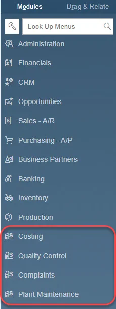

# Extension

## Installation Guide

In this page, you can find a step-by-step guide on how to install the ProcessForce Extension.

---

:::note
    If you only need to upgrade ProcessForce, please check the [**ProcessForce Upgrade Guide**](../upgrade).
:::

:::caution
    Be sure to acquaint yourself with the [ProcessForce System Requirements](../../system-requirements.md) before starting the installation.
:::

:::caution
    It is recommended to install [CompuTec License Server](./license-server) first.
:::

:::caution
    It is recommended to restart the SAP Business One client before the installation of the ProcessForce Extension.
:::

:::caution
    Due to technical limitations, it is required to execute a specific SQL query on the company database during the first installation of the Extension in the SAP HANA version. Additional information can be found in the eighth step of the installation description.
:::

:::danger
    Prior to upgrading the ProcessForce Extension, ensure that the following SAP Business One stored procedures are in their default state, without any custom queries:

    - SP_TransactionNotification
    - SP_PostTransactionNotice
:::

:::danger
    Before starting the installation, ensure that Serial Numbers and Batches, Production, and Units of Measure boxes are **unchecked** in General Settings → **Hide functions** (the way it is on the screenshot provided below).

    <details>
      <summary>Click here to expand</summary>
      <div></div>
    </details>
:::

:::danger
    Please note that Copy Express, or the option Copy User-Defined Fields and Tables/Copy User-Defined Objects in the Create New Company wizard, cannot be used for copying ProcessForce objects and structures.

    <details>
        <summary>Click here to find out more</summary>
        <p>When a new ProcessForce database is created by using Copy Express, or with the option Copy User-Defined Fields and Tables/Copy User-Defined Objects in the Create New Company wizard, the SAP Business One mechanism does not set a proper value for EditType fields in Processforce structures (it is set to NULL). It is a result of an SAP Business One bug: new fields with DateTime type are not properly created in a new database.</p>
    </details>

    To avoid this situation, you can create a new database, install ProcessForce and move the required data through ProcessForce API with [PowerShell scripts](../../../developer-guide/data-import/overview.md).
:::

### Installation

:::danger
    Please note that ProcessForce in 10.0 version is provided as a **Lightweight Deployment Extension only**. Please use **SAP Business One Extension Manager** to install it.
:::

Download installation files for it [here](../../../releases/download.md).

ProcessForce for SAP Business One 10.0 is a lightweight deployment extension. As such to install it, log in to your SLD Extension service and import and assign the ProcessForce extension from there.

1. You can access it directly by using a default URL `HTTPS://<SERVER_NAME>:40000/ExtensionManager` or by opening it from your SAP Business One client. Choose the highlighted option in SAP Business One:

    

2. Log in to System Landscape Directory.

    

3. Click the Import button and browse to the path with the extension installation file:

    

4. Go to the Company Assignment tab, choose the required database from the Company List and click the Assign button:

    

5. Choose the ProcessForce option and go through the installation by clicking Next.

    

6. It is recommended to set up the Startup Mode as manual on the first run of the application. It can be changed later to Mandatory. After that click Next.

7. Once it is done, re-log your company, run the extension manually and wait until the installation is finished.

    :::caution
        Note that the first ProcessForce installation on a company where it was not previously installed may take several dozen minutes up to a few hours (depending on the system environment).
    :::

8. When installing the ProcessForce extension for SAP HANA, you'll need to manually create a specific SQL procedure during the installation process. To do this, click the "Copy to Clipboard" button in the System Message window, then paste the query into SAP HANA Studio and execute it on the appropriate schema (company database):

    

    :::caution Common query problem

    <details>
        <summary>Click here to expand</summary>
        <div>
            When you do not select a schema by opening SQL Console from the root tree schema selection, the query window is set to the default selected schema, e.g. SYSTEM schema. The first execution of a query creates a procedure in the SYSTEM schema and not in the proper company schema where ProcessForce is installed.

        To install the copied SQL procedure to the proper company schema, please open SQL Console and use the below command before the copied query to switch to the proper schema:

        ```sql
        SET SCHEMA "<COMPANY-DATABASE-SCHEMA-NAME>";
        ```
    
    
    </div>
    </details>
    :::
9. After the installation is completed, the message about the database structure modification is displayed – click Yes.

10. Additional message – recommending the SAP Business One client restart – is displayed: click OK.

11. At the end of the installation process, the ProcessForce main menu positions appear:

    

### License assignment

:::info
    This step may be skipped only in case of making the extension upgrade.
:::

You can find the License Import and Assignment guide [here](../../licensing/license-import-assignment.md).

### Data preparation

:::note
    Before running restore procedures please determine whether the [**Manage Item Cost per Warehouse**](../../../user-guide/costing-material-and-resources/configuration.md) setting is used. If you alter this setting after restoration, it will necessitate the removal and subsequent restoration of all Item Costing Details.
:::

If ProcessForce is installed on a database with an existing data (particularly Item Master Data entries) for the first time, it is necessary to run the data restoring procedures:

- Restore Item Details
- Restore Item Costing
- Restore Resource Costing
- Restore Employee Calendars
- Restore Batch Details


Click [**here**](../../../user-guide/system-initialzation/data-restore.md) to find out more about the Restore function.
