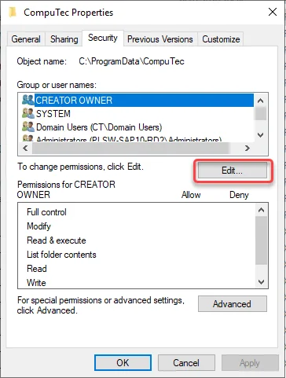
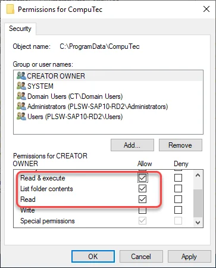

# Security Settings

:::info
    The security settings outlined below are applicable to installations on machines that allow for custom security configurations. No adjustments are necessary in standard system security settings.
:::

1. In a file explorer, navigate to the below location (the ProgramData folder is hidden by default): `C:\ProgramData\`

2. Right-click on the CompuTec folder, select Properties, switch to Security tab, and press the Edit... button:

    

3. In the Permissions for CompuTec window, make sure all SAP Business One users with installed ProcessForce have the **Read & execute**, **List folder contents** and **Read** permissions for the folder and **all descendant folders and files** of it:

    
