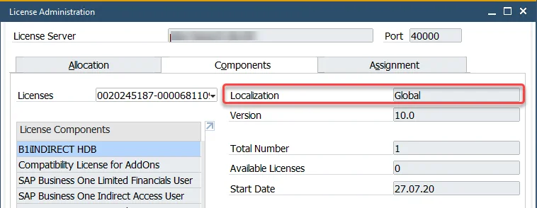

# Request for a License

To obtain a license file, please create a support ticket at the [CompuTec Support Portal](https://support.computec.pl) (Type: Information, Component: License request) and provide the following information:

---

## License Type

The destined environment:

- a customer server
- a partner internal server

and the license purpose:

- an official purchase
- a demo/test license

:::info
    We generate demo/test licenses for 1 Professional user by default.
:::

## System Information

The information needed for generating the license placed on:

- About CompuTec ProcessForce form

    :::info **Location**
        The SAP Business One application (with CompuTec ProcessForce installed) → upper menu → Help → About CompuTec ProcessForce.
    :::

  - **SAP Business One Major version** (9.3, 10.0, etc.)

        :::caution
            Please note that each ProcessForce license is issued for a specific major SAP Business One version. Therefore, requesting a new file on the planned upgrade between these versions is required.
        :::

  - **SAP Business One Installation Number** (10 signs)

  - **CompuTec Key** (40 signs)

        :::caution
            Please copy CompuTec Key using the Copy function available in a field context menu and paste it into the support issue.

            Alternatively please use the buttons on the lower right corner of the form: Copy to Clipboard / Copy to File.
        :::

    

- **License Administration Form**

    :::info Location
        SAP Business One application → upper menu → Modules → Administration → License → License Administration (Components tab)
    :::

  - **SAP Business One License Localization**

        

        :::info
            Click [**here**](../licensing/license-import-assignment.md) to check how to load a license file after getting it from the CompuTec support.
        :::
