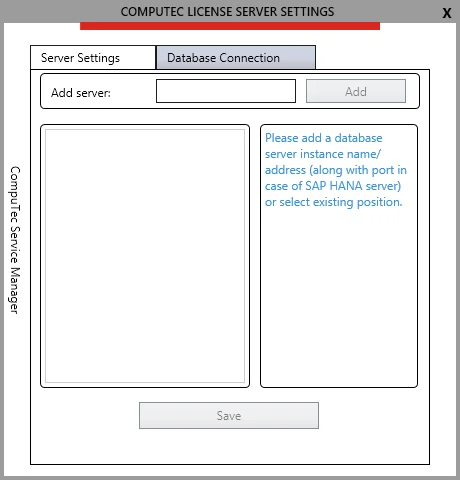
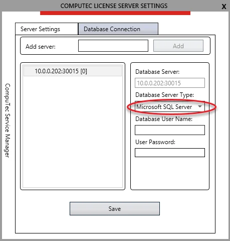
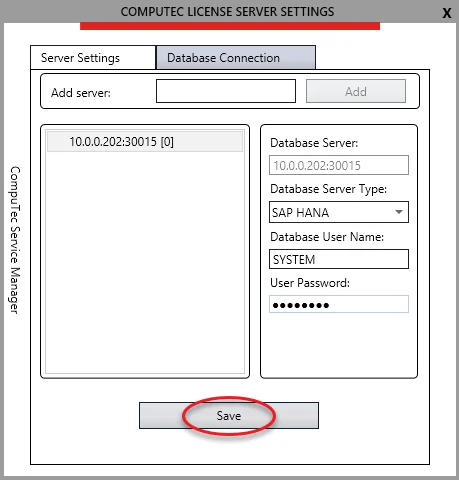

# Configure CompuTec Service Manager

This document provides a step-by-step guide on how to use and configure CompuTec Service Manager.

:::info
    CompuTec Service Manager is a part of CompuTec License Server, and you can locate its installation guide at [the CompuTec License Server Installation page](./license-server-installation.md).
:::

---

## Starting CompuTec Service Manager

After the CompuTec License Server installation in the system, you'll find the CompuTec Service Manager shortcut in the Windows program list.

After clicking it, the CT icon appears in the Windows notification area:

After opening the Manager, the COMPUTEC SERVICE MANAGER window appears. Here you can start/stop/restart a chosen CompuTec service:

Configuring the settings of a selected service is possible after clicking the Settings button.

Terminal Licensing is a section for managing the license of CompuTec PDC / CompuTec WMS products.

## CompuTec License Server Settings

You can change Server Name and Port Number in the Server Settings tab. You do not have to change the default values:

You can also specify a logging level and see a disk location where logs are kept.

## Configuring CompuTec License Server Database Connection

1. In the COMPUTEC LICENSE SERVER SETTINGS window, switch to the Database Connection tab:

    

2. Specify the SAP Business One database server name/address. You can take it from here:

    :::info Path
        SAP Business One → Administration → Choose Company
    :::

    

    Click the Add button after setting the server name:

    

    :::info
        Depending on a database server type, specify the server name in the below format:

        | Database Server Type                   | Server Name Format      | Example                |
        | -------------------------------------- | ----------------------- | ---------------------- |
        | Microsoft SQL Server, default Instance | ServerName              | Test-System            |
        | Microsoft SQL, Named Instance          | ServerName\InstanceName | Test System\Production |
        | SAP HANA                               | ServerName:Port         | 10.0.0.199:30015       |
    :::

    You can check the Microsoft SQL Server server/instance name using the Microsoft SQL Server Management Studio tool:

    

        
Click here to find out more

        

    

    You can read the SAP Business One HANA server and port in the SAP Business One installation:

    

        
Click here to find out more

        

    

3. Set a database server type of added server:
  
    

4. Specify a database user name and password, and click Save:

    

5. If inserted data are correct, then the 'Data has been saved' message appears, and the company database number is displayed next to the server position:

    :::caution
        Please note that the application does not show a newly restored/imported company database until Choose Company list in the SAP Business One client is refreshed.
    :::

    

    :::info
        After this step, the message: `Direct Data Access mode is disabled.` will not appear anymore while starting ProcessForce provided that the connection to CompuTec License Server is configured correctly in ProcessForce License Administration (see [Extension → License assignment section](../../installation/first-installation/extension)).
    :::

6. You can also expand the list of existing company databases to make sure that a particular SAP Business One company uses Direct Data Access:

    

    :::caution
        Please note that there is a need to refresh the list each time you add/import a new company database:

        
    :::

7. Upon highlighting the added database server position, you will no longer see the inserted database username and the actual password length, as they are now masked.

    

    :::info
        It is possible to set up more than one database server:
        

        
Click here to expand

        

        
        

        

    :::
