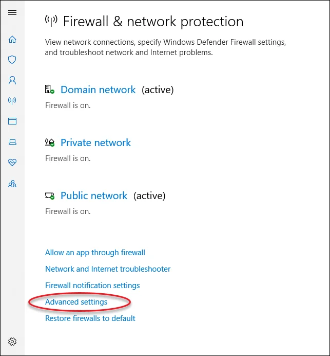
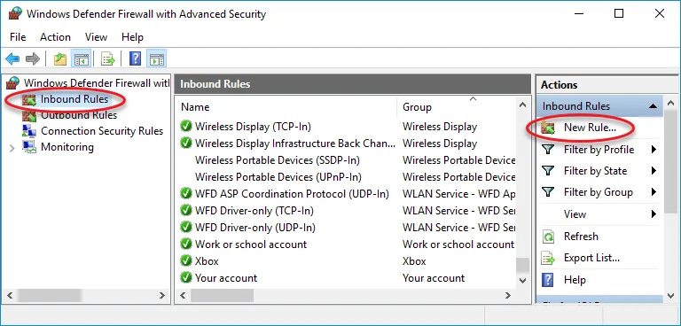
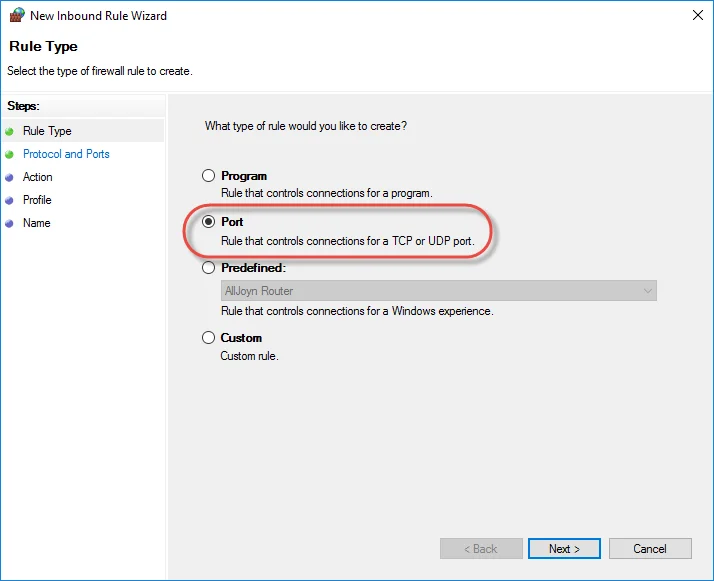
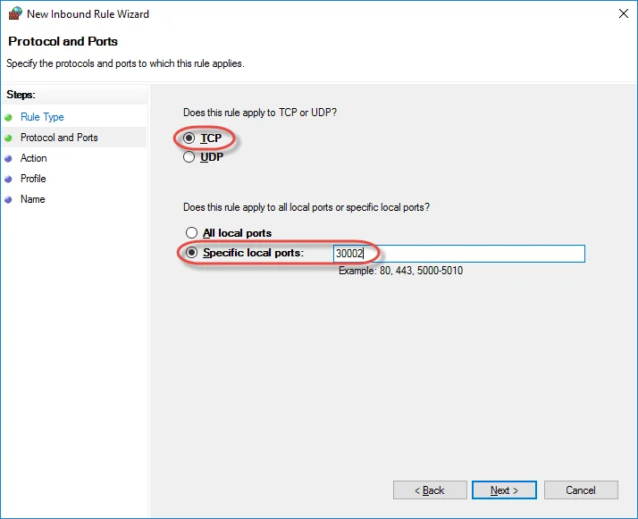
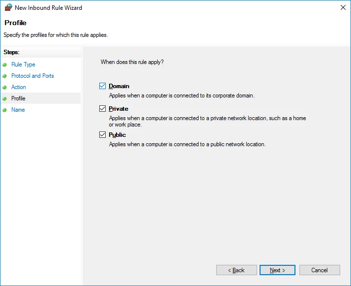
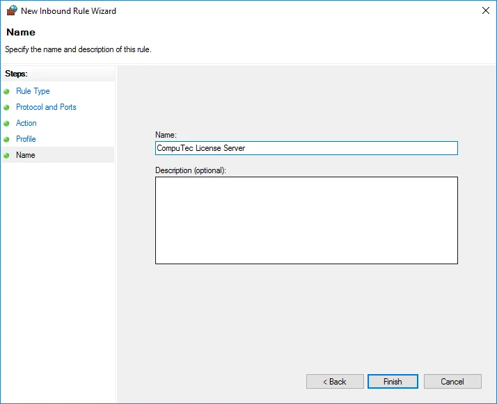

# CompuTec License Server Installation

This document provides a step-by-step guide on how to install and configure CompuTec License Server.

:::info
    You can check the available **ProcessForce user license types** [**here**](./../license-chart.md).
:::

---

## Installing CompuTec License Server

:::danger
    Remove an old version of ProcessForce License Server and SAP COM License Bridge in case you used them previously (with ProcessForce 8.81 / 8.82 / 9.0 PL05 - PL08 HotFix) before installing a new version.
:::

:::caution
    CompuTec License Server can be installed in a Windows environment only.
:::

1. Download CompuTec License Server from here<!-- TODO: Add link -->.

2. Extract the ZIP file.

3. Run the `CompuTec.LicenseServer.Setup.msi` file.

4. Click the Next button and go through the installation process.

## Setting Windows Firewall rule

1. Open: `Windows Settings → Network & Internet → Windows Firewall`:

    

2. Click the Advanced settings option:

    

3. In Windows Firewall with Advanced Security window, select Inbound Rules and click New Rule... in the Actions section – this will run New Inbound Rule Wizard:

    

4. Choose Port as a rule type:

    

5. Choose TCP protocol and specify 30002 local port:

    

6. Choose the Allow the connection action:

    

7. Choose all profiles:

    

8. Specify the rule name and click Finish:

    

## Using CompuTec Service Manager and configuring Direct Data Access mode

You can find the guide [here](./direct-access.md).
