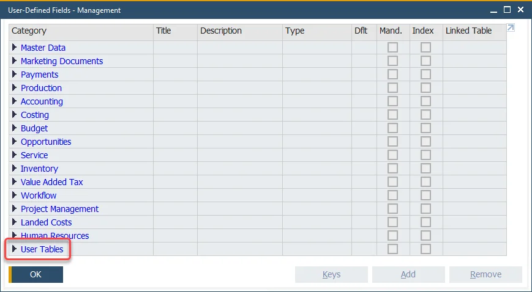
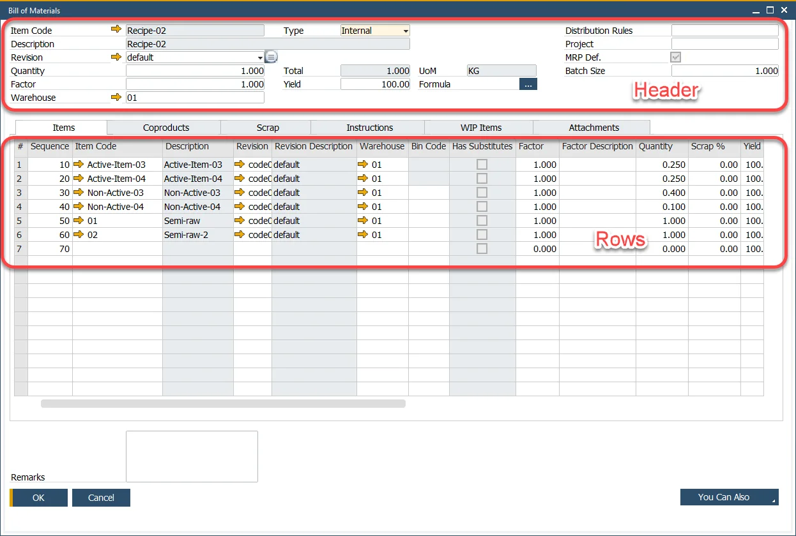
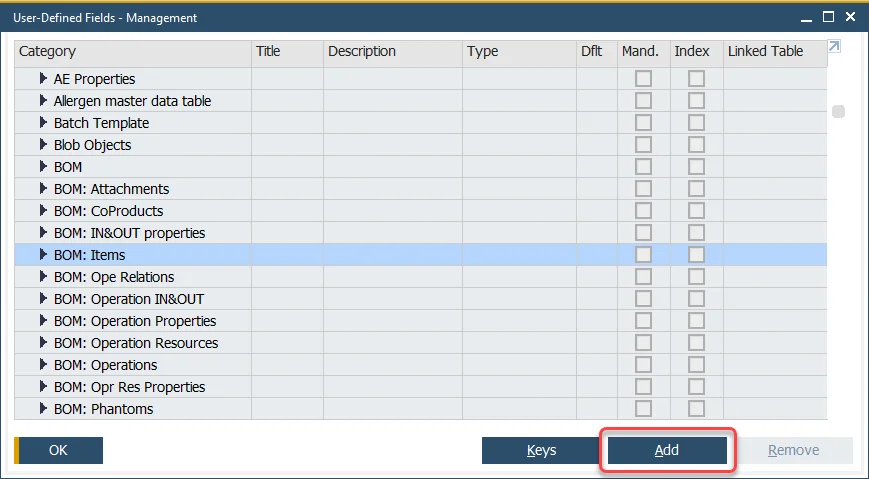
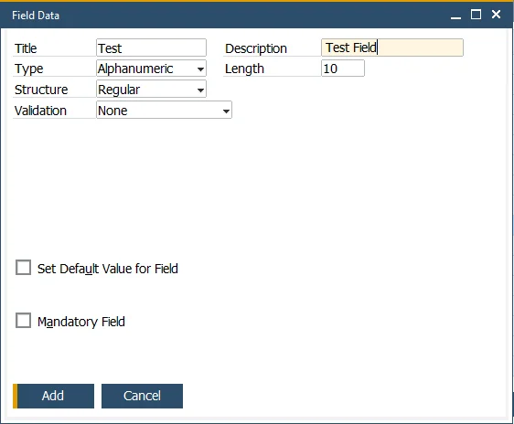
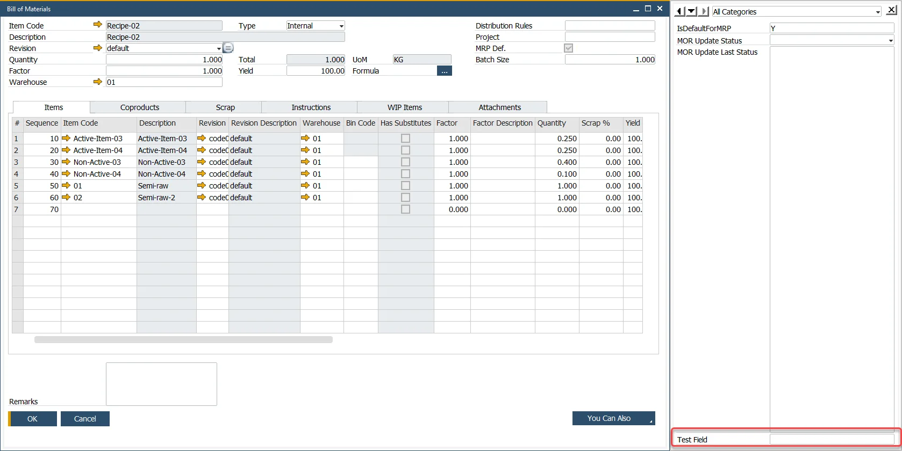
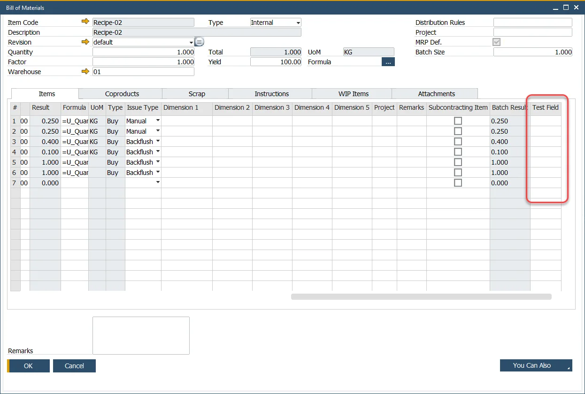

# Working with User-Defined Fields

A possibility to add User-Defined Fields (UDFs) is an SAP Business One option that can also be used with ProcessForce objects.

Supplementary fields are often added to master data and documents to meet specific customers’ business process requirements.

In this section working on UDFs with ProcessForce is described. Please check the respective SAP Business One documentation the respective [SAP Business One documentation entry](https://help.sap.com/viewer/68a2e87fb29941b5bf959a184d9c6727/10.0/en-US/4510ff7bcf465d7be10000000a11466f.html), to find out more about the SAP Business One UDF option.

---

## Adding User Defined Fields

:::danger
    It is impossible to add UDFs to the Costed Bill of Materials form.
:::

:::danger
    Adding UDFs to Item Costing and Resource Costing forms may cause errors and is not recommended.
:::

:::caution
    Only users with the following SAP Business One authorization assigned can add UDFs: *Customization Tools → User-Defined Fields - Management*.

    You can reach this option in the Authorizations form:
    *Administration → System Initialization → Authorizations → General Authorizations*.
:::

:::info
    In the examples used in this section, adding UDF to the Bill of Materials is used.
:::

- To add a UDF, go to the upper menu *Tools → Customization Tools → User-Defined Fields - Management*. You can reach ProcessForce tables in User Tables:

    

    UDF can be added either to a form's header or a row.

    

        
Header and Row

        

    

    ProcessForce headers have simple names, e.g., BOM. ProcessForce rows have names combined from a form name and a row name, e.g., BOM: Items, BOM: Scrap.

- Choose the place that you want to add UDF to and click Add (Bill of Materials, Items in this example):

    

- Fill in all desired fields (check [the respective SAP Business One documentation entry](http://help.sap.com/saphelp_sboh92/helpdata/en/45/10ff7bcf465d7be10000000a11466f/content.htm) for more information) and click Add.

    

    Note that Title, Type, and Structure fields cannot be edited once the field is added. You can remove UDF and add it again.

- Information about a database structure change will be displayed. Accept it.

- Information about other workstations connected to the company with a list of workstations will be displayed. You can either ignore it, try again after disconnecting it, or cancel.

    :::caution
        Adding UDFs changes the database structure, therefore, it is recommended to disconnect all the other users logged in to the SAP Business One database on which the change is to be performed.
    :::

- Restart SAP Business One client.

### Header User Defined Fields

UDFs added to a header are not displayed on it. You can check it on a side panel (you can reach it by using the *View → User-Defined Fields* menu or pressing Ctrl+Shift+U):

### Row User Defined Fields

User Defined Fields added to a row are displayed as another column in the row table:

### Flat Forms

Some forms do not have tables (rows), e.g., Downtime Reason. In this case, you can add UDF only in the same manner as [header UDFs](#header-user-defined-fields): it will not be available on a form. It will be available on a side panel:

### Form Settings

You can manage the visibility and activity of a UDF by standard SAP Business One option: Form Settings, chosen on a specific form. Newly created UDFs are visible and active by default.

Note that only row UDFs are available in Form Settings.

## Recommended Form Settings

Installing ProcessForce causes adding ProcessForce UDFs to some of the SAP Business One forms, e.g., Revision on Sales Order:

Keeping ProcessForce UDFs placed on SAP Business One Forms visible in Form Settings is recommended. Turning off the option leads to a blockage of the fields update during transactions and may lead to data inconsistency.
