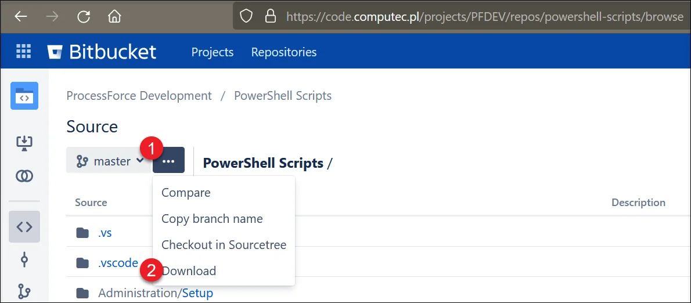

# Overview

:::caution
    On the 4th of March 2022, PFI (ProcessForce Import) plugin for AppEngine was released. PFI facilitates the import and updating of data to ProcessForce objects, providing a streamlined, faster, and more flexible alternative to PowerShell updates.
:::

This section provides information on running PowerShell scripts for importing or updating data in databases. On related pages, you can find all the necessary information on PowerShell configuration, predefined scripts, and how to modify them.

:::danger Please Note
   Should you modify our scripts and encounter any resulting issues necessitating our team's review and resolution, we will apply charges for the time spent at an hourly rate of 150 EUR/USD, plus applicable expenses. Prior to commencing any work, mutual confirmation via email is required to acknowledge and accept these charges.
:::

:::info
    Please note that updated and standardized scripts were released on October 22, 2018. Additionally, as part of this update, connection parameters have been relocated to a separate file named "configuration.xml (which can be found in a zip file of a specific script).
:::

## Required Files

You can use predefined PowerShell scripts. The latest versions are available from our [public git repository](https://github.com/CompuTec/processforce-powershell).

Download:



In the following example, Ingredient Master Data scripts are used. Go to the downloaded folder and find the Ingredient Master Data folder ([...]\Inventory\Ingredients\Ingredients Master Data):


Each folder contains three types of files:

- **Configuration file** – a file that holds information on a database access

- **PowerShell script** – for executing import or update of the data

- **Comma-Separated Values (CSV) files** – files to be filled in with data to be imported or updated

## Procedure

### Configuration File

Open the file in the edition mode using any app suitable for editing XML files:

```xml

<?xml version="1.0" encoding="UTF-8" standalone="yes"?>
<configuration>
  <connection
    Database="PFDEMOGB"
    SQLServer="NDB@hanaserver:30013"
    LicenseServer="hanaserver:40000"
    DbServerType="dst_HANADB"
    UserName="manager"
    Password="1234"
  />
  <!-- Database       = Database/schema name (check in SAP Company select form/window, or in Microsoft SQL Server Management Studio or in SAP HANA Studio) -->
  <!-- SQLServer      = Database server name or IP address with port number; Should be the same as in the System Landscape Directory (check https://<Server>:<Port>/ControlCenter); Sometimes the best is to use an IP address to resolve connection problems -->
  <!-- LicenseServer  = SAP Business One Licence Server name or IP address with a port number (check in SAP Business One client -> Administration -> License -> License Administration -> License Server) -->
  <!-- DbServerType   =
                        [SAPbobsCOM.BoDataServerTypes]::"dst_HANADB"      # For SAP HANA
                        [SAPbobsCOM.BoDataServerTypes]::"dst_MSSQL2019"   # For Microsoft SQL Server 2019
                        [SAPbobsCOM.BoDataServerTypes]::"dst_MSSQL2016"   # For Microsoft SQL Server 2016
                        [SAPbobsCOM.BoDataServerTypes]::"dst_MSSQL2014"   # For Microsoft SQL Server 2014
                        [SAPbobsCOM.BoDataServerTypes]::"dst_MSSQL2012"   # For Microsoft SQL Server 2012
  -->
  <!-- UserName       = SAP Business One username, e.g., manager -->
  <!-- Password       = SAP Business One user password -->
</configuration>

```

Edit the parameters in the connection element based on the comment in the file and save the file.

The filled-in file can now be used with any of the predefined PowerShell scripts to update/import data to the database defined in the file – copy it to any of the scrip folders and replace the configuration file that is already there.

### CSV Files

Set required values in the CSV files (in this example Ingredient Classification Certificates) using a suitable application (e.g., Microsoft Excel). In this example, the second and the third lines are filled with data (the first line holds the fields' names. This line is provided in the CSV file.

| IngredientCode | ClassificationCode | BusinessPartnerCode | CertificateNumber | CertificateDate | Status | StatusDate | Attachment  | Remarks |
| -------------- | ------------------ | ------------------- | ----------------- | --------------- | ------ | ---------- | ----------- | ------- |
| 2              | 2                  | 2                   | 1                 | 02.07.2015      | A      | 02.07.2015 | C:\test.pdf | remarks |
| 2              | 2                  | 2                   | 2                 | 02.07.2015      | P      | 02.07.2015 |             | remarks |

After saving changes, open it in a text editor (e.g., Notepad) and check if values are separated by a semicolon (like in the screenshot below). Sometimes, semicolons are automatically changed for a comma or other signs. This change can influence the data import/update process.

```IngredientCode;ClassificationCode;BusinessPartnerCode;CertificateNumber;CertificateDate;Status;StatusDate;Attachment;Remarks

2;2;2;1;02.07.2015;A;02.07.2015;C:\test.pdf;remarks

2;2;2;2;02.07.2015;P;02.07.2015;;remarks

```

### Executing Script

Open the required script in a suitable application ( PowerShell ISE in this example). Remember to keep all the files related to one kind of data (configuration file, CSV files, script) in one folder (like in the screenshot in the required files section).


