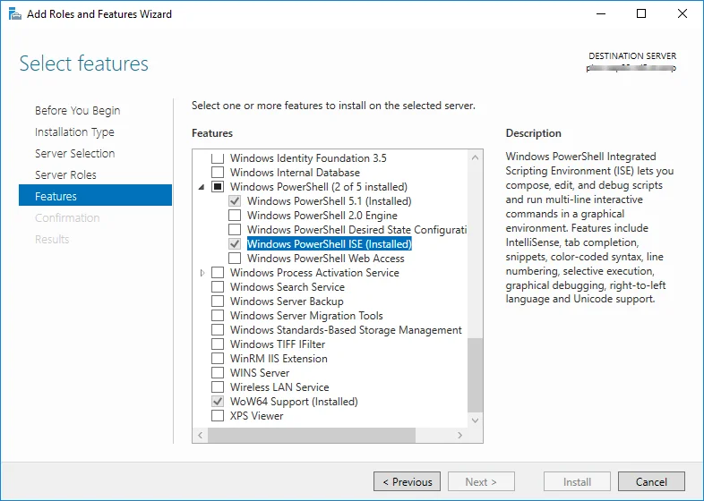
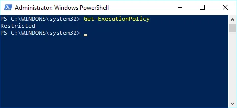
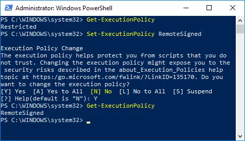

# PowerShell application configuration

On this site, you can find a step-by-step manual on performing the PowerShell configuration required to import or update data.

:::danger

If you take our scripts and modify them, which then causes an issue of any sort which requires our team to spend time reviewing your scripts etc., we will charge you for the time spent in fixing these issues on a time and material basis at an hourly rate of 150 EUR/USD, plus expenses if applicable. Before any work is started, an email confirmation is required between both parties that these charges will be applied and accepted.

:::

---

## Installation

On the machine where the scripts are executed, the CompuTec ProcessForce API in the same version as the CompuTec ProcessForce version used in the company database must be installed.

To edit PowerShell scripts more conveniently, you can install the Windows PowerShell ISE application or Visual Studio Code with a PowerShell extension.

You must use the same bitness (64-bit) of the PowerShell as SAP Business One and ProcessForce you have.

If you are using Windows Server, here is an example of how you can add Windows PowerShell ISE in the Server Manager:

## Execution policy

Set execution policy to RemoteSigned. To check which execution policy is selected, choose the Get-ExecutionPolicy command.

If the result is Restricted (as in the screenshot above), perform the `Set-ExecutionPolicy RemoteSigned` command and type Y on the dialog window to complete it:
After rechecking the policy, you should see RemoteSigned communication.

Now you can use PowerShell scripts to import data. Check here how to do it.
