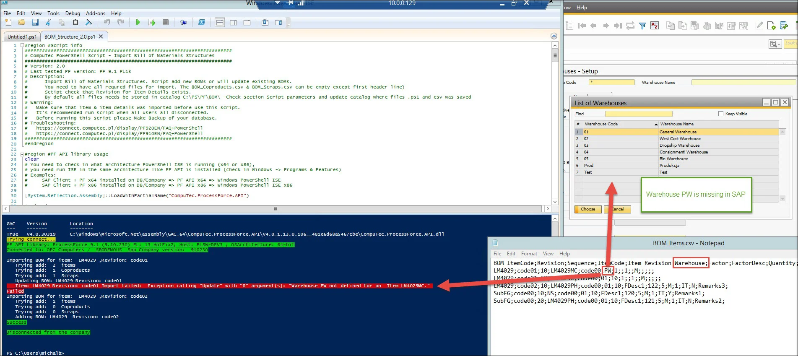
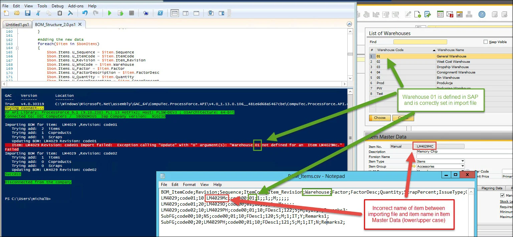
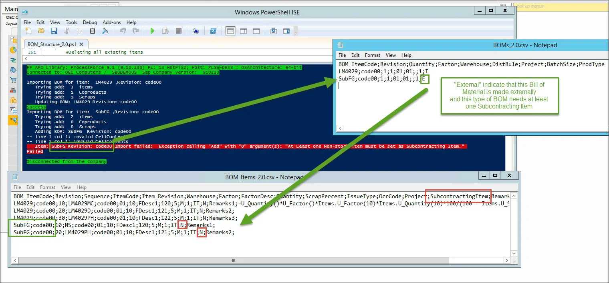
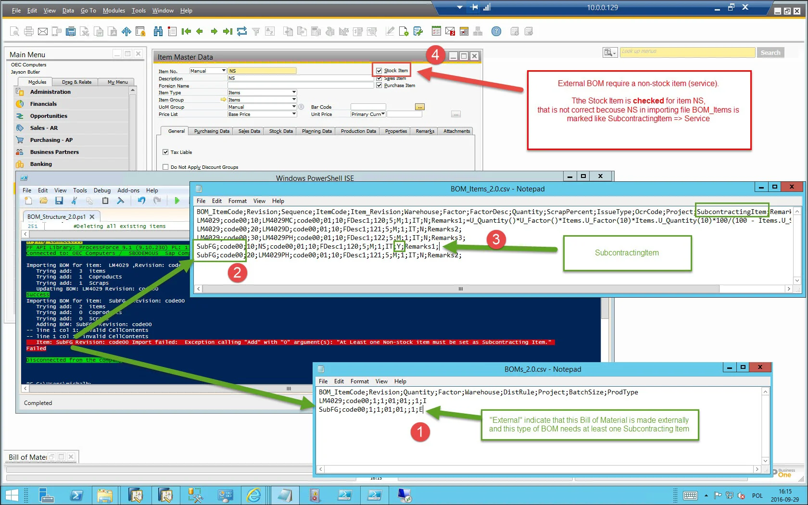

# Bill of Materials Issues

You can find the most common Bill of Materials issues on this page.

---

## Exception: Warehouse xx is not defined for an Item xxxxxx

Example 01: Exception: Warehouse PW not defined for an Item LM4029MC.

**Diagnose Steps (for the example)**

- In the BOM_Items.csv file for itemCode LM4029MC check the Warehouse value.

- Then go to SAP Client and display all Warehouses
  Check that the Warehouse Code exists in SAP. If it does exist, check Example 2. If it does not, follow the instructions in the next section:

**Solution**

Set the correct Warehouse code in the BOM_Items.csv file for itemCode LM4029MC or add Warehouse to SAP with Warehouse Code ex. PW.

## Example 02: Exception: Warehouse 01 not defined for an Item LM4029Mc

**Diagnose Steps (for the example)**

- Does the Warehouse code exist in SAP B1?
  - If no, go to Example 1
  - If yes, check the name of the Item in the file to import BOM_Items.csv and compare it with the Item name in SAP B1

**Solution**

- Item in BOM_Items.csv needs to have the same names as in Item Master Data in SAP
- Cannot be any differences with lower/upper in the item name, for example, LM4029Mc and LM4029MC.

## Exception: At Least one Non-stock item must be set as Subcontracting Item {#exception-1}

**Diagnose Steps**

- In file BOM_Items.csv, find the BOM Items for Item SubFG & revision code00

- Check that at least one Item is marked as SubcontractingItem = Y

**Resolution**

None of the Items in BOM of type external is marked as Subcontracting Item

## Exception: At Least one Non-stock item must be set as Subcontracting Item {#exception-2}

**Diagnose Steps**

- In file BOM_Items.csv, find the BOM items for item SubFG & revision code00
- Check which items are marked as SubcontractingItem = Y
- Go to SAP B1 Client and open Item Master Data for each subcontracting item to check that the Stock Item field is unchecked

**Resolution**

When importing an external type Bill of Materials (BOM), one of the items marked as a subcontracting item can have the Stock Item field unchecked.
