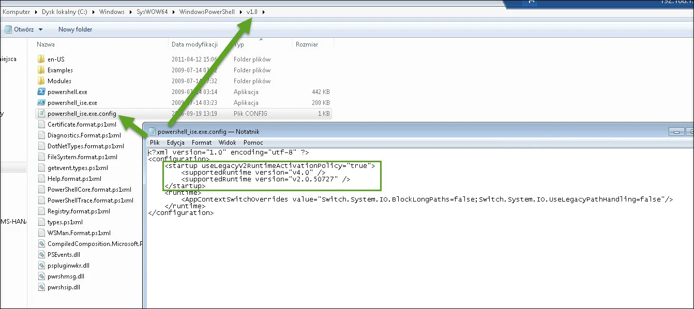
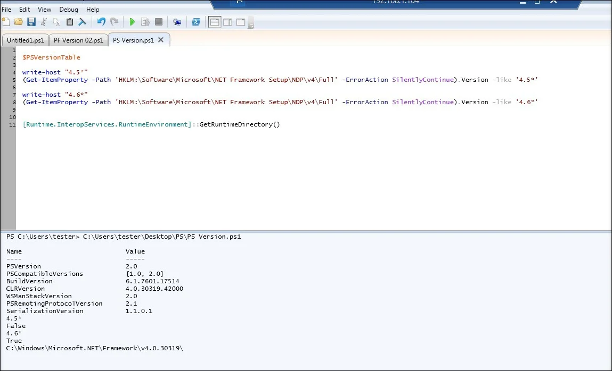
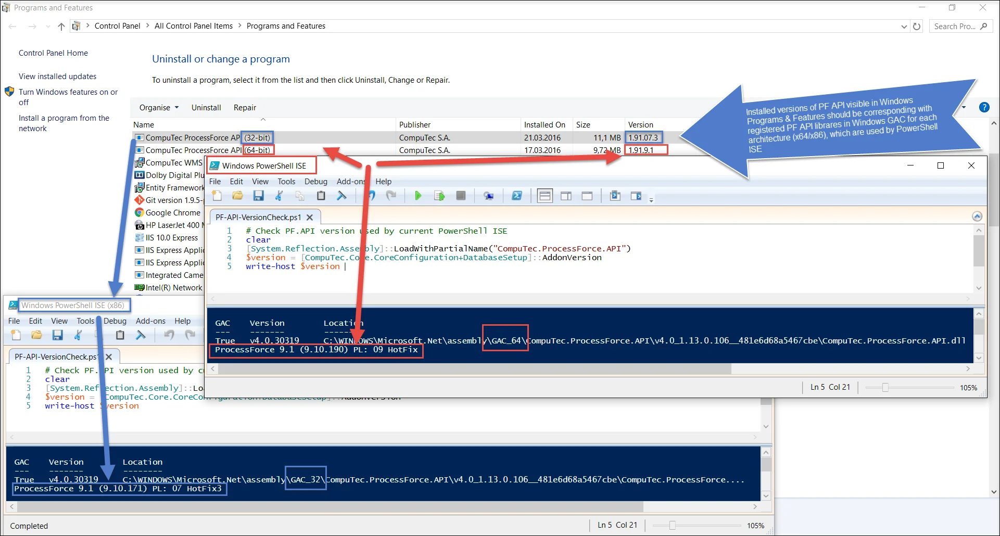

# General Issues

The most common issues concerning PowerShell script management will be published on this page.

---

## Connection issues

Please review the provided login data on the machine you tried connecting from PowerShell with the DITool from SAP to check if the provided login data are valid. This tool is available from the SAP Note:

[2057143 - DI API_How to Prepare and Debug an XML Payload](https://launchpad.support.sap.com/#/notes/2057143)

Please also use this SAP Note to diagnose the problem with the connection:

[2029714 - Troubleshooting Integration Framework SLD DI Connection](https://launchpad.support.sap.com/#/notes/2029714)

:::note

Despite this SAP Note relating to Integration Framework, many DI connection issues are common, regardless of the application that uses DI API.

:::

## Exception: Unable to find type [CompuTec.ProcessForce.API.ProcessForceCompanyInitializator]: make sure that the assembly that contains this type is loaded.

### Reason {###reason-1}

You are probably using PowerShell 2.0 with CLRVersion 2.0.

### Diagnose actions

Check if the CLR Version is 2.0 or lower.

PowerShell 2.0 script

```powershell
$PSVersionTable
```


### Solution steps - 01 (example for PowerShell ISE x86)

- Change CLRVersion to 4.0 (need installed .NET Framework 4.5/4.6 Full) by adding a configuration file to PowerShell ISE

- see **the Configuration files** section in [the PowerShell application configuration](./../../data-import/ps-app-configuration.md).

  

- restart PowerShell ISE and check CRLVersion

  

### Solution steps - 02 - ProcessForce 10.0 & newer

- use PowerShell 5.1

- [Check the installation part of the documentation](./../ps-app-configuration.md#installation)

## Exception: PF Database Version is not supported. Please update the Database or Reinstall API.Setup


### Reason {#reason-2}

ProcessForce, PowerShell ISE, and PF.API versions vary.

## Diagnose actions {##diagnose-actions-2}

![Different Version]Check the ProcessForce version and platform. You can do this in SAP Client > Administration > Add-On Manager (see a screenshot above).

- Check what architecture PowerShell ISE is working on (on example screenshot is x86 = 32-bits) and check if this platform is the same as ProcessForce one.

- Check In Windows > Programs & Features installed PF.API version and compare it to SAP Client > Add-on Manager – ProcessForce version & platform.



- Check if PowerShell ISE is using the correct PF API library version.

```powershell
# Check PF.API version used by current PowerShell ISE
clear
[System.Reflection.Assembly]::LoadWithPartialName("CompuTec.ProcessForce.API")
[System.Reflection.Assembly]::LoadWithPartialName("CompuTec.Core")
$version = [CompuTec.Core.CoreConfiguration+DatabaseSetup]::AddonVersion
write-host $version
```

### Solution

Use PowerShell ISE 64-bit if ProcessForce add-on x64 is installed on your database.

Use PowerShell ISE 32-bit if ProcessForce add-on x86 is installed on your database.

## Exception: Unable to access SBO-Common database


### Reason {#reason-3}

Mismatch of DBServerType.

### Exception: Database server type not supported


Mismatch of DBServerType.

## Exception: The specified resource name cannot be found in the image file

### Diagnose steps

1.  
2.  

### Solution {##solution-2}

Check SQL/HANA server name in the credentials configuration. Sometimes, a database server can be visible only by its name or IP address.

It should be the same as in the SAP Client Choose Company form/window.

## Exception: Login SLD Failed; make sure the server, company, and user credentials are correct


### Solution {##solution-3}

- Check SQLServer & LicenceServer IP address or name.
- Check SQLServer & LicenceServer port numbers (they should be used only for HANA connection).
- Be sure about lower & upper cases in login or password.
- Check if SLD is working - try to log in using SAP B1 Client to the target database.
