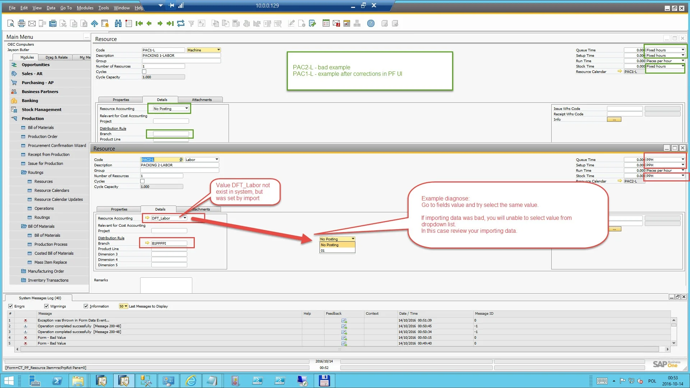
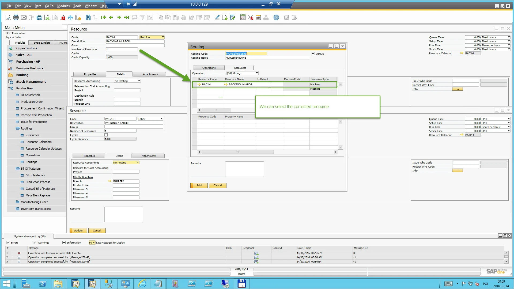
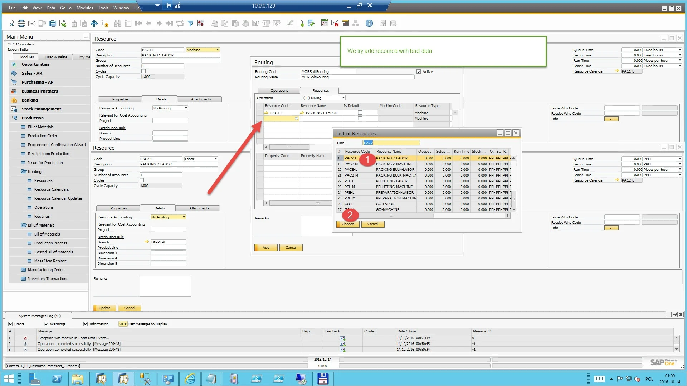
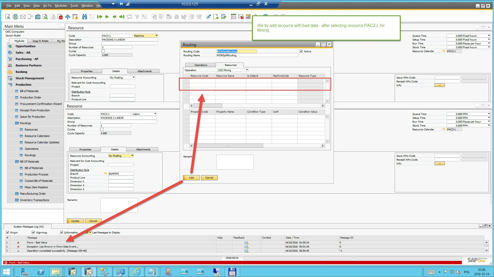

# Resource Issues

On this page, all PowerShell Resource data import-related issues will be described. The page will be subsequently updated based on issues raised on the support portal and recognized CompuTec consultants.

---

**How to troubleshoot a case of incorrect data import for resources that triggers a "Form - Bad Value" error**

No error message on PowerShell scripts upload does not guarantee that the data values are correctly imported, as we do not have validation in API for every case.

The following description shows an example reproduction of an incorrect data upload issue and how to diagnose what is wrong with imported data.

Please follow the instructions on the following screenshots:

- **Step 1**:

- **Step 2**:

- **Step 3**:

- **Step 4**:

## Summary

After selecting some Resource that will generate the error Form - Bad Value, you can go to Resource definition and try to reselect all values and update resource data.

Most of the time, you will get an error for incorrect data during the update. So if all data is reselected and recourse will be updated, the issue should not occur.

If you want to add more resources, you must check all resources.
