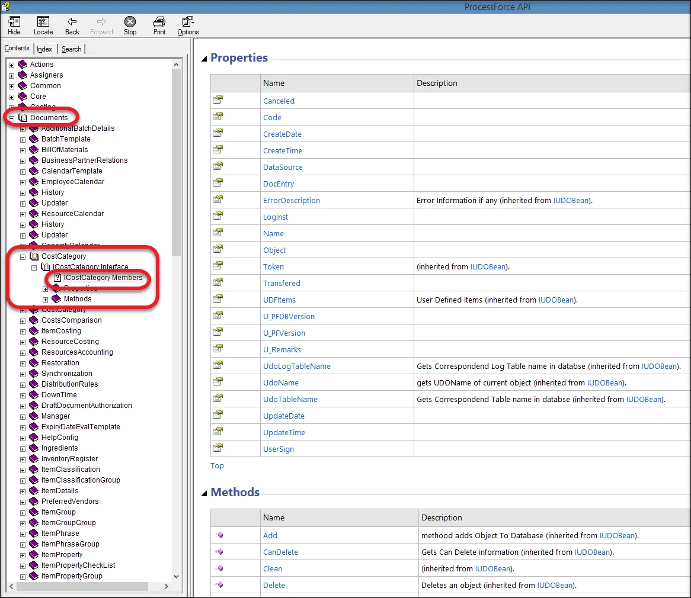
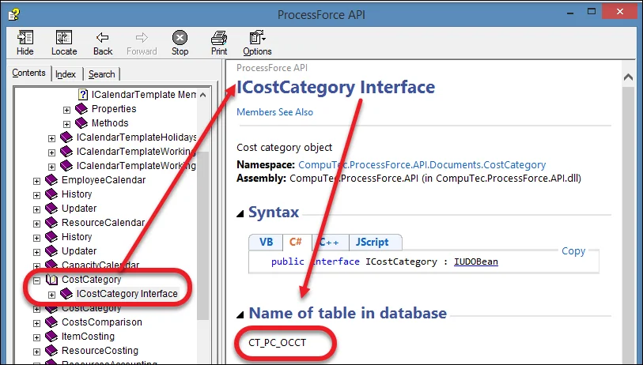

# ProcessForce API Documentation

Here you can download ProcessForce API Documentation. It helps to work on any type of external software that uses ProcessForce API, e.g., PowerShell or a third-party add-on.

:::info
    ProcessForce API documentation file: Download <!-- TODO: Add Link -->
:::

---

:::note
    In case the file is blank when opened, please choose Properties from the file context menu and click the Unblock option on the General tab.
:::

## Documents

All objects available through ProcessForce API are listed in the Documents section, along with their properties and methods (descriptions of which will be added consecutively). In the example below, a path to a list of Cost Category properties and methods is shown (paths to other objects lists are generated analogically):

## Table Name

The documentation file contains table names specified for objects:

It is also possible to check what kind of data is stored in a specific table:

