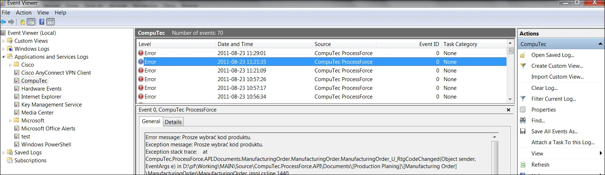

# General

1. ProcessForce Objects & LINQ – all child objects are fully compatible with LINQ syntax. It is beneficial when you need to find specific data. E.g., finding all Resources from the Bill of Materials that are used in a specific operation and a specific Routing:

    ```csharp
    IBillOfMaterial bom = company.CreatePFObject(CompuTec.ProcessForce.API.Core.ObjectTypes.BillOfMaterial);
    com.GetByItemCodeAndRevision("Chair01", "") == 0
    var resources = bom.RoutingOperationResources.Where(p => p.U_OprCode == "Cutting" && p.U_RtgOprCode == 1 && p.U_RtgCode == "DIRtg1");
    ```

2. Automatic updating relative resources – when objects such as BOM, MOR, Routing, or Operation are used and properly set, it should get some data. For example, when we set U_RtgCode filed on MOR, all routing data is automatically copied from BOM to MOR:

    ```csharp
    IBillOfMaterial bom = company.CreatePFObject(CompuTec.ProcessForce.API.Core.ObjectTypes.BillOfMaterial);
    if (bom.GetByItemCodeAndRevision("Chair01", "") == 0)
    {
        bom.Routings.SetCurrentLine(bom.Routings.Count - 1);
        if (!string.IsNullOrEmpty(bom.Routings.U_RtgCode))
            bom.Routings.Add();
        bom.Routings.U_RtgCode = "DIRtg1";
        bom.Routings.U_IsDefault = "Y";
        bom.Update();
    }
    ```

3. A good practice is to make SetCurrentLine(Count-1) after setting the field that updates an object. It will prevent unexpected row changes:

    ```csharp
    rtg.OperationResources.SetCurrentLine(rtg.OperationResources.Count - 1);
    if (!string.IsNullOrEmpty(rtg.OperationResources.U_RscCode)) //Check if the last line in udoobject is empty. If not, add a new line.
        rtg.OperationResources.Add();
    ```

4. Every item has to have correspondent item details object. Please remember it when importing items from DTW or using other tools based on SAP DI API. To achieve this, please use the following PowerShell script:

    ```csharp
    clear
    #### Path to dlls ####
    add-type -Path "d:\pf\Working\MAIN\Binaries\8.8\881PL05\Interop.SAPbobsCOM.dll"
    Add-Type -Path "d:\pf\Working\MAIN\Source\CompuTec.ProcessForce\bin\Debug\CompuTec.ProcessForce.API.dll"

    #Creating PF company
    $pfcCompany = [CompuTec.ProcessForce.API.ProcessForceCompanyInitializator]::CreateCompany()
    $pfcCompany.UserName = "manager"
    $pfcCompany.Password = "enigma"
    $pfcCompany.SQLPassword = "1q2w3e"
    $pfcCompany.SQLServer = "PCNBPO02"
    $pfcCompany.SQLUserName = "sa"
    $pfcCompany.Databasename = "PFDemo"
    $pfcCompany.DbServerType = [SAPbobsCOM.BoDataServerTypes]"dst_MSSQL2008"
    try
    {
        $code = $pfcCompany.Connect()
        if($code -ne 1)
        {
            write-host –backgroundcolor green –foregroundcolor white "ProcessForce is Conneced"

            $rs = $pfcCompany.CreateSapObject([SAPbobsCOM.BoObjectTypes]"BoRecordset")
        
            $rs.DoQuery("SELECT T0.ItemCode FROM OITM T0
                LEFT OUTER JOIN [@CT_PF_OIDT] T1 ON T0.ItemCode = T1.U_ItemCode
                WHERE
                T1.U_ItemCode IS NULL")
            
            if($rs.RecordCount -gt 0)
            {
                Write-Host "Number of Items To Add: "$rs.RecordCount
                Write-Host "Starting Transaction..."
                $pfcCompany.SapCompany.StartTransaction()
            
                while (!$rs.EoF)
                {
                    $itemCode = $rs.Fields.Item(0).Value.ToString()
                    Write-Host "Adding Item Details For Items: "$itemCode
                
                    $itemDetails = $pfcCompany.CreatePFObject([CompuTec.ProcessForce.API.Core.ObjectTypes]"ItemDetails")
                    $itemDetails.U_ItemCode = $itemCode;
                    Write-Host "Result (0 - succces): "$itemDetails.Add()        
                    $rs.MoveNext()
                }
                Write-Host "Commiting Transaction..."
                $pfcCompany.SapCompany.EndTransaction([SAPbobsCOM.BoWfTransOpt]"wf_Commit")
            }
            else
            {
                Write-Host "Operation finished. All items have a correspondent ItemDetails object!"
            } 
        }
    }
    catch [Exception]
    {
        Write-Host "Error occured while Adding Item Details Transaction is Rollbacking"
        $pfcCompany.SapCompany.EndTransaction([SAPbobsCOM.BoWfTransOpt]"wf_Rollback")
        Write-Host $_.Exception.InnerException.ToString()
    }
    ```

5. Every exception from ProcessForce is saved in Event Viewer under CompuTec log as CompuTec ProcessForce source:

    

6. Be very careful when using backflushing. Use it only when it is necessary. This is the equation for calculating the issue quantity for the backflush item.

    ```csharp
    ((item.U_Result / moruo.U_Quantity) * (moruo.U_ActualQty + finalgoodRow.U_PickedQty) - (item.U_ActualQty+item.U_ResidualQty))
    where:
    item.U_Result- Result of formula calculation in Backflush Item Rowmoruo.U_Quantity- Planedd Quantity of final good
    moruo.U_ActualQty- Final Good quantity that is already receipted
    finalgoodRow.U_PickedQty - quantity of final Good that is currently receipted
    item.U_ActualQty- Actual Quantity of backflush Itemitem.U_ResidualQty-Residual Quantity of backflush Item
    ```

7. ProcessForce creates exceptions when something is wrong. It is strongly recommended to use a try-catch block.

8. When you want to replace an item with child items, for example, routing operations, you do not need to remove all children. That will be done automatically when you replace its code or remove the chosen line.

9. When creating a manufacturing order from a Bill of Materials that has filed a Revision to improve performance, use ItemUtils class:

    ```csharp
    IManufacturingOrder mor = company.CreatePFObject(CompuTec.ProcessForce.API.Core.ObjectTypes.ManufacturingOrder);
    SAPbobsCOM.Recordset rec = company.SapCompany.GetBusinessObject(SAPbobsCOM.BoObjectTypes.BoRecordset);
    rec.DoQuery(string.Format("Select Code from [@CT_PF_OBOM] where U_ItemCode=N'{0} and U_Revision=N'{1}'", "Table01", "Rev01"));
    mor.U_BOMCode = rec.Fields.Item(0).Value;
    ```

10. When working with formulas on IBillOfMaterial Or IManufacturingOrder, use RecalcFormulas() method. If there is an error in the formula, it will throw an exception. Every time you Add or Update an object, this method is automatically executed.

11. User-defined fields on an issue and receipt from productions.

    If you want to add extra information on Goods Receipt or Goods Issues from production lines, you can achieve it by adding User Defined Fields.
    Add User Defined Field on PickOrderRequiredItems or PickReceiptRequiredItems table with the same code, name, and type as on SAP document lines. Then all information will be automatically copied to the production Inventory transaction.

12. Own FIFO LIFO or another type of selecting batches or serials in production transactions (Item backflush).

    To achieve another type of material selection in back-flush Items, you have to manually edit SQL functions CT_PF_GetFreeSerials and/or CT_PF_GetFreeBatches. You have to amend Order By in this SQL code.

    :::caution
        Remember that you have to edit this function after each ProcessForce upgrade, as our installer overrides these functions automatically.
    :::
