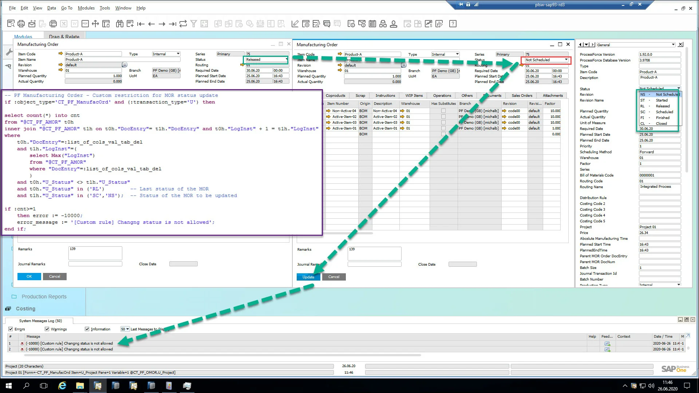

# Transaction Notification Examples

Here you can find an example usage of Transaction Notification.

---

## Manufacturing Order

### Scenario 01 - Manufacturing Order's Status Blocking

It is required to block the Manufacturing Order status change to Scheduled or Not Scheduled when the current Manufacturing Order status is in the Released status.



#### For HANA

```sql
-- PF Manufacturing Order (MOR) - Custom restriction for MOR status update 
if :object_type='CT_PF_ManufacOrd' and (:transaction_type='U') then
select count(*) into cnt
from "@CT_PF_AMOR" t0h -- Log table of  MOR header
inner join "@CT_PF_AMOR" t1h on t0h."DocEntry"= t1h."DocEntry" and t0h."LogInst" + 1 = t1h."LogInst"
where
    t0h."DocEntry"=:list_of_cols_val_tab_del
    and t1h."LogInst"=(
        select Max("LogInst")
        from "@CT_PF_AMOR"
        where "DocEntry"=:list_of_cols_val_tab_del
        )
    and t0h."U_Status" <> t1h."U_Status"
    and t0h."U_Status" in ('RL')        -- Last status of the MOR
    and t1h."U_Status" in ('SC','NS');  -- Status of the MOR to be updated
     
if :cnt>=1
    then error := -10000;
    error_message := '[Custom rule] Changng status is not allowed';
end if;
```

#### MS SQL

```sql
-- PF Manufacturing Order (MOR) - Custom restriction for MOR status update 
if @object_type='CT_PF_ManufacOrd' and (@transaction_type='U')
begin
declare @cnt int;
select @cnt = count(*)
from "@CT_PF_AMOR" t0h -- Log table of  MOR header
inner join "@CT_PF_AMOR" t1h on t0h."DocEntry"= t1h."DocEntry" and t0h."LogInst" + 1 = t1h."LogInst"
where
    t0h."DocEntry"=@list_of_cols_val_tab_del
    and t1h."LogInst"=(
        select Max("LogInst")
        from "@CT_PF_AMOR"
        where "DocEntry"=@list_of_cols_val_tab_del
        )
    and t0h."U_Status" <> t1h."U_Status"
    and t0h."U_Status" in ('RL')        -- Last status of the MOR
    and t1h."U_Status" in ('SC','NS');  -- Status of the MOR to be updated
     
if @cnt>=1
    begin
        select @error = -10000;
        select @error_message = '[Custom rule] Changng status is not allowed';
    end
end
```
