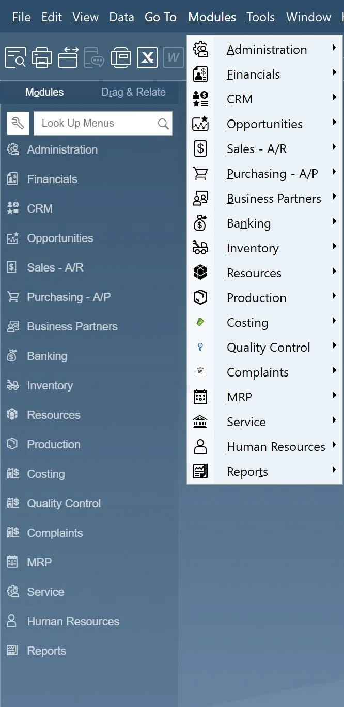
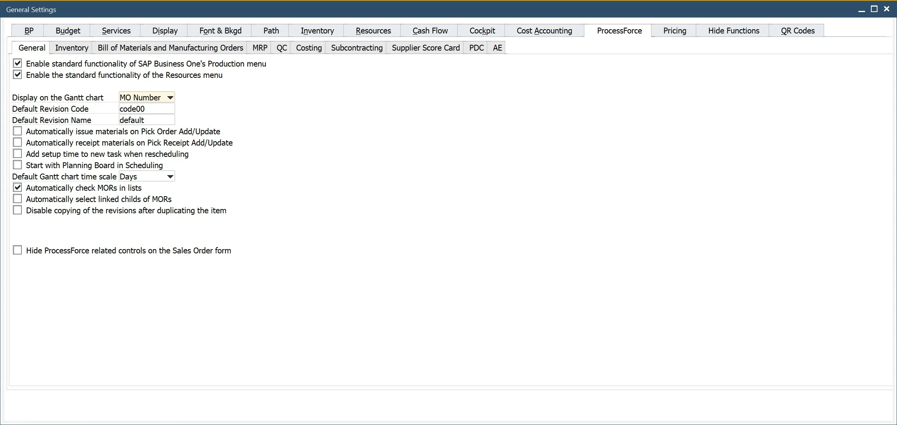
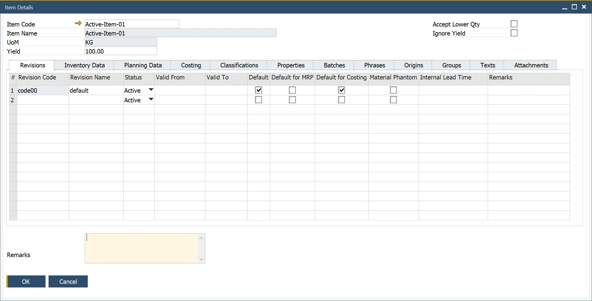
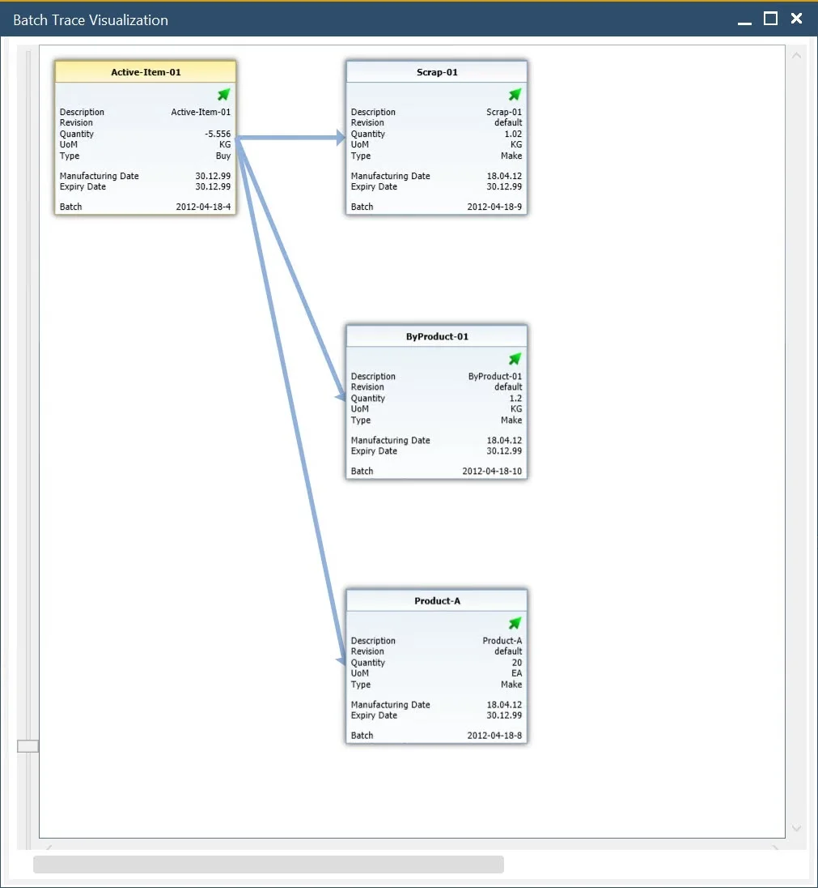
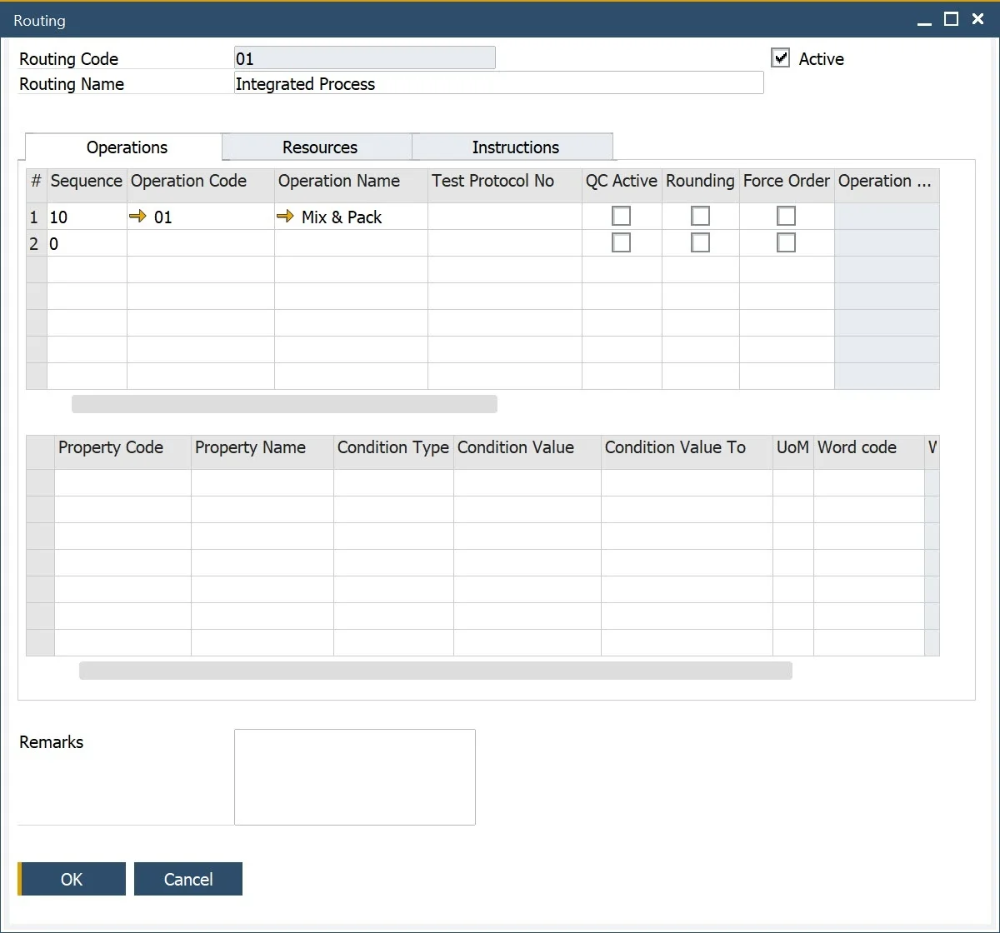
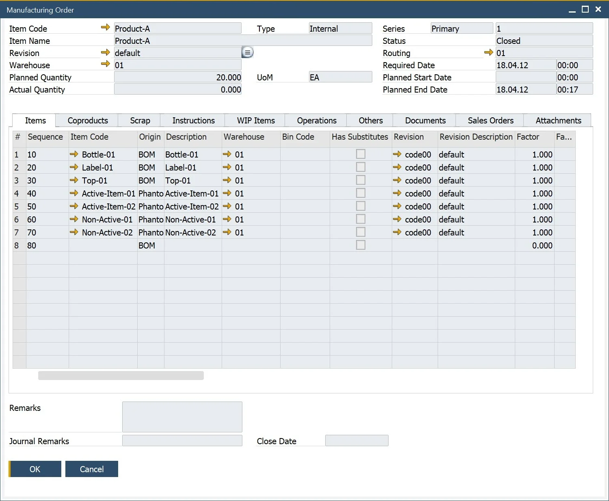
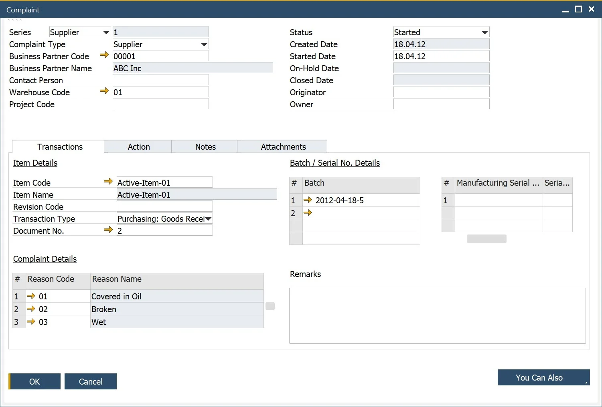

# Introduction to ProcessForce

Welcome to the ProcessForce 10.0 Documentation. On this page you can find a quick introduction to the application. You will be installing and starting the application, setting it up, and getting to know the opportunities that the application gives.

:::info
    This page contains a compilation of basic pieces of information on how to start working with the ProcessForce solution. To get more detailed instructions, check other sections of the documentation.
:::

## Getting Started

To start using ProcessForce add-on you must:

1. Adjust system which ProcessForce will be working on to the add-on requirements. You can find it [here](./administrator-guide/system-requirements.md).
2. Download files required for installation of CompuTec License Server and Add-on components. You can download it from [here](./releases/download.md).
3. Install both components. You can find detailed information on how to do this [here](./administrator-guide/installation/first-installation/license-server.md). ProcessForce will work in trial mode for 14 days since the first installation of CompuTec License Server.
4. After the expiration of the trial mode, ProcessForce requires a valid license file to be used. You can obtain it from your ProcessForce provider – check [here](./administrator-guide/licensing/license-request.md) how to do this.
5. ProcessForce is up and ready to work with. You can manage it, e.g. turn off, upgrade, by a standard SAP Business One add-on administration functionality: `Main Menu → Administration → Add-ons`.

## Main Menu and Functions

ProcessForce contains many functions. You can get to them through the standard SAP Business One menu. The main ProcessForce functions are presented below with the Main Menu path required to reach it.

## General Settings

:::info Path
    Administration → System Initialization → General Settings → ProcessForce tab
:::

Here you can define general ProcessForce settings, e.g. set default values or time constraints for many of the add-on features.

To find out more about every tab and options on it, click [here](./user-guide/system-initialzation/general-settings/overview.md).

## Product Data Management

:::info Path
    Inventory → Item Details
:::

Extended Item definition allows assigning much more information to an item. In the menu you can assign revision, classifications, phrases, groups, texts, and attachments to a specific item.

Click [here](./user-guide/item-details/overview.md) to find out more.

## Ingredient Declaration

:::info Path
    Inventory → Ingredients
:::

ProcessForce provides an extension to product master data. Nutrient and ingredient information can be used to create complex ingredient listings and declaration statements, thus are useful in the creation of product labels.

Click [here](./user-guide/ingredient-declarations/overview.md) to find out more.

## Batch Control

:::info Path
    Inventory → Item Management → Batches
:::

Batches are groups of the same products. Batch Master Data functionality allows to define of many values for a whole group of the same products.

Click [here](./user-guide/inventory/batch-control/overview.md) to find out more.

## Batch Traceability

:::info Path
    Inventory → Item Management → Batches → Batch Traceability
:::

Batches are a base for traceability – a function that allows to track down a certain raw material on every level of production and a product in later distribution, which can be used e. g. in a fast and easy recall process. Batch Trace functionality allows tracing a whole track that a certain product passed.

Click [here](./user-guide/inventory/batch-control/batch-traceability.md) to find out more.

## Bill of Materials

::info Path
    Production → Bill of Materials
:::

Bill of Materials (BOM) represents a product structure that is a list of raw materials or sub-components that together creates a specific product. BOM is the main concept of process manufacturing. It allows defined values like co-products, scrap, yield, and many more things crucial for production.

Click [here](./user-guide/formulations-and-bill-of-materials/bill-of-materials/overview.md) to find out more.

## Production Routings

:::info Path
    Production → Routings
:::

Routing determines the steps that are performed in the manufacturing process for a specific product. Resources required for production and Operations performed on it can be defined within Routing. ProcessForce solution allows defining of many settings for Routing, Operation, and Resource.

Click [here](./user-guide/routings/overview.md) to find out more.

## Manufacturing Order

:::info Path
    Main Menu → Production → Manufacturing Order
:::

ProcessForce Manufacturing Orders are used to plan, execute and record production activities.

Click [here](./user-guide/manufacturing/manufacturing-order/overview.md) to find out more.

## Production Scheduling

:::info Path
    Production → Manufacturing Order → Scheduling
:::

Based upon many resources and time constraints, ProcessForce provides a simple but powerful scheduling solution to manage the Manufacturing Orders within the plant and to manually re-schedule via "drag and drop" means.

Click [here](./user-guide/scheduling/overview.md) to find out more.

## Product Costing

:::info Path
    Main Menu → Costing
:::

ProcessForce Product Costing has been built to take advantage of all the costing methods provided by SAP Business One. Thus providing a solution that supports the costing, analysis, and finance controlling operations.

Click [here](./user-guide/costing-material-and-resources/item-costing/overview.md) to find out more.

## Quality Control

:::info Path
    Main Menu → Quality Control
:::

A Quality Control Test can be generated using predefined test protocols, from Goods Receipt PO, Complaint, Manufacturing Order. A request for it can also be set up by an SAP B1 Business Alert. QC functionality allows to set a wide range of details for a quality test, e.g. test protocol templates, Resources and Items used to conduct a test, assigned Inspector, frequency of a test, defects, reasons along with additional instructions and attachments, and more.

Click [here](./user-guide/quality-control/overview.md) to find out more.

## Complaint Management

:::info Path
    Main Menu → Complaints
:::

You can create and manage complaints from customers, suppliers, or internal departments. Functionality allows recording, analyzing and starting action upon complaints, among other things.

Click [here](./user-guide/complaint-management/complaint.md) to find out more.

