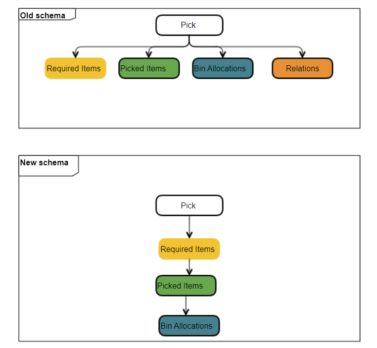
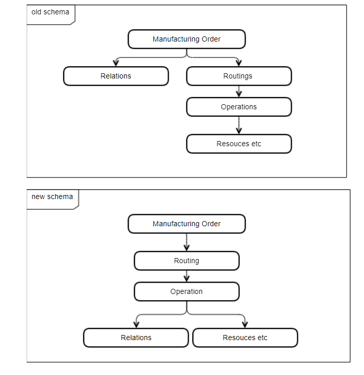

# Upgrade Notes for version 10.0.7

Due to the changes presented on this page, the 9.30 PL14 R3 10.0.7 versions are released in two variants: with the changes and with a backward compatibility (to give our partners time to rewrite any affected custom code).

WEB API structure of data was changed for the following Objects:

    - Pick Order
    - Pick Receipt
    - Routings
    - Bill of Materials
    - Manufacturing Order

---

## Pick Order And Pick Receipt Model Changes

:::note
Relation of  PickedItems and BinAllocation is now in hierarchy
:::

## Routing, Bill of Materials, and Manufacturing Order

