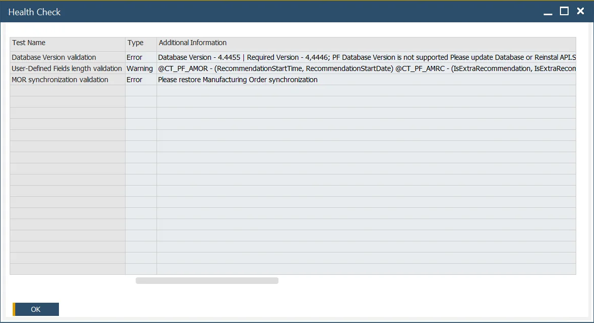

# Health Check

ProcessForce Health Check is an option that can help diagnose some of the problems with ProcessForce. The information in this form suggests a resolution to be performed by a User. It can also be a clue for a support team consultant. Therefore, sending results from this form to a support ticket is good.

:::info Path
    Upper menu → Help → Support Desk → Health Check.
:::

Example Health Check results:

The Health Check results table contains the following:

- Test Name - a description of tested validations.
- Type – it can be Error, Warning, or Information.
- Additional Information – usually contains a suggested solution.
- Documentation link – a documentation entry related to the problem.
- Object Type and Code.
