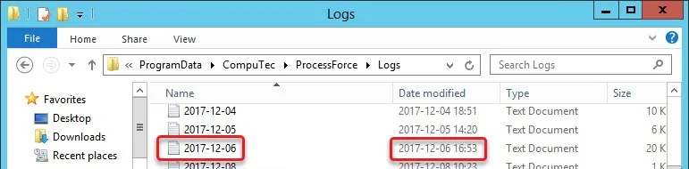
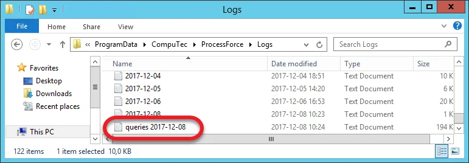

# Logging

You may be asked to send ProcessForce log files during the support procedure. Adding them to a support ticket (even without the request) may speed up the support procedure. On this page, you can find out where to find the files.

---

## Log files directories

### ProcessForce

The ProcessForce log files are kept in the following location: `C:\ProgramData\CompuTec\ProcessForce\Logs`.

Choose the file that is related by time and date to the issue you are reporting:



### CompuTec License Server

The CompuTec License Server log files are kept in the following location: `C:\ProgramData\CompuTec\License Server\Logs`.

## Additional options

:::caution
    Please note that changes described in this section (raising the log level or adding new rules) can significantly impact the system's performance. Therefore it is recommended to turn it on only during problem investigation (and to turn it off afterward).
:::

### Log level

If it is needed or asked by support, the log level can be raised in the following file: `C:\Program Files\SAP\SAP Business One\AddOns\CT\CompuTec ProcessForce\X64Client\NLog.config`.

It is possible to add a rule to save all queries executed on a database to a log file.

To enable the option, it is required to:

- Go to `Nlog.config` file. A default location of it is `C:\Program Files\SAP\SAP Business One\AddOns\CT\ProcessForce`.
- uncomment the following line (remove `<!--` and `-->`):

    ```config
    <!--<logger name="QueryNLogger" minlevel="Trace" writeTo="fileEventLogForQueries" />-->
    ```

Once the following step is done, all database queries will be logged by default in this location: `C:\ProgramData\CompuTec\ProcessForce\Log`.

By default, log files are saved in this location with the current date as the name, e.g., `2023-12-15.log`. After enabling the option, additional files will be held: with the `queries` prefix, e.g., `queries 2023-12-15.log`.



To disable the option, comment out the previously uncommented line (add `<!--` and `-->` to it) in `Nlog.config`.
