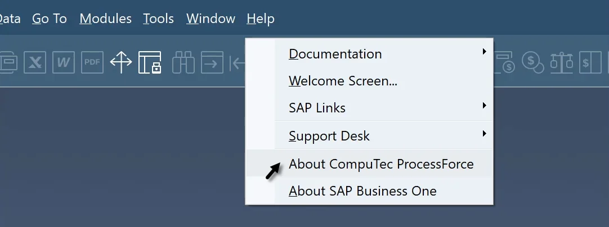
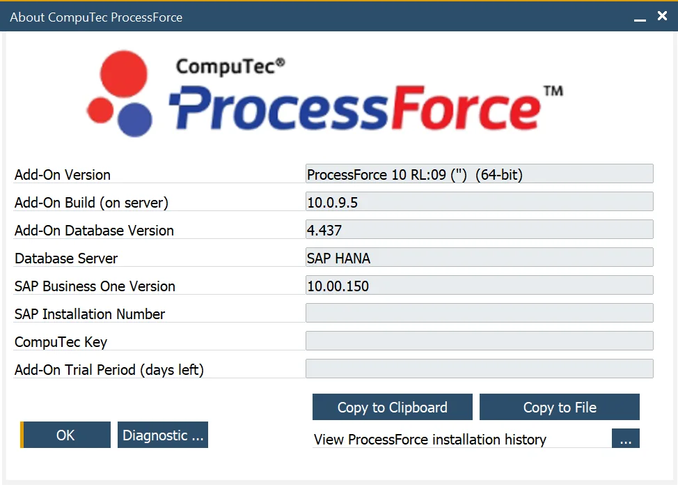
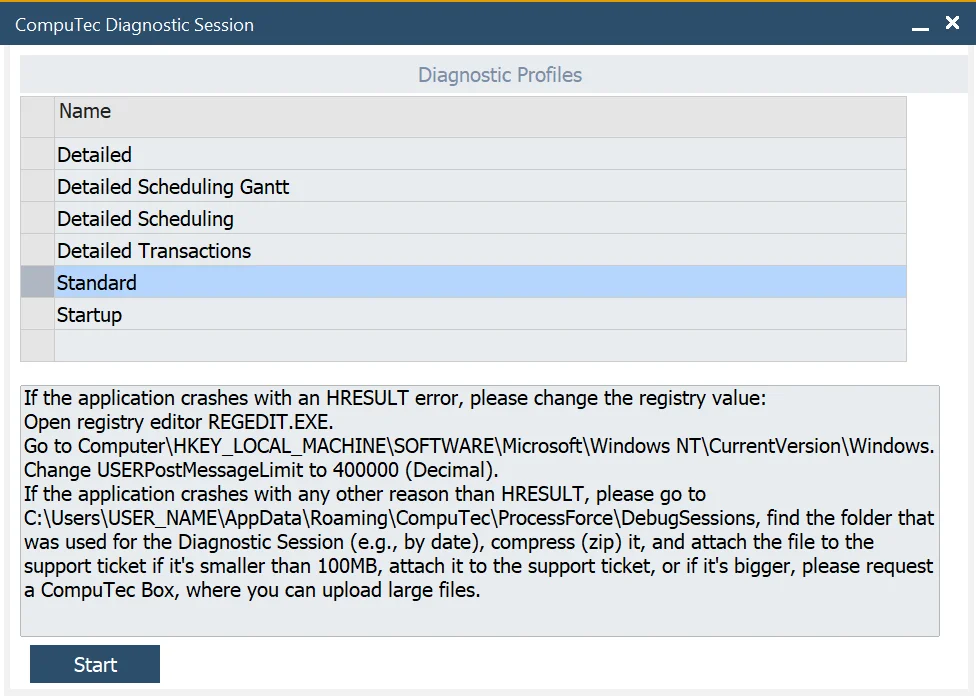
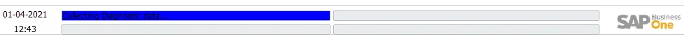
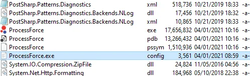
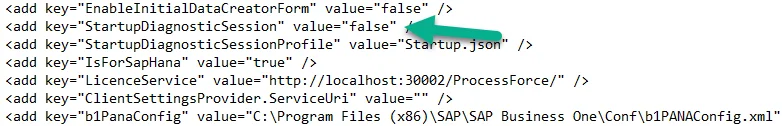

# Diagnostic Session

The Diagnostic Session functionality lets you record all user activities (related to ProcessForce functionality) inside the SAP Business One desktop client.

CompuTec Support Team can request an issue reproduction using this functionality during the support procedure.

:::info Path
    The Diagnostic Session is available from version 9.30 PL14 R5 and 10.0 R9.
:::

---

## Starting Diagnostic Session

### How to start Diagnostic Session

Enable the Diagnostic button by opening the About CompuTec ProcessForce form with the keys Ctrl & Shift pressed:

Open the Profile selection form by pressing the Diagnostic button:

Select the Diagnostic Profile by choosing it:

Press the Start button.

A system message will be displayed, which needs to be confirmed:

After confirming this rule, the system starts the Diagnostic Session.

If the Diagnostic Session is enabled, the blue indicator is the SAP Business One message bar appears.

### How to start Diagnostic Session when ProcessForce starts

The Diagnostic Session can also be started automatically when ProcessForce starts, which might help in case of problems related to the installation or initial crashes.

Please remember to disable it if it is no longer needed.

Please use these steps to enable it:

1. Go to the ProcessForce.Exe file location and find ProcessForce.exe.config, and edit the file:

    
2. Change StartupDiagnosticSession value to true:

    
3. You can also change the `StartupDiagnosticsSessionProfile` value to the name of the available profile files. By default, it's `Startup.json`, which corresponds to the Startup profile.
4. Start SAP Business One with CompuTec ProcessForce.
5. The diagnostic session will start automatically.

## Finish Diagnostic Session

You need to finish the Diagnostic Session, whether it was started from the user interface or by changing the `ProcessForce.exe.config` file directly.

In this case, we prepare and save all files to the specified folder.

1. Open Diagnostic Session Profile from how it is described in the How to start Diagnostic Session section - steps 1-2.
2. Press Stop Session.
3. Specify a path to when the diagnostic file will be saved.

When the session is finished, if the file is smaller than 100MB, attach it to the support ticket. If it is more extensive, please request a CompuTec Box to upload large files.

Profiles

|       Profile Name        |                                   Information                                   |                             Performance impact                             |
| :-----------------------: | :-----------------------------------------------------------------------------: | :------------------------------------------------------------------------: |
|         Standard          |                        Captures General information low.                        |                                    Low                                     |
| Detailed Scheduling Gantt |            Captures detailed information about Gantt and scheduling             |                                    High                                    |
|         Detailed          |                    Capture detailed report of all processes                     | Extreme Please do not use it unless requested by the CompuTec Support Team |
|    Detailed Scheduling    |                 Captures detailed information about scheduling                  |                                    High                                    |
|   Detailed Transactions   |                Capture information about Inventory transactions                 |                                    High                                    |
|          Startup          | Capture information about PF starting and Database structure installation high. |                                    High                                    |

:::info Performance
    Please be aware that debugging session is slowing down ProcessForce execution time.

    This tool is still in a test phase, so unexpected issues might occur, and we recommend running it on a copy of the company database.
:::

## Troubleshooting

1. If the application crashes with an HRESULT error, please change the registry value:

    - Open registry editor REGEDIT.EXE.
    - Go to Computer\HKEY_LOCAL_MACHINE\SOFTWARE\Microsoft\Windows NT\CurrentVersion\Windows.
    - Change USERPostMessageLimit to 400000 (Decimal).
2. If the application crashes for any other reason than HRESULT, please go to `C:\Users\<USER_NAME>\AppData\Roaming\CompuTec\ProcessForce\DebugSessions`, find the folder that was used for the Diagnostic Session (e.g., by date), compress (zip) it, and attach the file to the support ticket if it's smaller than 100MB, attach it to the support ticket, or if it's bigger, please request a CompuTec Box, where you can upload large files.
