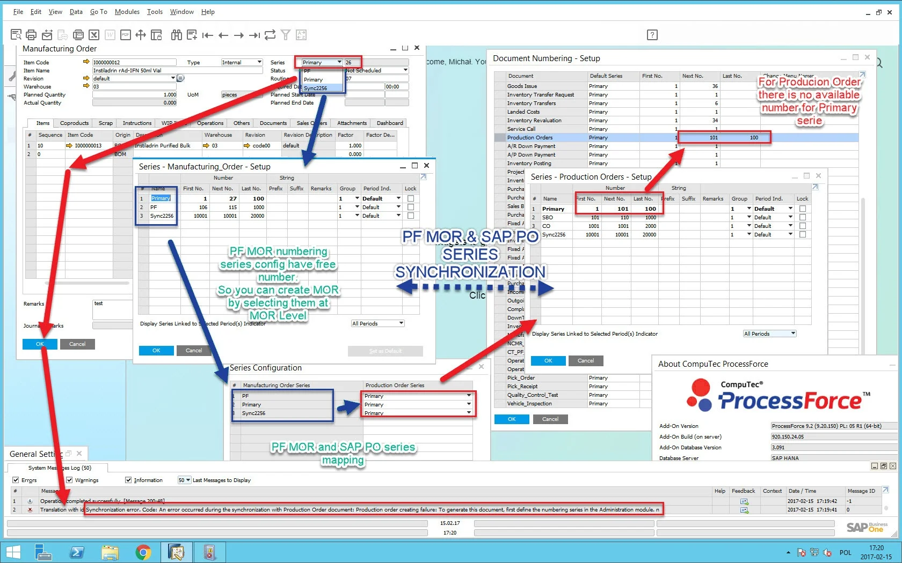
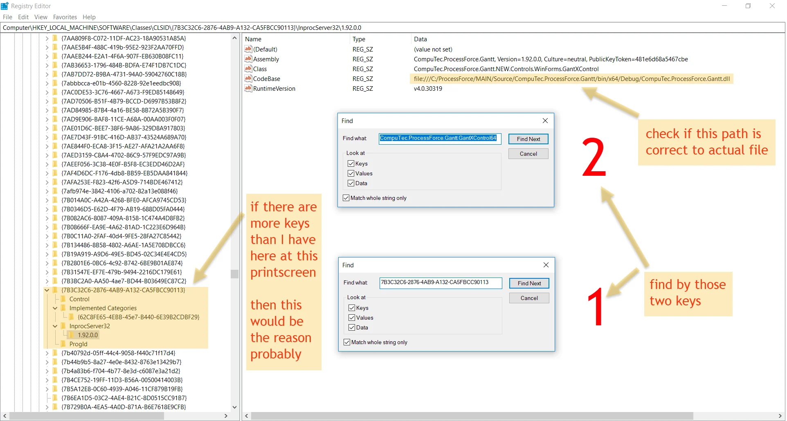

# General Functions

## Problem with document series

```text
There was a problem with the document series.
```

In an attempt to open Manufacturing Order, some users get an error communication (There was a problem with the document series).

### Solution {#solution-1}

Permission for the numbering series groups is not assigned to the specific user. Check if authorization for the numbering series group is set for a particular user. Click here to find out more.

## Form - Invalid Form

```text
Form - Invalid Form
```

The error message is displayed on an attempt to open a standard SAP Business One form when ProcessForce is set up as mandatory or automatic.

### Solution {#solution-2}

The problem can be solved in many ways, depending on the system, therefore please try to perform the following scenarios:

### Scenario 01

- Open SAP Business One client and go to Add-on Administration.
- Change ProcessForce startup to manual.
- Restart SAP Business One client.
- Go to Add-on Manager and run ProcessForce.
- Check, for example, SAP Business One forms by showing System Message Log or other.
- Go to Add-On Administration and change ProcessForce startup to Mandatory/Automatic.
- Restart SAP Business One client and check the result.

### Scenario 02

- Go to SAP Add-On Administration and change the order of add-ons by using up/down arrows
- Restart SAP Business One client

### Scenario 03

- Remove the ProcessForce add-on from the Add-on Administration level.
- Log into the company again to the add-on uninstalling process finishes.
- Close SAP Business One client.
- Open Windows Programs and Features and remove CompuTec ProcessForce API.
- Open SAP Business One client, log into the company, and register the add-on again.

```text
Synchronization error. Code: An error occurred during the synchronization with the Production Order document: Production order creating failure: To generate this document, first define the numbering series in the Administration module
```

One of the reasons for the error in the incorrect Production Order document numbering series definition:



## PF Manufacturing Order & SAP Production Order Synchronization error during Pick Order

```text
Re-throwing An error occurred during the synchronization with the Production Order document: Production Order updating failure: The warehouse is not defined for the item.  [WOR1.wareHouse][line: 1] , 'Row no. 1'
```

### Description

When making Pick Order for all Items that need to be issued to production, the above error appears.

### Solution {#solution-3}

- check CoD Item is correctly defined (need to have one, default Warehouse defined in `Item Master Data > Inventory tab`). See MRP-related configuration.
- check that all warehouses used in Manufacturing Order for Items/Coproducts are defined in `Item Master Data > Inventory` tab correctly for each Item and that Warehouse is not locked.

One reason for the error is the incorrect Production Order document numbering series definition.

## Cannot save Time Bookings document

```text
Missing Account Code for line 1
```

### Scenario

- Create a Manufacturing Order for an Item with Routing attached.
- Materials are issued to the Manufacturing Order, and Final Good is produced.
- There is a labor-type Resource. The work of the employee is to be recorded on the Resource.
- The Resource has only Run Time defined in Resource Costing.
- Time is to be recorded for labor type Resource on Time Bookings form.
- Time for an Employee will be recorded on Employee Time Recording (Time Bookings context menu). Saving changes with the Save button.
- An error occurs on clicking Add on Time Bookings.

### Reason

Not all Times for a given Resource have Accounts assigned in Resources Accounting.

### Solution {#solution-4}

Assign an Account to each of the Times on Resource Accounting. Click here to find out more.

## Gantt chart does not open



Please open Windows Registry and find the following keys: `7B3C32C6-2876-4AB9-A132-CA5FBCC90113 CompuTec.ProcessForce.Gantt.GantXControl64`.
Check the screenshot above and take the same in your environment. Also, please check if the file path is correct: find the `CompuTec.ProcessForce.Gantt.dll` file in your system, and then check if the file path in the registry is valid. Please take a screenshot too. Then create a support ticket on support.computec.pl with the problem description and the screenshots.

## Closing SAP Business One client while opening a ProcessForce window after at least 15 minutes of inactivity or after re-logging into the company database

### Issue

In the SAP Business One Cloud environment (managed by Cloud Control Center), there is a known defect causing the closure of SAP Business One client without any message when logged in as Partner Support User (`_PSU_1` or `_PSU_2` User Code) while opening a ProcessForce window after at least 15 minutes of inactivity or after re-logging – without closing SAP Business One client – into the company database.

### Log content

The issue writes the following message (which is part of a more extensive section) to the ProcessForce log file:

```text
CompuTec ProcessForce: Error message: The remote procedure call failed. (Exception from HRESULT: 0x800706BE)
Exception message: The remote procedure call failed. (Exception from HRESULT: 0x800706BE)
```

### Solution {#solution-5}

The issue is being investigated and planned to be fixed in a future ProcessForce version.

## Database Test Before Upgrade results with the following error: Undefined Table and Fields (@CT_PF_MOR5_OLD, @CT_PF_AMOR5_OLD)

### Prerequisite

ProcessForce version equal to or later than 10.0 RL11.

### Scenario

- Running SAP Business One Setup Wizard and testing DB(s) before an upgrade.
- During the test, the system detects warnings similar to `Undefined UDF and UDT` and refers to **SAP Note**: 1079098.
- Executing the check queries from the note one by one. The below queries from the note return some lines related to `@CT_PF_MOR5_OLD` and `@CT_PF_AMOR5_OLD`

  - {"2."} UDT is not registered
  - {"8."} UDF exists but is not defined

### Reason

Before the 10.0 RL11 version, ProcessForce used a child table (`@CT_PF_MOR5`) to register transaction details. It has been decided that ProcessForce will not register document details in the `@CT_PF_MOR5` table but will collect them from the same document by a view, resulting in performance improvement. The `@CT_PF_MOR5_OLD` table was created during this migration. All records in `@CT_PF_MOR5` have been moved to the `@CT_PF_MOR5_OLD` table in case of any future possible data requirement from a legacy table. The `@CT_PF_MOR5` table has been removed from the database. After version **10.0 RL11**, you have the `CT_PF_MOR5` view and `@CT_PF_MOR5_OLD` and `@CT_PF_AMOR5_OLD` tables.

### Solution {#solution-6}

We do not automatically remove the `@CT_PF_MOR5_OLD` and `@CT_PF_AMOR5_OLD` tables, but they can be removed anytime below the DROP statement.

```sql
DROP TABLE "@CT_PF_MOR5_OLD";
DROP TABLE "@CT_PF_AMOR5_OLD";
```

:::danger
    We recommend keeping the mentioned tables for some time (2-3 months) after upgrading ProcessForce to a version equal to or later than **10.0 RL11**.
:::
