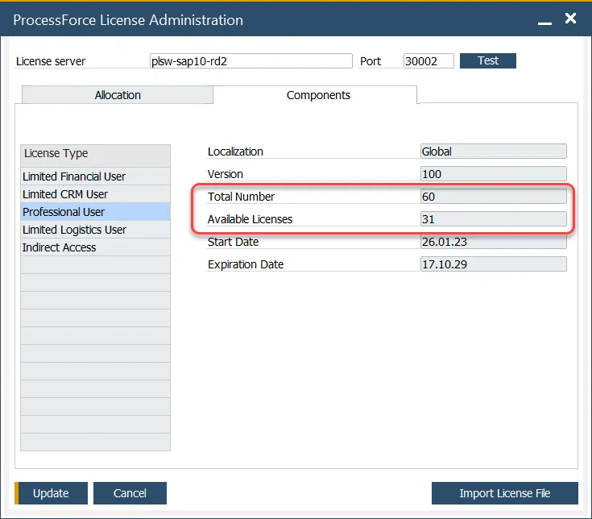
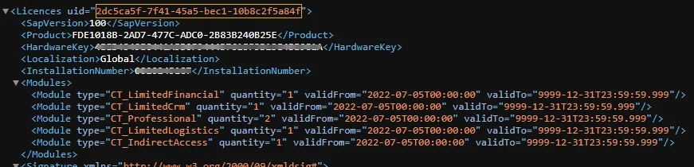

# Licensing Issues

The most common issue connected to ProcessForce licensing will be noted on this page.

---

## The data needed to generate a license file is not available

The following data is required to generate a ProcessForce license file: Installation Number, CompuTec Key, and SAP Business One version. In some cases, the data can be missed in the About ProcessForce form.

### The installation Number key field is empty

Installation Number is generated for SAP Business One installation. The lack of this number suggests that the SAP Business One license is not imported.

### CompuTec Key field is empty

In some cases CompuTec Key field on the About ProcessForce form is empty. It can indicate a problem with the connection to CompuTec License Server. In this case, please try to perform the following steps:

1. Probably, the wrong version of CompuTec License Server is installed. Install the latest version: Download section.
2. Restart SAP Business One client.
3. Open Administration > License > ProcessForce License Administration.
4. Check if the specified License server is correct and click the Test button. The following communication on the AP status should be displayed: Test the connection to the CompuTec License Server completed successfully.

    - If any other communication is displayed, please check if the name / IP address of the server where CompuTec License Service is installed is correct.
    - If yes, then on this server, go to Services and check if the CompuTec License Server service is running.
5. Click Update after making any changes.
6. Open Help > About ProcessForce. You should now see the Installation Number and CompuTec Key.

## Error message: The server was unable to process the request

```text
Error message: The server could not process the request due to an internal error. For more information about the error, turn on IncludeExceptionDetailInFaults (either from ServiceBehaviorAttribute or the <serviceDebug> configuration behavior) on the server to send the exception information back to the client or turn on tracing as per the Microsoft .NET Framework SDK documentation and inspect the server trace log.
```

```text
Response status code does not indicate success: 500 (The given key was not present in the dictionary.)
```

### Solution {#solution_1}

1. Stop Computec Licence Server service.
2. Perform a backup and remove the content of the following folders:

    - `C:\ProgramData\CompuTec\License Server\CacheFolder\`
    - `C:\ProgramData\CompuTec\License Server\Licenses\`
3. Start Computec Licence Server service.
4. Import ProcessForce license in SAP Business One client again.

## Error message: Not authorized license assignment

```text
Response status code does not indicate success: 500 (Not authorized license assignment)
```

### Description

The error occurs on an attempt to load and assign a license file.

### Solution {#solution_2}

Be sure to run SAP Business One with administrator privileges before loading and assigning a license file.

## Cannot assign all licenses

In some cases, it is not possible to assign all of the licenses available in a license file:

`Administration > ProcessForce License Administration`:



In this example, we have a license file with 60 Professional Users loaded, 28 users assigned on the Allocation tab, and 31 licenses still available to be assigned; therefore, one professional user license is missing.

### Issue

Similarly, as with SAP Business One user removal, it is necessary to unpin a ProcessForce license from the user first. Otherwise, the license will still be reserved for the removed user without the possibility to unpin it.

### Solution {#solution_3}

The issue will be fixed in one of the future ProcessForce releases. Until then, please contact CompuTec support in case of getting this problem.

## Closing SAP Business One client while trying to assign a user a ProcessForce license

### Issue

In the SAP Business One Cloud environment (managed by Cloud Control Center), the known defect is causing the closure of the SAP Business One client without any message when logged in as Partner Support User (`_PSU_1` or `_PSU_2` User Code) while trying to assign a user a ProcessForce license.

### Investigating the cause of the problem

Two aspects can cause the issue, and they can be identified by a related message (which is part of a more extensive section) in the ProcessForce log file.

#### Reason 1

```text
No connection could be made because the target machine actively refused it 127.0.0.1:40000
```

The above message may indicate that the b1-local-machine.xml file is located in the following folder on the system where used SAP Business One client is installed:

```text
C:\Program Files\SAP\SAP Business One DI API\Conf
```

includes the incorrect name – localhost – of SAP Business One License Server in LicenseServer leaf:

```xml
<node name="SAP Business One">
  <leaf kind="single" name="LicenseServer" type="String">
    <value>localhost:40000</value>
  </leaf>
```

That value is set by default by SAP software during the installation of a related component.

##### Solution {#solution_4}

Please set the correct name of the corresponding SAP Business One License Server in the b1-local-machine.xml file, save the change, and check again.

#### Reason 2

```text
The request was aborted: Could not create SSL/TLS secure channel.
```

The above message may occur when you try to assign a ProcessForce license to a user that does not have the required SAP Business One license – if you are sure it is not the case, please go to the Workaround section below.

##### Solution {#solution-05}

The issue is being investigated and planned to be fixed in a future ProcessForce version.

##### Workaround

You can assign ProcessForce licenses to users by manually preparing the content of the cache.xml file with the license assignments on the system where the connected CompuTec License Server is installed.

An exemplary content of the file is presented below:

```xml
<?xml version="1.0"?>
<LicenceCache xmlns:xsd="http://www.w3.org/2001/XMLSchema" xmlns:xsi="http://www.w3.org/2001/XMLSchema-instance">
  <Licences>
    <Licence>
      <LicenceUid>PF-LICENSE-UID</LicenceUid>
      <Users>
        <User>
          <UserName>USER-CODE-A</UserName>
          <UserLicences>
            <UserLicence>
              <InstallationNumber>SAP-B1-LICENSE-INSTALLATION-NUMBER</InstallationNumber>
              <ModuleType>CT_Professional</ModuleType>
            </UserLicence>
          </UserLicences>
        </User>
        <User>
          <UserName>USER-CODE-B</UserName>
          <UserLicences>
            <UserLicence>
              <InstallationNumber>SAP-B1-LICENSE-INSTALLATION-NUMBER</InstallationNumber>
              <ModuleType>CT_LimitedLogistics</ModuleType>
            </UserLicence>
            <UserLicence>
              <InstallationNumber>SAP-B1-LICENSE-INSTALLATION-NUMBER</InstallationNumber>
              <ModuleType>CT_IndirectAccess</ModuleType>
            </UserLicence>
          </UserLicences>
        </User>
      </Users>
    </Licence>
  </Licences>
</LicenceCache>
```

`USER-CODE-A` and U`SER-CODE-B` are User Codes of existing SAP Business One user.

`SAP-B1-LICENSE-INSTALLATION-NUMBER` you can find on About SAP Business One or About CompuTec ProcessForce window.

`PF-LICENSE-UID` value you can read by copying the imported ProcessForce license file located in the following location:

```text
C:\ProgramData\CompuTec\License Server\Licenses
```

To another location, changing its extension to .xml, and opening it:



The prepared cache.xml file should be saved in the following location:

```text
C:\ProgramData\CompuTec\License Server\CacheFolder
```

After restarting the CompuTec License Server service and ProcessForce, you should see the license assignments in the ProcessForce License Administration window.
