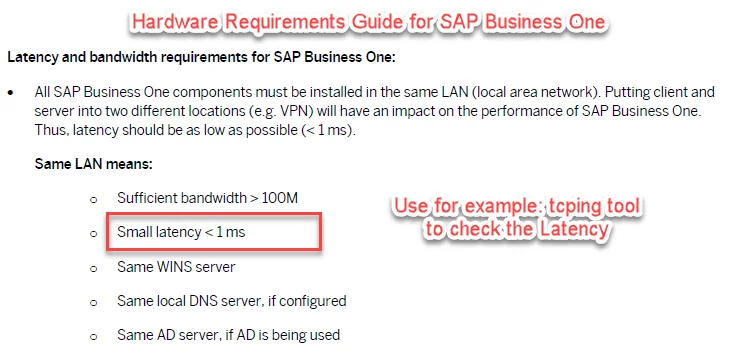

# Performance Issues

On this page, you can check the most common performance problems while working with ProcessForce and ways of resolving these issues.

---

## The long delay in opening and browsing through some of the ProcessForce forms on SAP Business One, the version for SAP HANA

In some cases, users can experience a long delay in opening some documents or switching to another one when operating ProcessForce on SAP Business One, a version of SAP HANA. Usually, the issue affects the Bill of Materials, Manufacturing Order, Item, or Business Partner Master Data, among others.

If you experience the described issue, please collect the following data, and raise a support ticket on support.computec.pl with the collected data.

### Network bandwidth and Latency

Download: [tcping](https://www.elifulkerson.com/projects/tcping.php)

Command: `tcping -t IP port`

- Do network latency tests using the `tcping -t` command and take a screenshot with the results.
- Obligatory do a complete set of tests and do separate tests for the cases:

  - from the workstations/server to the SAP HANA database (default port: 30015),
  - from the workstations/server to SAP License Server (default port: 40000),
  - from the workstations/server to CompuTec License Server (default port: 30002),
  - use proper settings IP / Server name, which is currently configured in SAP B1 Client.
