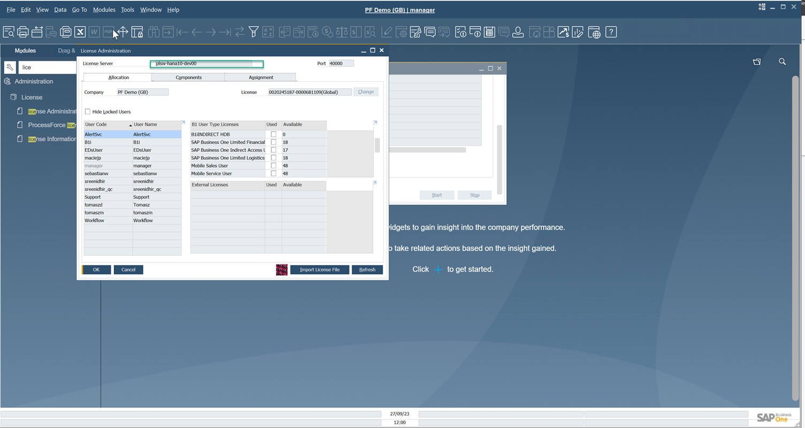
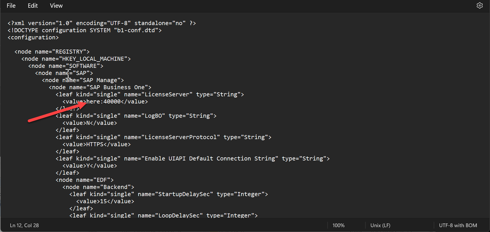

# SAP Business One SP2308

There are two known issues with the SAP Business One FP 2308 that are planned to be fixed in the next ProcessForce release. For now we offer the following workarounds.

---

## Cannot open any ProcessForce form

1. Open Notepad (or any other text editor) as administrator.
2. Open the following file: C:\Program Files\sap\SAP Business One DI API\Conf\b1-local-machine.xml.
3. Replace the localhost to SLD address from:

    
    

## Direct Access

SAP Business One SP2308 is supported on two versions of SAP HANA:

| SLES Version | SAP HANA Database Revision | SAP HANA Client Version |
| --- | --- | --- |
| 15 SP2, SP3, or SP4 | Enterprise Edition 2.0 SPS 05 Revision 059.04 | 2.7.26 |
| 15 SP2, SP3, or SP4 | Enterprise Edition 2.0 SPS 05 Revision 059.09 | 2.17.22 |

No action is required, when SAP HANA Database **059.04** and SAP HANA Client **2.7.26** are used.

However, when SAP HANA Database 059.09 and SAP HANA Client 2.17.22 are used, there is a very high chance that the previous SAP HANA Client version is not removed from the machine during the SAP HANA Client upgrade, and two or more SAP HANA Client libraries are published on the machine (in the Global Assembly Cache - GAC), what creates library conflicts.

After upgrading the SAP HANA Client to version **2.17.22**, please check if you don't have more folders with previous versions in the location: **C:\Windows\Microsoft.NET\assembly\GAC_MSIL\Sap.Data.Hana.v4.5.** You should only have one folder with the versions in its name, e.g.: **v4.0_2.17.22.0**__0326b8ea63db4bc4.

If there are more folders, please stop all ProcessForce or any other CompuTec software instances and remove these folders except v4.0_2.17.22.0__*.

After removing these folders, restart the machine.
