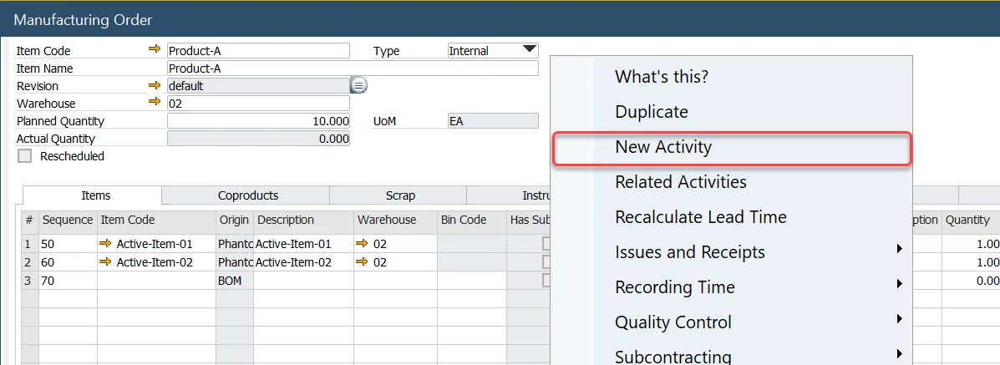
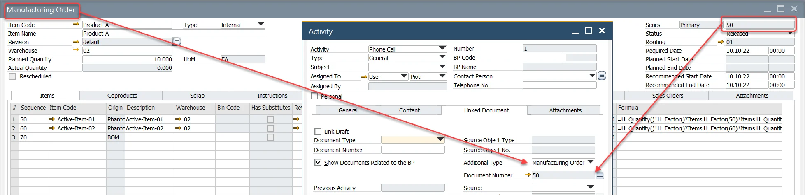
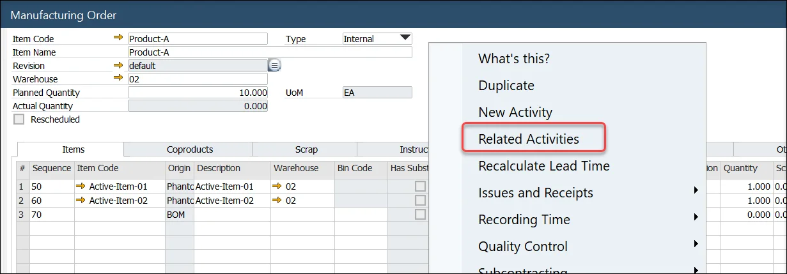

# Activities for ProcessForce Documents

SAP Business One Activities can be used on ProcessForce documents. Activity in SAP Business One refers to recording or reminding interactions between an enterprise and its business partners, such as tasks, meetings, or phone calls.

---

## Manufacturing Orders

### Create an Activity

To create an activity for a manufacturing order, select the Create Activity menu option:

The Activity form opens.

Add a BP Code to the activity.

:::caution
    Internal Business Partner Code

    To use Activities related to Manufacturing Orders, it is required to create an internal or dummy Business Partner Code.
:::

Note: The document type and document number are copied into the activity form

### Manufacturing Order Activity Report

Select the Reports menu and click Related Activities:

All related Activities are displayed within the Activity Report.

## Complaints

To create an Activities for a Complaint, select the New Activity menu option (to check Activities already related to this Complaint, click Related Activities):

- The Activity form opens.
- The BP Code from the Complaint is automatically added.
- Within the linked document tab, the Document Type and Document Number from the Complaint are copied (the same way for Manufacturing Orders - see the example above).

## Quality Control

### QC test with no BP Code

- The option is available from the document's tables, not the header (as it is in previous document types).
- The Quality Control Test document type and number are copied into the Linked Documents Tab.

### QC test with BP Code

- As in previous documents, navigate in the same way to create an Activity.
- When a QC test includes the BP Code, for example, a test for Goods Receipt PO, the BP Code is copied into the Activity.

### Non-Conforming Materials Report

- As in previous documents, navigate in the same way to create an Activity.
- The QC test document number is copied into the Linked Documents Tab.

## Batch Master Data form

### Create an Activity

To create an Activity for Batch Master Data, right-click within the Batch Master Data form and choose the New Activity option (to check Activities already related to this Batch, click Related Activities).

The Activity form opens.

Add a BP Code to the activity.

Note: The document type is set to Batch Master Data, and the batch number is copied in the Document Number field in the Linked Documents tab.
