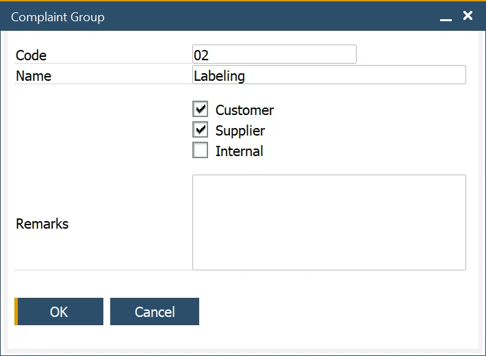

# Complaint Group

:::info Path
    Administration → Setup → Complaints → Complaint Groups
:::

This form allows the user to define and edit Complaint Groups, to categorize Reason Codes for reporting and analysis purposes.

The Group can be used for customer, supplier, and internal purposes. Remarks can be added if needed. The user can pick more than one option simultaneously.

