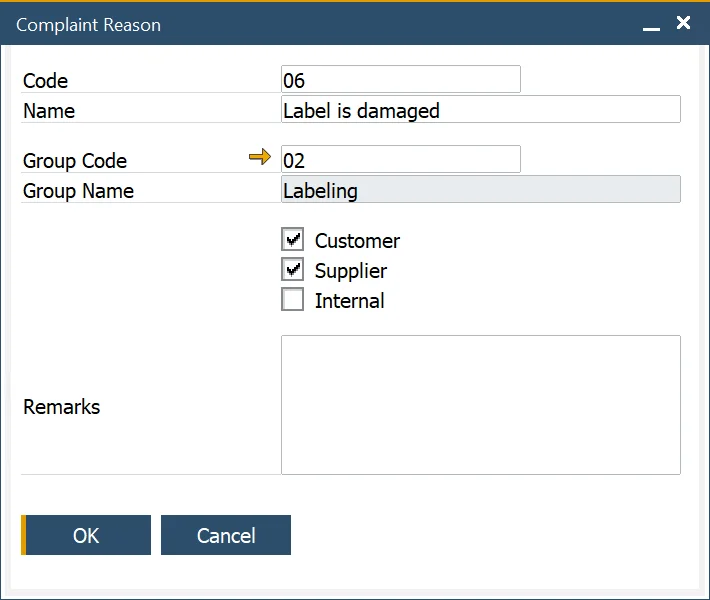

# Complaint Reason

:::info Path
    Main Menu → Administration → Setup → Complaints → Complaint Reasons
:::

This form allows the user to define Reason Codes, record why a complaint has been created, and use it for reporting and analysis purposes.

The Reason Code can be used for customer, supplier, and internal purposes and is used within the Complaint form.

