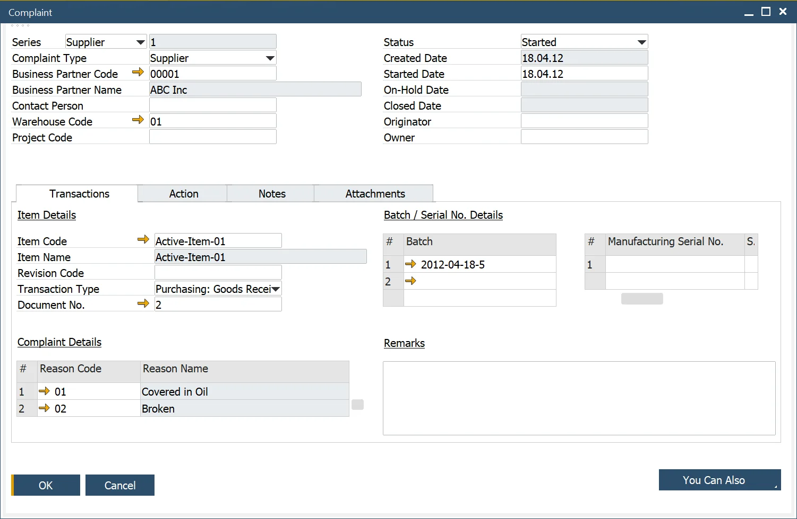
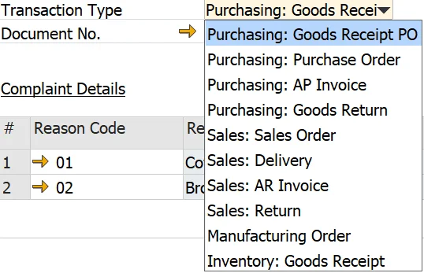
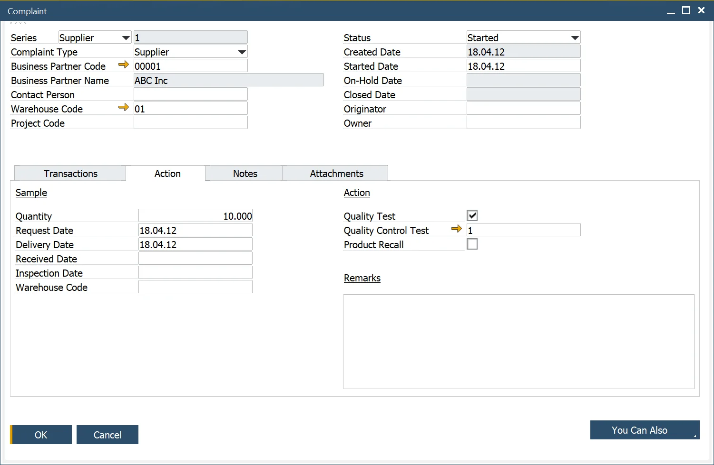

# Complaint

In this form, you can set all the details needed to create a Complaint, among other things, document type (Customer, Supplier, Internal), Contact Person, Warehouse, or action required to be performed as a result of a Complaint.

:::info Path
    Complaints → Complaint
:::

---

## Complaint Header

The form header allows the user to manage the following:

- Select and enter a complaint number using a defined Document Series Number.
- Enter the source of the complaint, Customer, Supplier, or Internal.
- Select and enter the Business Partner Code. Note the lookup table filters the business partners based on Compliant Type. If chosen Complaint Type is Internal, Business Partner Code, Business Partner Name, and Contact Person fields are greyed out.
- Enter the Contact Person. Note the filter is based on the selected Business Partner Code.
- Enter the Warehouse and Project Code.
- To manage the Complaint cycle, the user can select a Status and its corresponding Date. The valid values are Created, Started, On-Hold, and Closed.
- Enter an Originator, i.e., the person who started the Complaint.
- Enter an Owner, i.e., the person responsible for managing the Complaint.
- An Alert can be generated to be sent to the Complaint Manager to allocate the Owner.

## Transaction

This Tab allows the user to record Item related and Non-Item related Complaints.

If the Complaint is Item related, the user enters the Item, and optionally the Reason Code, that is the cause of the Complaint.

The user can also enter the Transaction Type, Document Number relating to the Complaint, and Batch and Serial Numbers.

When the user enters the appropriate Transaction Type, only the data relating to the Business Partner is shown.

Batches and Serial Numbers can be added and deleted.

Multiple Reason Codes can be added and deleted for recording and analysis purposes. Reason Codes can be added and deleted.

A remark can also be added.

## Action

If additional Action is required, the user can enter a sample quantity that will be returned from the Customer or to the Supplier.

The sample can be tracked by entering the corresponding Date and the desired location where the Sample will be placed.

An alert is sent to the Warehouse Managers to inform them that a sample will be delivered.

- The alert is based on the following query, Status = Started, Business Partner Code and Name, Item Number, Batch/Serial Number, Delivery Date, Warehouse Code, and Warehouse manager.

    When the sample is received at the warehouse, based on a Return document, an alert is sent to the Complaint Owner.
- The alert is based on the following query, Status = Started, Complaint No, Business Partner Code and Name, Item Number, Batch/Serial Number, Received Date, Warehouse Code, and Complaint Owner.

## Notes

The Notes Tab is a text field for any Complaint related information.

## Attachments

The Attachments Tab allows the user to attach documents relating to the Complaint.

## Creating a Quality Control Test

From the Action Tab, the user can check that the Complaint requires a [Quality Control Test](../quality-control/quality-control-test/overview.md) and create a Quality Control Test from the You Can Also button.

The user can also check that this Complaint was the source of a Product Recall activity.

## Creating an activity for a complaint

The standard SAP Business One activity functionality is available to create and check within the Complaint form. To get more information on the subject, click [here](../activities-for-processforce-documents.md).

## Complaint Status

- **Created** – a document is created but not yet started; create Date can be set up.
- **Started** – a document is started, Started Date can be set up.
- **On-Hold** – a document is on-hold (no action is taken on it), On-Hold Date can be set up.
- **Closed** – a document is closed; **no further editing can be done**.
