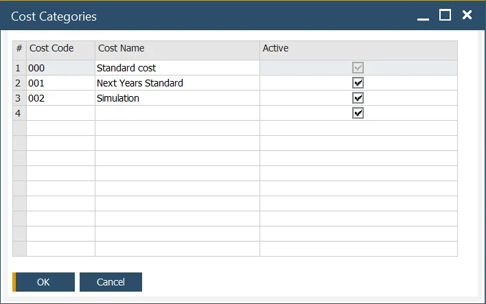

# Configuration

In this section, you will find all information needed for the costing function to work correctly. Note that both SAP Business One and ProcessForce settings must be set.

---

## SAP Business One Setting

### Company Details

:::info Path
    Administration → System Initialization → Company Details
:::

- Use Perpetual Inventory – This field can be checked or unchecked. For example, in the UK, this field is checked, while in Italy, this field is unchecked.
- Manage Item Cost per Warehouse – it is optional, but it should be decided before costings recreation.

### Document Settings

:::info Path
    Administration → System Initialization → Document Settings
:::

Within a Standard Costing environment, WIP variances will occur when there are differences between planned vs. actual quantities and cost and the cost of the finished product.

The standard production configuration is to check Parent Item WIP Accounts.

### Warehouses

- When a new warehouse is added, depending on the SAP Business One configuration, new warehouses are automatically added to the Item Master record.
- In turn, each warehouse is added to each Item Costing record.
- If a warehouse is deleted, this warehouse is deleted from each Item Costing record.
- For Drop Ship warehouses, these are not added to the Item Costing record.

## ProcessForce Settings

:::info Path
    Administration → System Initialization → General Settings → ProcessForce tab → Costing tab
:::

### Costing Price Determination

Click [here](./costing-price-determination.md) to get more information.

### Restore Functions

If you have added items to the Item Master Data form when ProcessForce is not installed and running, select Restore Item Costing and Resource Costing to populate the corresponding costing objects.

Click [here](../system-initialzation/data-restore.md) to find out more about Restore Function.

### Cost Categories

:::info Path
    Administration → Setup → Financials → Cost Categories
:::

### Default Overhead Rates

:::info Path
    Administration → Setup → Inventory → Item Groups
:::

By Item Group default, fixed and variable overhead rates can be added.

When a new Item is created as part of the Item Group, these values will be automatically added to the corresponding fields within the Item Costing form.

Default fixed and overhead values are automatically added to the item costing record for all defined cost categories, except 000

### Changing Default Overhead Values

- Change any of the default values and press Update button.
- System Message will display.
- To use these new values on all existing Item Costing records, press OK and then Update.
- To use these new values for new items being added to the system, press the X in the window and Update.
- Any new item added to the database will use these new default values.
