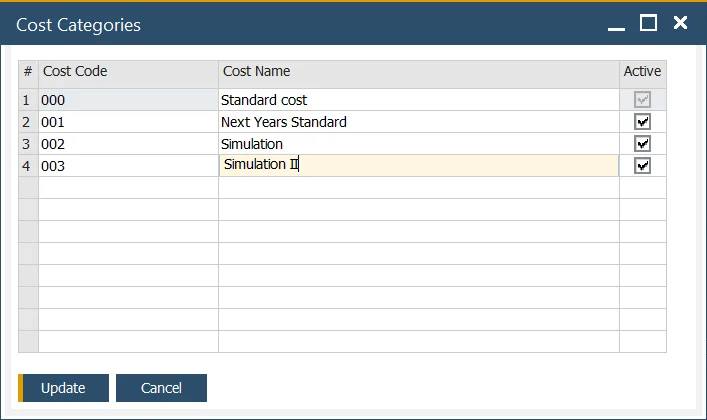
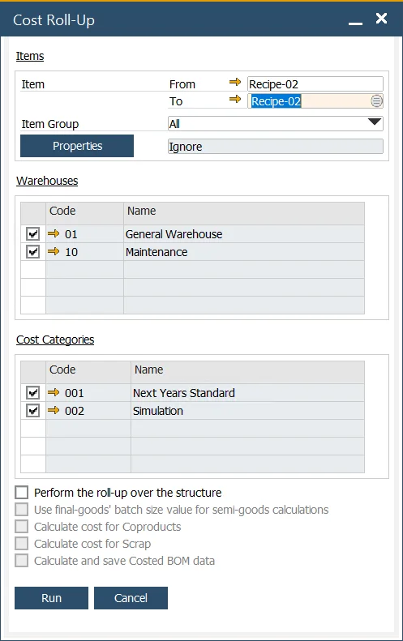
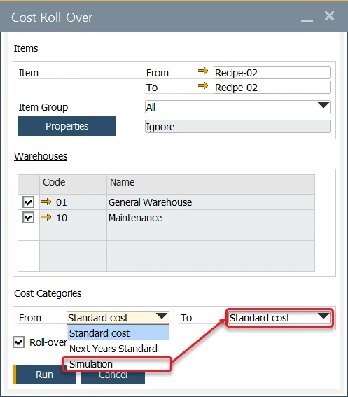
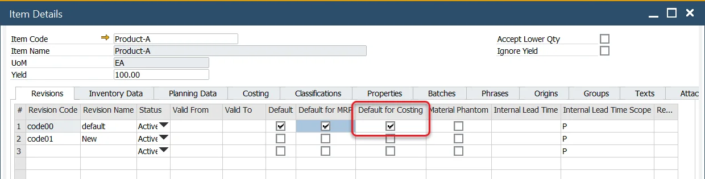

# Cost Categories

Here you can find information on Cost Categories: sets of costing data used to simulate production costs and apply them to production.

:::info
    Please check the [Configuration section](./configuration.md) before running the Costing functions.
:::

---

## General

:::info Path
    Administration → Setup → Financials → Cost Categories
:::

Cost Categories are different sets of cost data (Item Costing) for the same Items and Bill of Materials. Similarly, it allows the creation of multiple costing data sets for a specific Resource (Resource Costing).

Cost Categories are used for production cost simulation and final production valuation.

You can define many Cost Categories: on adding an Item to the system, Item Costing is created for every Cost Category. Now you can define different data for different Item Costing for the same Item. Similarly, Resource Costing is created by adding a Resource to the system.

On adding a new Cost Category, Item Costing and Resource Costing records are created for all of the Items and Resources in the system.

### 000 Cost Category – Standard Cost

000 Cost Category is a basic cost category that defines the final production valuation of an Item and is used on production documents.

This Cost Category has a specific status: it cannot be deleted or deactivated, and its data cannot be changed on any of the other forms.

Any other Cost Category can be used for a costing simulation. Still, to make it applicable to the system, it is required to load it to the 000 Cost Category by Cost Roll-Over procedure.

## Cost Roll-Up

:::info Path
    Costing → Cost Roll-Up
:::

The Cost Roll-Up function calculates or re-calculates the costs of one or several items. These items would be semi-finished or finished products.

Select an Item or a range of Items for the cost roll-up. If the fields are not filled, Cost Roll-Up will be performed for all the Items. If only From field is filled, Cost Roll-Up will be performed for all of the Items on the list starting from the chosen Item. If only the To field is filled, Cost Roll-Up will be performed for all of the Items from the start on the list to the selected Item. It is possible to narrow the Items range to one of the Item Groups.

It is possible to choose specific Item Properties.

The procedure can be applied just to selected warehouses.

The procedure can be applied just to selected cost categories. Note that the procedure cannot be used for the 000 cost category (you can only perform Roll-Up on another cost category and then load it to the 000 Cost Category by Roll Over procedure).

Cost Roll-Up is always performed for every revision.

:::info
    When performing a Cost Roll-Up, all costing forms should be closed; if not, a message will be displayed to close the appropriate forms.
:::

### Perform the roll-up over the structure

Perform the roll-up over the structure check box unchecked by default. Roll-up will be performed over the whole product structure when it is checked. If the check box is not checked, the lowest level of an Item (Raw Materials level) is not recalculated.

When the "Perform the roll-up over the structure" checkbox is checked, the costs are calculated in the following way:
First, the structure is built for the Items selected on the Roll-Up form. This structure is generated based on the Bill of Materials data and the relations with other Bill of Materials.

**Example**:

Let's say that you have the following Final Good product: **FG-01**, which has only one raw material **SG-01**, which is also a Bill of Materials, which has only one raw material: **RM-01**, which is a standard Item:

FG-01:

- SG-01:
- RM-01

**If the checkbox mentioned above is checked**, then:

1. First, the costs will be refreshed and calculated for the RM-01 raw material.
2. Then, the costs of the SG-01 semi-good product will be calculated based on the RM-01 data (calculated during the 1st step) and its costing configuration (fixed, variable, etc.).
3. At the end, the costs of the FG-01 final-good product will be calculated based on the SG-01 data (which was calculated during the 2nd step) and its costing data (fixed, variable, etc.)

`RM-01 recalculation (saving) → SG-01 recalculation (saving) → FG-01 recalculation (saving)`

**If this checkbox is not checked**, only the 2nd and 3rd steps are performed – and the costs are not refreshed/recalculated for the lowest level (Raw Materials, in this case: RM-01). The expenses are recalculated/restored only for the FG-01 final-good product and SG-01 semi-finished product based on the data saved for the RM-01 during the previous roll-up performance.

`SG-01 recalculation → (recalculation) FG-01 (saving)`

### Use final goods batch size value for semi-goods calculations

This option defines if the final goods' Batch size also covers semi-goods calculations. Click [here](../costing-material-and-resources/item-costing/batch-size-costing.md) to find out more.

**Example**

We have the following product structure:

FG-01:

- SG-01:
- RM-01

The batch Size for Item FG-01 is set up to 10.

The batch Size for Item SG-01 is set up to 5.

**If the checkbox mentioned above is checked**, Roll-Up will be performed with all the Items in the structure inheriting Batch Size from FG-01 Item: 10 pieces.

**If the checkbox is not checked**, all the semi-finished products (and top, finished product) in the structure keep their Batch Size: 10 pieces for FG-01, five pieces for SG-01.

## Cost Roll-Over

All of the Cost Categories apart from the 000 Cost Category are cost simulations. To make them relevant during the production process, they must be copied to the 000 Cost Category. Copying values between Cost Categories can be done using the Roll-Over option.

The Cost Roll-Over function is used in the following:

- To copy costing values into Cost Category 000 to update the SAP Business One Item Cost field (only for Standard Costing).
- To copy values from one Cost Category to another to perform simulation and what-if calculations.
- To update the Cost Category 000 record for Resource Costs.

To perform Cost Roll-Over:

- Select an Item or a range of Items in the same manner as on the Cost Roll-Up form.
- Choose Warehouses that will be affected by the process.
- Choose from which Cost Category to which one data will be transferred.

### Roll-over the costs of resources checkbox

Checking or unchecking this check box conditions whether Resource costs will be taken under consideration during the Roll-Over procedure or Item Costs will be copied.

## Inventory Revaluation – Standard Costing

An Inventory Revaluation transaction is automatically generated if there is a difference between the current cost and the rolled-over cost.

Inventory Revaluation is generated only for the revision with the **Default for Costing** checkbox checked:

This applies to Standard Costing valuation only.
