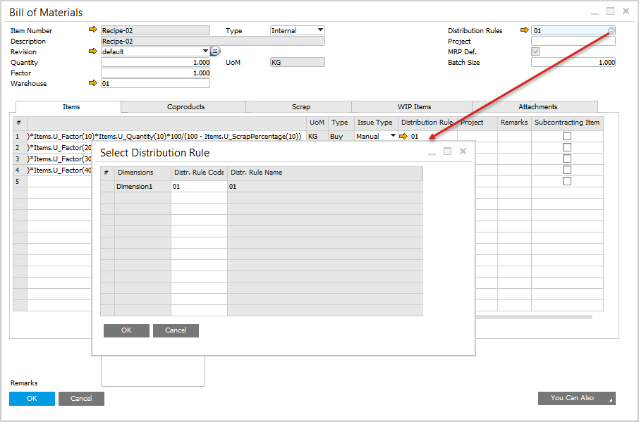
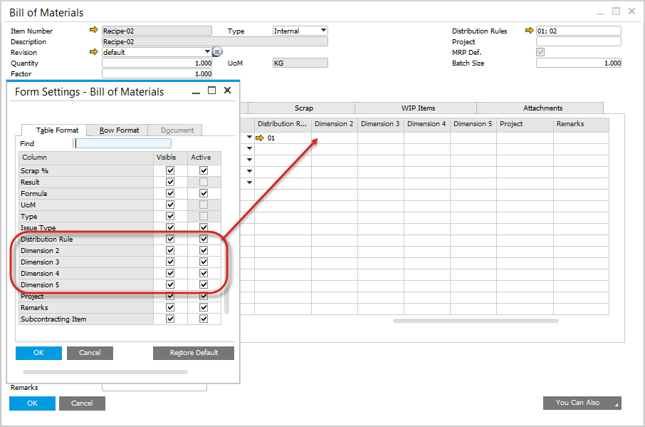
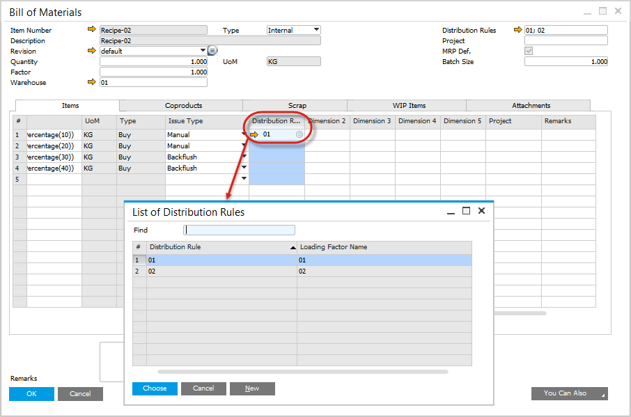
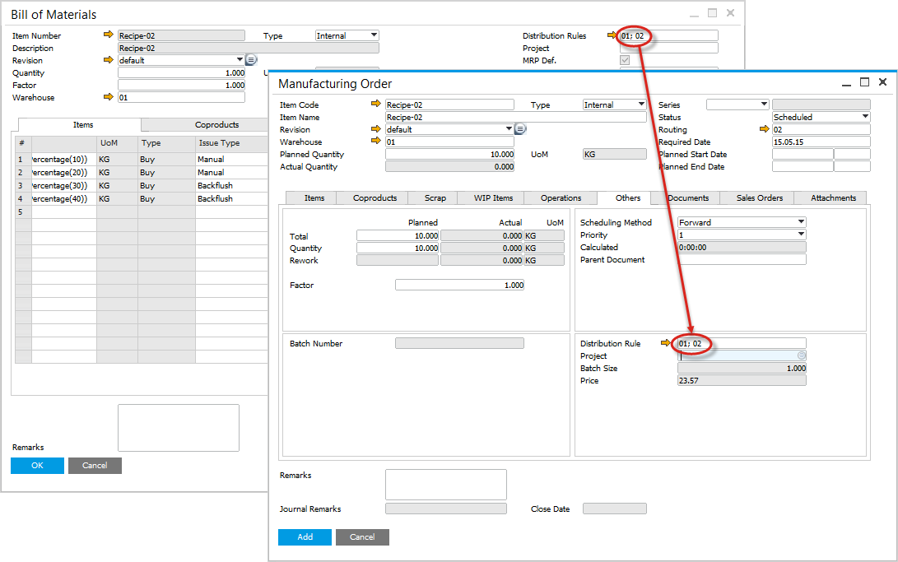
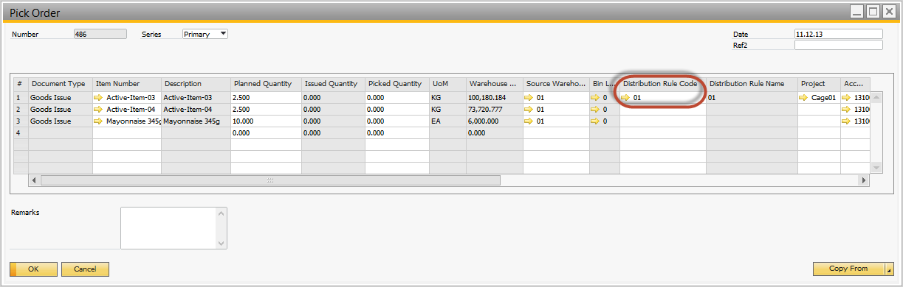
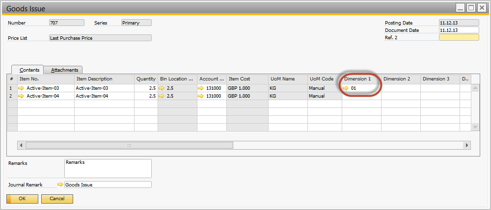
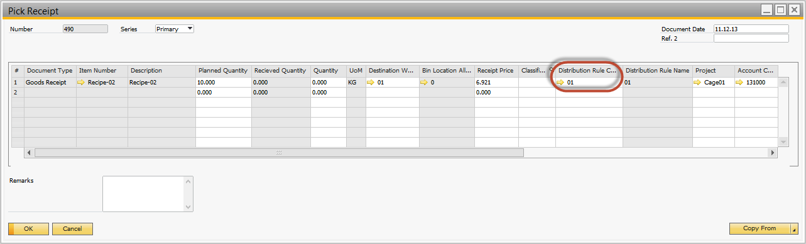
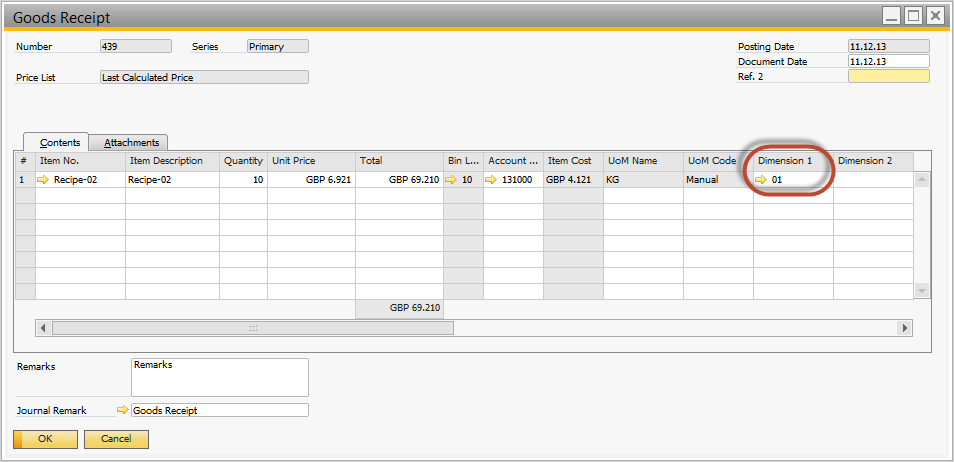

# Item - Distribution and Cost Dimensions

## Introduction

Currently Distribution Rules and Cost Centers can only be added to Items and added on the following ProcessForce master data forms and documents:

- Bill of Materials
- Manufacturing Orders
- Pick Receipt
- Pick Order
- Roll Back correction

## Master Data

Distribution Rules can be allocated as follows, and once set at this level will be copied to the related forms, as per the list above:

- Bill of Materials Header
- Item, CoProduct and Scrap Lines

### Bill of Materials

- Select the Distribution rules for the appropriate dimensions

    

- Using the Form Setting for the form select the dimensions to be displayed

    

- For each line select the distribution rule

    

### Manufacturing Orders

- Based on the Bill of Materials, the dimensions are copied into the Manufacturing Order

    

### Pick Issues

- Based on the Manufacturing Order, the dimensions are copied into the Pick Issue Document

    

### Goods Issues

- Based on the Pick Issue, the dimensions are copied into the SAP Business One Goods Issue Document

    

### Pick Receipt

- Based on the Manufacturing Order header, the dimensions are copied into the Pick Receipt

    

### Goods Receipt

- Based on the Pick Receipt, the dimensions are copied into the SAP Business One Goods Receipt

    
