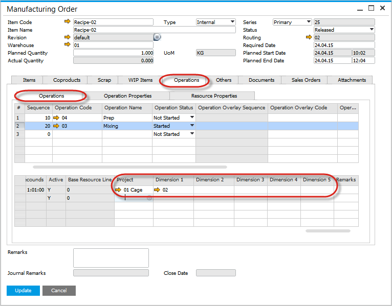
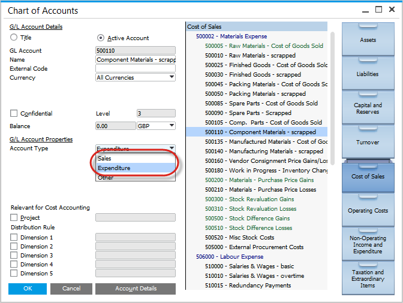

# Resources - Distribution and Cost Dimensions

- On the Resource form, Accounting tab, Cost Centers and Projects can be selected
- According to how many Cost Centers are enabled within SAP Business One General Settings one or more dimensions fields are displayed
- Note the Resource Accounting combo-box, has been moved to this tab.

    

## Operation form

- On the Operation form in Resources tab the Cost Centers and Project are displayed for each resource
- Values are defaulting from the Resource form and can be changed if required

    

## Routing form

- On the Routing form in Resources tab the Cost Centers and Project are displayed for each resource
- Values are defaulting from the Operation form and can be changed if required
- When the operation is selected the default values are copied from the Operation definition, and can be changed if required
- When the resource is selected the default values are copied from the Resource definition, and can be changed if required

    

## Production Process Form

- On the Production Process form in Resource section the cost centers and projects are displayed
- When the routing is selected the default values are copied from the Routing definition, and can be changed if required
- When the operation is selected the default values are copied from the Operation definition, and can be changed if required
- When the resource is selected the default values are copied from the Resource definition, and can be changed if required

    

## Manufacturing Order Form

- On Manufacturing Order form, Operations tab in Resource section the cost centers and resources are displayed
- According to the routing definition for the Bill of Material which was used to create the Manufacturing Order the default values are copied, and can be changed if required
- When an operation is selected and added to the Manufacturing Order, the default values are copied, and can be changed if required
- When a resource is selected and added to the Manufacturing Order, the default values are copied, and can be changed if required

    

## Time Bookings Form

- On Time Bookings form the cost centers and resources are displayed
- According to Manufacturing Order definition the default values are copied, and can be changed if required

    

## Time Corrections Form

- On Time Corrections form  the cost centers and resources are displayed
- According to Time Booking record the default values are copied, and can be changed if required

    

## Postings

- When Time Booking or Time Correction document is saved we use set there Cost Centers and Project in created Journal Entry document
- Each cost center dimension from Time Bookings is saved in its respective counterpart in Journal Entry
- Cost centers are only saved for Sales and Expenditure type accounts
- Project is saved for every type account

