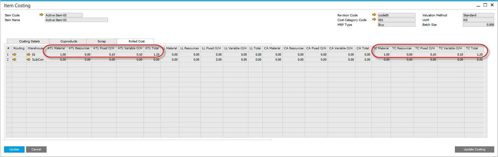

# Overview

ProcessForce costing uses a bottom-up approach to calculate the cost of a semi-finished and finished product.

Each Item Master, a part of a Bill of Materials, needs to be defined to calculate the cost of the semi and finished product for Standard Costing and an Estimated Moving Average.

- Moving Average and FIFO: These forms can also be used to include fixed and variable overhead values.
- Warehouses: If there are multiple warehouses defined for the item, then numerous data rows will be created, thus allowing different fixed and overhead values to be determined by a warehouse.
- Revision Codes: If there are multiple revisions for the same item, a unique item costing record will be created.
- Cost Category Code: if there are multiple cost categories, a unique item costing record will be created.

:::info
    Please check [the Configuration section](../configuration.md) before running the Costing functions.
:::

:::warning
    Adding UDFs to the Item Costing and Resource Costing form may cause errors and is not recommended.
:::

---

## Purchased Materials

For each Buy item, an item cost record will be created.

Use this form to determine where the Item Cost value will come from for calculation purposes and manually add fixed and variable overhead values.

- Select the Item Code, Revision, and Cost Category
- Select where the cost will come from:
- Price List – choose which Price List where the value will come from, and the value will populate the Item Cost field (grayed out).
- Price List (no roll-up) – an item that has an inventory value, included within the bill of materials, but the cost is not considered in the cost calculation of the semi-finished and finished product.
- Manual – enter a value into the Item Cost field.
- Manual (no roll-up) – an item that has an inventory value included within the bill of materials, but the cost is not considered in the cost calculation of the semi-finished and finished product.

    
- Select the Price List where the Item Cost will come from.
- For Moving Average and FIFO, use the Last Evaluated Price.

    

    For Fixed and Variable overhead values, amounts can be added as a value or a % of the Item Cost:
- Enter Fixed Overhead, e.g., 10.
- Enter Fixed Overhead %, e.g., 10% of Item Cost @ 1.000 = Fixed Overhead % Cost 0.100.
- Enter Fixed Overhead Other.
- The total of these Fixed Overhead values will be displayed in the Fixed Over Head Sub-Total column.
- The process is the same for adding the Variable Overhead Values.
- When entering the values, the Total column will auto-calculate.
- Press the Update button to save the data.

    
- Within the Rolled Cost tab, all the values are displayed, and the value in the TC Total column is copied to the Item Costing field within SAP Business One Item Master Details, Inventory Data tab.

    

## Semi-Finished Products

For each Make item, an item cost record will be created.

Use this form to determine where and how the Item Cost value will come from for calculation purposes and manually add fixed and variable overhead values.

This form also calculates the costs of a semi-finished and finished product by performing a cost roll-up using the "Update Costing" function.

- Select the Item Code, Revision, and Cost Category.
- Select where the cost will come from.
- Automatic – system will calculate the cost.
- Automatic (no roll-up) – an item that has an inventory value, included within the bill of material of a higher-level bill of materials, but the cost is not considered in the cost calculation.
- Price List – choose which Price List where the value will come from, and the value will populate the Item Cost field (grayed out).
- Price List (no roll-up) – an item that has an inventory value, included within the bill of materials, but the cost is not considered in the cost calculation of the semi-finished and finished product.
- Manual – enter a value into the Item Cost field.
- Manual (no roll-up) – an item with an inventory value included within the bill of materials. Still, the cost is not considered in calculating the semi-finished and finished products.
- Rolled Cost Tab displays a summary of the calculated costs.
- The summary values for a single-level bill of material displayed within the "At this Level" – ATL Materials, Resources, Fixed, and Variable Overhead columns. The TC Total value is the calculated cost of the bill of materials. The value is copied to the SAP Business One Item Cost when performing a cost rollover to cost category 000.
- If performing a cost rollover to a cost category that is not 000, these values are copied to allow for what-if and cost simulation.

## Distribution Rules and Cost Dimensions

For details, click Item - Distribution and Cost Dimensions.
