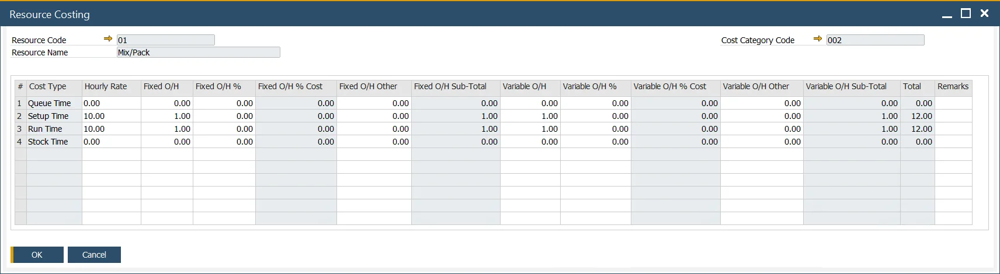
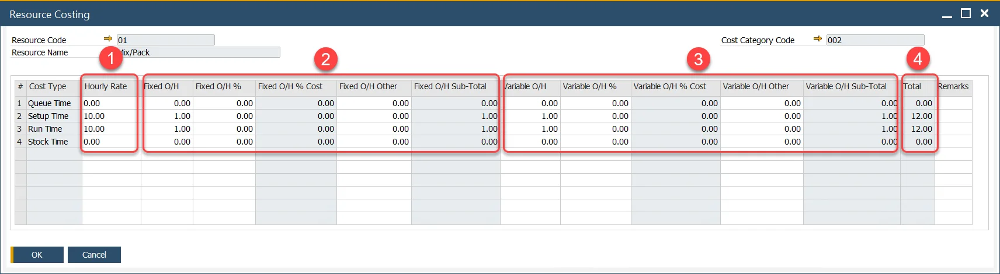
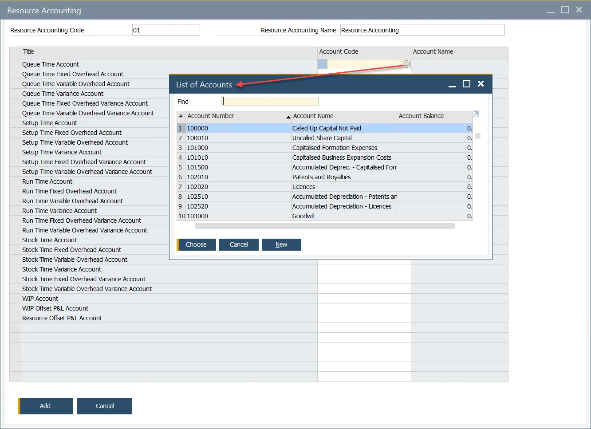
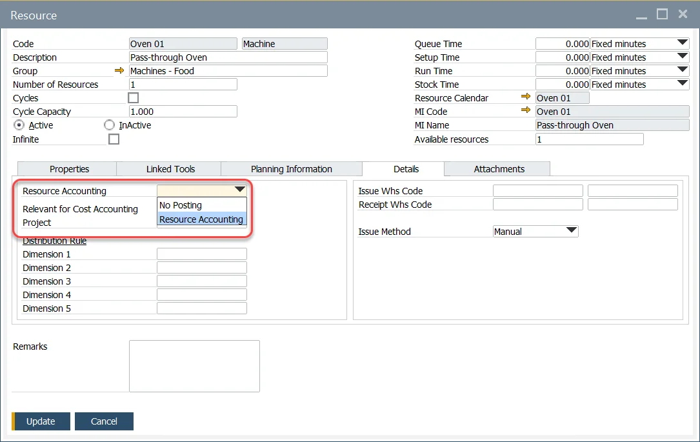

# Resource Costing

Resource Costing is a function that evaluates a Resource's work during production. Combined with Item Costing (which holds materials costs), this option assesses the production based on a given Manufacturing Order.

:::warning
    Adding UDFs to the Item Costing and Resource Costing form may cause errors and is not recommended.
:::

Please check [the Configuration section](./configuration.md) before running the Costing functions.

:::info Path
    Costing → Resource Costing
:::

## General information

Resource Costing is created automatically upon adding a new Resource to the system. For every Resource, separate Resource Costing is created for each of the Cost Categories in the system (Note that Resource Costing for Cost Category 000 cannot be edited on this form).

During the Item Cost Roll-up for a semi-finished or finished product, these fixed and variable overhead values will be displayed within the Fixed and Variable Overhead columns.

### Resource Cost Calculation

Overall Resource Cost calculation is based on three elements:

1. Resource Cost – in Resource Costing is calculated for 1 hour of work. Resource cost taken under consideration in Item Costing is calculated based on two values: Resource Costing Hourly Rate and Resource Times values (default Resource Times values for a specific Resource are defined in Resource form, but it can be later changed in a particular Operation and specific Production Process):

    

    Resource Cost is calculated on the following basis:

    |     |       Unit        |    Pattern     |
    | :-: | :---------------: | :------------: |
    |  1  |   Fixed seconds   |   V(H/36000)   |
    |  2  |   Fixes minutes   |    V(H/60)     |
    |  3  |    Fixed hours    |     V × H      |
    |  4  | Seconds per piece |  V/(3600 × H)  |
    |  5  | Minutes per piece |   V/(60 × H)   |
    |  6  |  Hours per piece  |     V × H      |
    |  7  | Pieces per second | 1/V/(3600 × H) |
    |  8  | Pieces per minute |  1/V/(60 × H)  |
    |  9  |  Pieces per hour  |   1/(T × H)    |

    H - Hourly Rate

    V - a value for a given time for a Resource, e.g., in the screenshot above Queue Time value is 30
2. Fixed Overhead Cost – fixed overhead is a set of costs that usually do not change with changes in activity, e.g., factory rent. Three values can define it:

    - Fixed O/H – main fixed overhead cost
    - Fixed O/H % – percent value of an Hourly Rate to be added to fixed overhead
    - Fixed O/H % Cost – value calculated based on Hourly Rate and Fixed O/X %
    - Fixed O/H Other – it is possible to define other fixed costs
    - Fixed O/H SubTotal – overall fixed overhead value: Fixed O/H + Fixed O/H % Cost + Fixed O/H Other
3. Variable Overhead Cost – costs that may vary significantly in relation to production output changes, e.g., production supplies.

    - Variable O/H – main variable overhead cost
    - Variable O/H % – percent value of an Hourly Rate to be added to the variable overhead
    - Variable O/H % Cost – percent value of an Hourly Rate to be added to the variable overhead
    - Variable O/H Other – it is possible to define other variable costs
    - Variable O/H Sub-Total – overall variable overhead value: Variable O/H + Variable O/H % Cost + Variable O/H Other
4. Total

    Added up values from the following fields: Hourly Rate, Fixed O/H SubTotal, Variable O/H SubTotal.

    It is possible to define structured overhead costs. Click [here](../costing-material-and-resources/item-costing/multistructure-fixed-and-variable-overhead-costs.md) to find out more.

### Labor

Resource Costs are expressed as an Hourly rate, and this Hourly rate may be a combined machine and labor value.

If machine and labor rates are required separately, there are two ways to do it:

Adding the labor rate as fixed overhead (or variable overhead) as a specific value, e.g., 10, or as a % of the Hourly rate, e.g., 10% of 20 = 2 (you can use [Multistructure Fixed and Variable Overhead Costs option](./item-costing/multistructure-fixed-and-variable-overhead-costs.md))
Create a specific resource called Labor and assign its costs and Resource Accounting codes.

## Resource Accounting

### Configuration

:::info Path
    Administration → Setup → Financials → Resources Accounting
:::

Resource Accounting is a set of connections between specific Resource related costs and Accounts. These accounting rules can be later assigned to one or more Resources.

Currently, only the Account, Fixed Overhead, and Variable Overhead accounts are used for financial posting. Variance, Fixed, and Variable Overhead Variance will be used in a later release.

Currently, all resource-related variances are posted into a single WIP variance posting (this is the same for inventory items)

If using different time types, each type can have a separate account code.

:::caution
    Note that each Resource Account (Title column) must have Accounts (Accounts Code) assigned for Resource Costing to work correctly.
:::

### Resource Account Definition

Predefined Resource Accounting (see the previous paragraph) can be added to a Resource within the Resource form > Details tab.

If financial postings are required, a Resource Accounting code has to be chosen. If financial postings are not needed, then select No Posting.

Click [here](../routings/resources.md) to find out more about Resources.

## Distribution Rules and Cost Dimensions

For details, click Resources - Distribution and Cost Dimensions.
