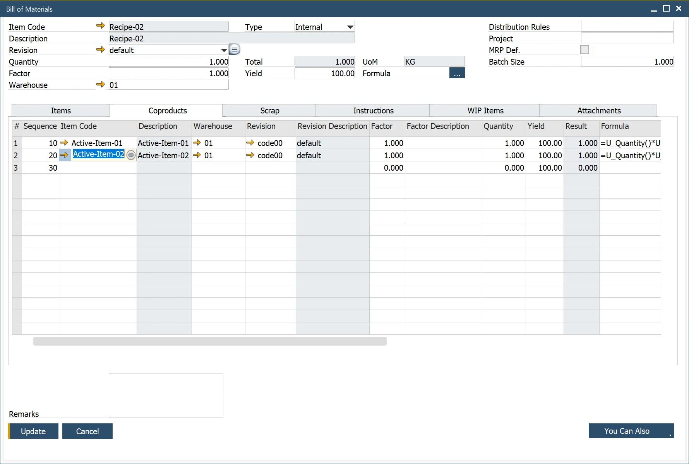

# CoProducts Tab

:::note
    Production → Bill of Materials → Bill of Material → CoProducts Tab
:::

This form allows the user to perform the following:

- Enter the components produced as a consequence of producing the parent product.
- Record the warehouse where the inventory is held. If the item is backflushed, this is the warehouse where inventory entry occurs.
- Define a factor and description. This factor is used as a variable to change the quantity.
- Enter a Quantity of the Coproduct in relation to the parent product.
- The Result is a calculated value of the Coproduct and parent quantity relationship based on the defined [Formula](../formula.md).
- Use the default Formula (as defined on the General Settings/ProcessForce Tab) or change the expression format to calculate the Coproduct quantity (result). See [Formula](../formula.md) for additional information.
- Enter the UoM, the default value defined within the Item Master Data/Inventory Data Tab.
- Enter the Issue Type - Backflush or Manual. The default value defined within the Item Master Data/General Tab.
- Enter the Project code for reporting and analysis purposes.

