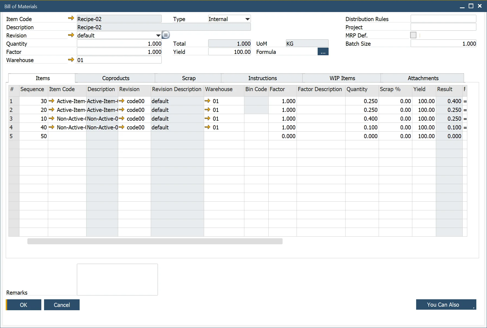

# Bill of Materials form header

:::note Path
    Production → Bill Of Materials → Bill of Materials → Header
:::

This form allows a user to define a Bill of Materials for a final product or a product to be used as a part of another Bill of Materials.

Multiple Bill of Materials can be defined for a product based on the Revision Code, defined within the Inventory → Item Details → Revision Tab. Click here to find out more.

The Quantity and UoM represent the product quantity of the parent item.

The factor is a method to add a variable that affects the parent and the component quantities, for example, yield or scrap.

The warehouse represents where the product will be produced.

The type field determines if a product is Internal (produced in the company) or External (ordered from a subcontractor).

If required, the user can enter a Distribution Rule and a Project.

MRP Def. field allows the user to confirm if this Bill of Materials is the default for MRP and which revision of the item is the default for MRP. If this field is not checked, the ProcessForce Bill of Materials is not synchronized with the SAP Business One Bill of Materials.

Batch Size allows the user to define the batch size of production used to determine the cost of a product, where there are fixed times such as setup, fixed runtime, stock, and queue.

