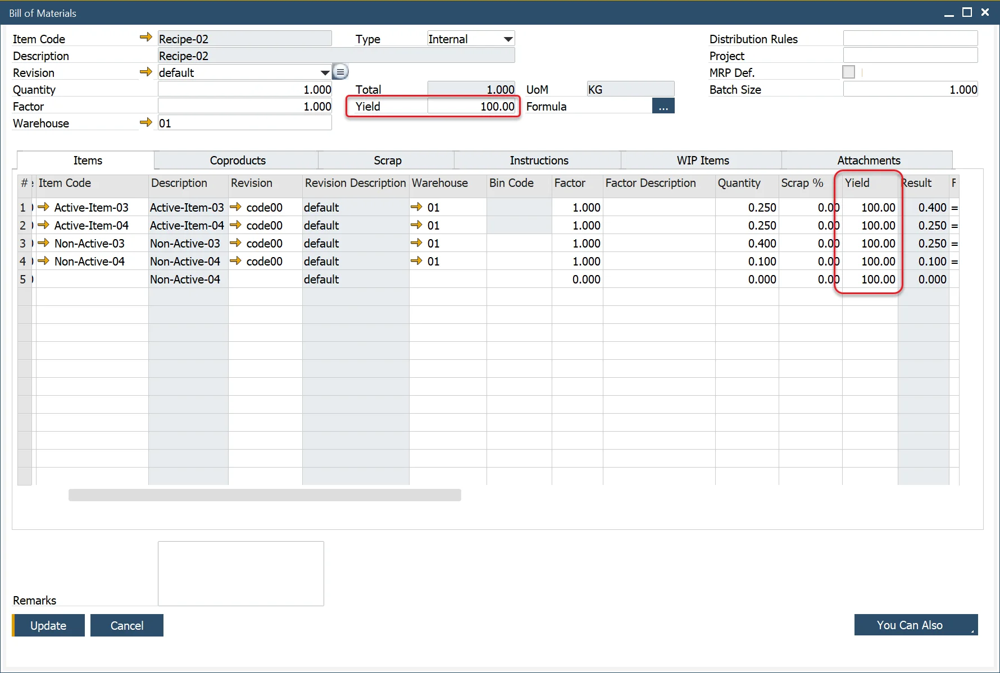
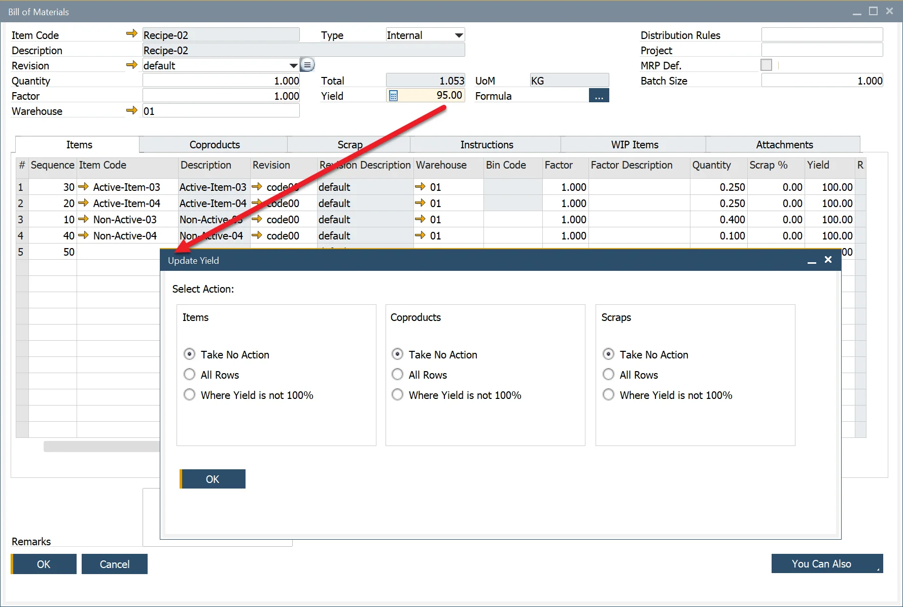
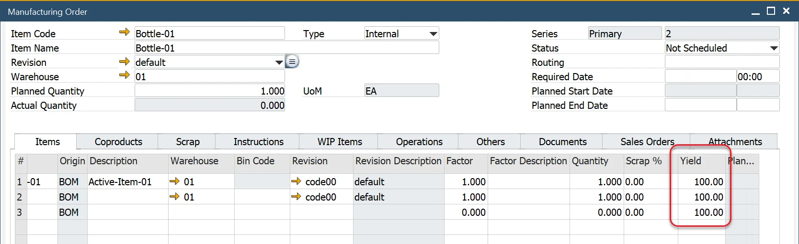
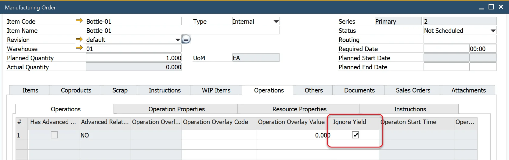

# Planned Yield percentage

The concept of planned Yield is to:

- Increase the amount of raw materials issued to production to cater for the material loss
- Increase the production time used to produce the full quantity.

---

## Item Details

Within the Item Details form, the planned yield value is within the Yield % field for the parent item in the bill of materials.

## Bill of Materials

The default planned yield is copied to the Bill of Materials header, and the value is added to each item added to the Bill of Materials.

If using planned yield, it is recommended to modify the default Item, CoProduct, and Scrap formulas to include the yield % calculation.

The result is an increase in the material quantity required to be consumed in production.

If using Scrap%, this will be a cumulative value to the material quantity.

## Production Process

To ignore the increase in production time for the operation/resource, check the Ignore Yield check box.

:::note
    The additional time based on yield has not been implemented into costing.
:::

## Changing the Bill of Material Planned Yield

If the Yield % value is changed, a window opens and provides a number of options:

- Take No Action: change the header only
- All Rows: copy the value and updates all rows
- Where Yield is not 100%: copy the value and update all rows where yield % is not 100%.

## Manufacturing Order

When the Manufacturing Order is created, the Planned Quantity is increased by the planned Yield % to increase the number of items issued and the required resource time.

Checked the Ignore Yield check box not to increase the operation/resource total time.

## Planned vs. Actual Yield

Based on the [Yield Formula](../production-process/yield-time-calculation.md), the Actual Yield is calculated when materials receipts and issues are created.

## Changing the Manufacturing Order Planned Yield

If the Yield% value is changed, a window opens and provides a number of options:

- Take No Action: change the header only.
- All Rows: copy the value and updates all rows.
- Where Yield is not 100%: copy the value and update all rows where yield % is not 100%.

