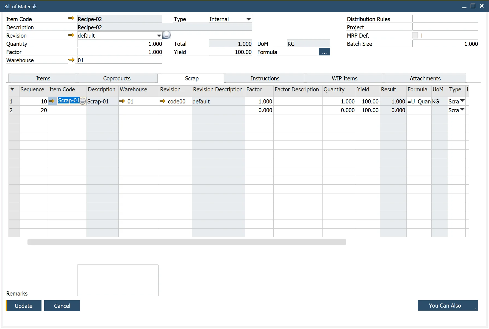

# Scrap Tab

:::note Path
    Production → Bill of Materials → Bill of Materials → Scrap Tab
:::

- Enter the products created as a consequence of producing the parent product.
- Record the Warehouse where the inventory is held. If the Item is backflushed, this is the Warehouse where the inventory will be placed from a Production Receipt.
- Define a factor and description. This factor is used as a variable to change the quantity.
- Enter a Quantity of the scrap in relation to the parent product.
- The Result is a calculated value of the scrap and parent quantity relationship based on the defined Formula.
- Use the default Formula (defined on the General Settings/ProcessForce Tab) or change the expression format to calculate the scrap quantity (result). See Formula for additional information.
- Enter the UoM; the default value is defined within the Item Master Data/Inventory Data Tab
- Select the scrap Type:
  - The valid options are Scrap and ByProduct.
  - Both types of scrap create inventory transactions.
  - ByProducts can be reused in future production processes or sold to customers.
  - Scrap cannot be reused.
- Select the Issue Type, Backflush, or Manual. The default value is defined within the Item Master Data/General Tab.
- Enter the Project code for reporting and analysis purposes.
- Set Distribution Rule.
- Type in Remarks to a specific Scrap.

