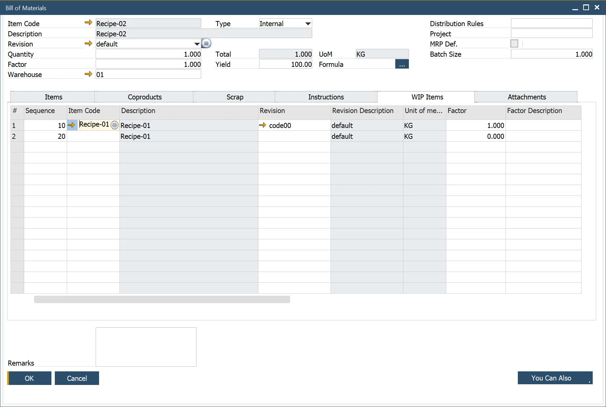

# WIP Items Tab

:::note Path
    Production → Bill of Materials → Bill of Materials → WIP Items

    Production → Manufacturing Order → Manufacturing Order WIP Items
:::

WIP Item tab (Work in Process Item) in ProcessForce shows what [Phantom Items](../bill-of-materials/multi-level-bill-of-materials/phantom-item.md) were used on a specific Bill of Materials / Manufacturing Order.

You can also:

- Define a factor and description. This factor is used as a variable to change the quantity.
- Enter a Quantity of the intermediate product in relation to the parent product: the result is a calculated value of the intermediate product and parent quantity relationship based on the defined [Formula](../formula.md).
- Use the default Formula (as defined on the General Settings → ProcessForce tab) or change the expression format to calculate the Coproduct quantity (result). See [Formula](../formula.md) for additional information.

