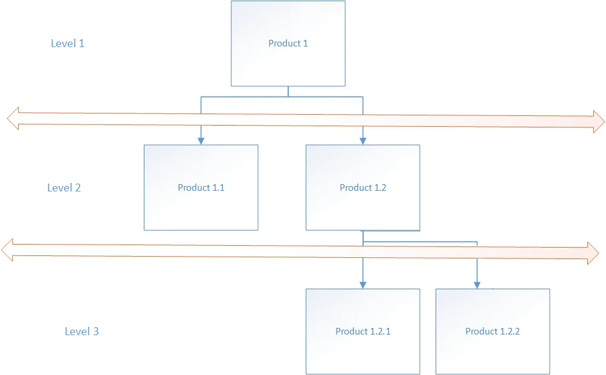

# Overview

Bill of Materials can have a multi-level structure. That means that an Item that is a part of the Bill of Materials can have its own Bill of Materials too. In the example below, Product 1 is a final good. Its Bill of Materials consists of Product 1.1. and Product 1.2. Product 1.2 also has its Bill of Materials (in this case, it contains two Items: 1.2.1, 1.2.2):

In ProcessForce, there are two ways of dealing with this situation:

- Semi-finished Items:
  in this case, Items in the final good structure can have their own Bill of Materials for which another Manufacturing Order has to be created (apart from the final good one). Items like this can also be produced separately (as a final good on a stand-alone Manufacturing Order) and stored.
- Phantom Item:
  it is also a Bill of Materials in the structure of another Bill of Materials but its production result cannot be stored nor produced separately: it is an element of the production process of a final good. It does not require creating a separate Manufacturing Order; its components and Operations are added to a Manufacturing Order of a final good.
