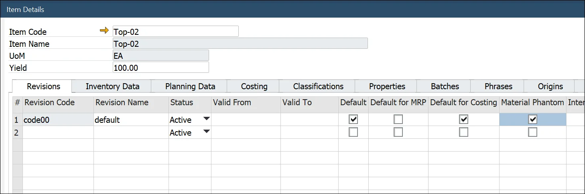

# Phantom Item

A Phantom Item is a Bill of Materials template that can be a part of another Bill of Materials. It is not an Inventory Item – any Warehouse never receives it. It serves only as a marking point in a master Bill of the Materials production process (Phantom Items do not create an inventory or financial transactions).

Phantom Item is an alternative to Semi-Finished products. You can use a Bill of Material Item on a master Bill of Materials, but in this case, a separate, linked Manufacturing Order is needed for each child BOM. Using Phantom on BOM does not create separate MOR: it explodes (adds its content) on Items Tab and Operations tab (adds operations defined in Phantom Production Process).

---

## Phantom Item

### Setting up

:::info Path
    Inventory → Item Master Data → Production Data tab
:::

To use a specific Item as Phantom, be sure to check the following settings:

- Phantom Item check box checked,
- Inventory, Sales, and Purchase Item fields un-checked,
- Issue Method set up to Backflush.

Also, note that a Phantom (as every Non-Inventory Item) cannot be managed by Batches or Serials (Item Master Data → General tab).

### Example

We have a beverage – Product-A. One piece consists of packaging (Bottle-01, Label-01, Top-01) and actual drink (Recipe-01), a separate Bill of Materials. Packaging elements can be bought or produced and taken from inventory during production. But drink (as a Phantom Item) can never be used on a separate Manufacturing Order (just for Recipe-01) nor goes into stock - it can only be produced during the Product-A production process and be a part of it. It also means that the drink is not received at Warehouse and then issued for the Product-A production process. Still, all the elements enter the manufacturing process together, which results in Product-A:

As seen in the screenshot above, the Phantom from the master Bill of Materials exploded on connected a Manufacturing Order: every Item from Recipe-01 was added to the Manufacturing Order → Items tab. Because of it, there is no need to create a separate Manufacturing Order for the Recipe-01 Bill of Materials (as we would have to do if it was a Semi-finished Product). Note that Operations defined for the Phantom in its Production Process are also added to the Operations tab.

You can check what Phantom Items were used on a specific Manufacturing Order in the WIP Items tab:

You can also add a Phantom manually to a Manufacturing Order. On adding a document after this, a communication form will pop up with information about Phantoms being present on a record and that it will be expanded automatically. It is required to confirm the communication before adding a document.

## Material Phantom

Material Phantom can also be, unlike Phantoms, Sale or Purchase Item. This function combines the regular and Phantom Item approach: it is still an Inventory Item (for which it is possible to create a separate Manufacturing Order). Still, it can be exploded on a master Bill of Materials to avoid creating a linked Manufacturing Order for a Bill of Materials used on another BOM.

### Example

An Engine Item is usually produced during a Car Item production process in Company. To do this, Company uses the Engine as Material Phantom on Car BOM (to avoid creating additional, linked Engine Manufacturing Order). The engine is not taken into inventory but is created during the Car production process and is a part of Car final goods. But in some cases Company wants to sell the Engine separately. Creating a separate Manufacturing Order for the Engine is possible in cases like this.

### Setting up

Material Phantom option can be set up for specific revisions in Item Details:

:::info
    Inventory → Item Details
:::

### Usage

On adding a Material Phantom Item to a Manufacturing Order, you can 'explode' it by using the context menu on the Item:

The application also displays a system message when there is a Material Phantom Item that was not exploded (There are phantoms. All phantoms will expand automatically. Do you want to continue?). It is impossible to add a Manufacturing Order with Material Phantom Item that has not been exploded.

:::tip
If a specific Item is required to be used on the Bill of Materials as a regular Item (without its BOM, just as an Inventory Item) in some cases and as a Material Phantom (A BOM that will explode on a master BOM) in other, it is required to create two separate revisions that will differ from each other by Material Phantom check box checked and by the fact that non-Material Phantom revision will not have a BOM assign.
:::
