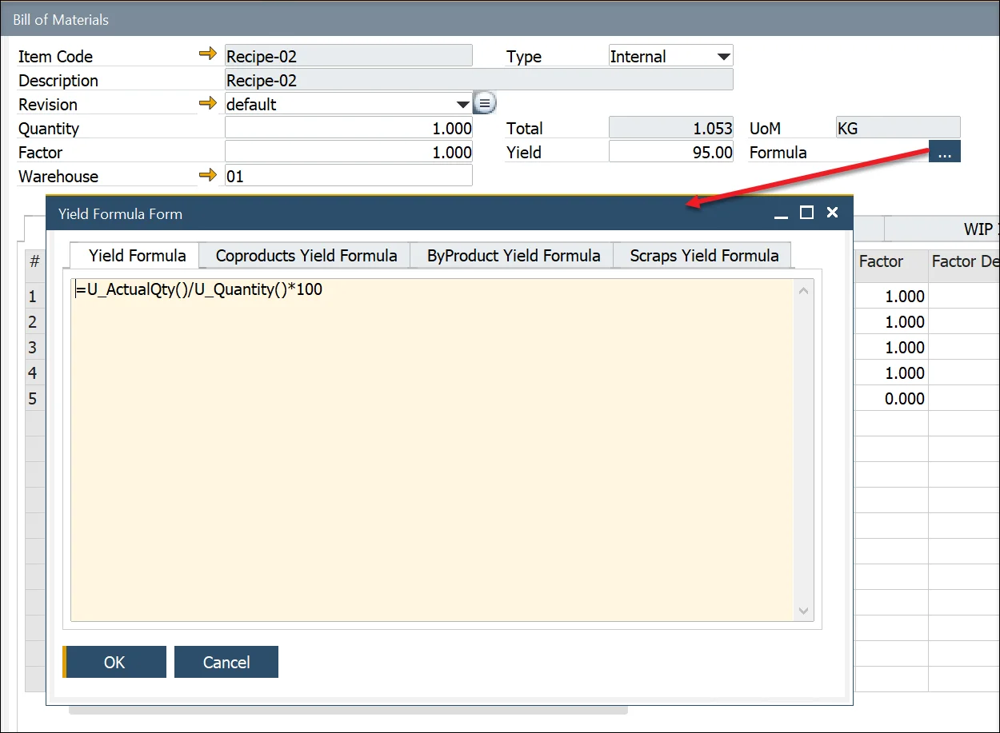

# Yield Analysis

## Introduction

The yield analysis can be very elementary, e.g., a comparison of Planned vs. Actual quantity, or complex, based on the comparison between the amount of a specific item used in production and a breakdown into Parent, Coproduct, Byproduct, and Scrap actual quantity.

Below is a table illustrating some yield analysis examples:

|  Yield Basis  |        Yield Calculation         |                                                          Example                                                          |
| ------------- | -------------------------------- | ------------------------------------------------------------------------------------------------------------------------- |
|  Item Parent  |           Item Parent            |                             Item Parent Actual Quantity / Item Parent Planned Quantity \* 100                             |
|  Item Parent  | Item Parent + CoProducts + Scrap | (Item Parent Actual Quantity + CoProducts Actual Quantity + Scrap Actual Quantity) / Item Parent Planned Quantity \* 100  |
|  Item Parent  | Item Parent + CoProducts - Scrap | (Item Parent Actual Quantity + CoProducts Actual Quantity - Scrap Actual Quantity) / Item Parent Planned Quantity \* 100  |
|  Item Parent  | Item Parent - CoProducts - Scrap | (Item Parent Actual Quantity - CoProducts Actual Quantity - Scrap Actual Quantity) / Item Parent Planned Quantity \* 100  |
|  Item Parent  |        CoProducts + Scrap        |                (CoProducts Actual Quantity + Scrap Actual Quantity) / Item Parent Planned Quantity \* 100                 |
|  Item Parent  |        CoProducts - Scrap        |                (CoProducts Actual Quantity - Scrap Actual Quantity) / Item Parent Planned Quantity \* 100                 |
| Specific Item |           Item Parent            |                            Item Parent Actual Quantity / Specific Item Actual Quantity \* 100                             |
| Specific Item | Item Parent + CoProducts + Scrap | (Item Parent Actual Quantity + CoProducts Actual Quantity + Scrap Actual Quantity) / Specific Item Actual Quantity \* 100 |
| Specific Item | Item Parent + CoProducts - Scrap | (Item Parent Actual Quantity + CoProducts Actual Quantity - Scrap Actual Quantity) / Specific Item Actual Quantity \* 100 |
| Specific Item | Item Parent - CoProducts - Scrap | (Item Parent Actual Quantity - CoProducts Actual Quantity - Scrap Actual Quantity) / Specific Item Actual Quantity \* 100 |
| Specific Item |        CoProducts + Scrap        |                (CoProducts Actual Quantity + Scrap Actual Quantity) / Specific Item Actual Quantity \* 100                |
| Specific Item |        CoProducts - Scrap        |                (CoProducts Actual Quantity - Scrap Actual Quantity) / Specific Item Actual Quantity \* 100                |
|   All Items   |           Item Parent            |                               Item Parent Actual Quantity / All Item Actual Quantity \* 100                               |
|   All Items   | Item Parent + CoProducts + Scrap |   (Item Parent Actual Quantity + CoProducts Actual Quantity + Scrap Actual Quantity) / All Item Actual Quantity \* 100    |
|   All Items   | Item Parent + CoProducts - Scrap |   (Item Parent Actual Quantity + CoProducts Actual Quantity - Scrap Actual Quantity) / All Item Actual Quantity \* 100    |
|   All Items   | Item Parent - CoProducts - Scrap |   (Item Parent Actual Quantity - CoProducts Actual Quantity - Scrap Actual Quantity) / All Item Actual Quantity \* 100    |
|   All Items   |        CoProducts + Scrap        |                  (CoProducts Actual Quantity + Scrap Actual Quantity) / All Item Actual Quantity \* 100                   |
|   All Items   |        CoProducts - Scrap        |                  (CoProducts Actual Quantity - Scrap Actual Quantity) / All Item Actual Quantity \* 100                   |

## Yield Formulas

:::info
    Please check the [Yield settings](../overview.md) for default formulas.
:::

Within the General Settings form → ProcessForce tab → Bill of Materials and Manufacturing Orders tab, four additional default formulas have been added:

- Yield,
- CoProduct Yield,
- ByProduct Yield,
- Scrap Yield.

When a default yield formula is added, this is copied to the corresponding yield formula field within the Bill of Materials form:

To view, create and edit the Yield Formula, click on the yellow button to open the Yield Formula Form:

The Yield Formulas defined within the Bill of Material form are also copied to the Manufacturing Order form and displayed by clicking on the yellow button.

If required, the Yield Formulas can be edited.

## Yield Formula Formats

Below is an example of different Yield analysis formulas:

| Yield Type |                            Default Description                            |                                                                                    Default Formula                                                                                    |
| ---------- | ------------------------------------------------------------------------- | ------------------------------------------------------------------------------------------------------------------------------------------------------------------------------------- |
|   Yield    |     Item Parent Actual Quantity / Item Parent Planned Quantity \* 100     |                                                                           =U_ActualQty()/U_Quantity()\*100                                                                            |
| CoProduct  | Total CoProduct Actual Quantity / Total CoProduct Planned Quantity \* 100 |                                            =Coproducts.U_ActualQty.Sum()/if(Coproducts.U_Result.Sum()=0;1;Coproducts.U_Result.Sum())\*100                                             |
| ByProduct  | Total ByProduct Actual Quantity / Total ByProduct Planned Quantity \* 100 | =Scraps.U_ActualQty.Sum(equals(Scraps.U_Type();"Usefull"))/if(Scraps.U_Result.Sum(equals(Scraps.U_Type();"Usefull"))=0;1;Scraps.U_Result.Sum(equals(Scraps.U_Type();"Usefull")))\*100 |
|   Scrap    |     Total Scrap Actual Quantity / Total Scrap Planned Quantity \* 100     |                                                  =Scraps.U_ActualQty.Sum()/if(Scraps.U_Result.Sum()=0;1;Scraps.U_Result.Sum())\*100                                                   |
