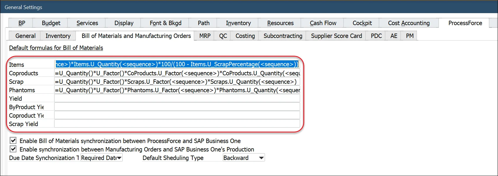
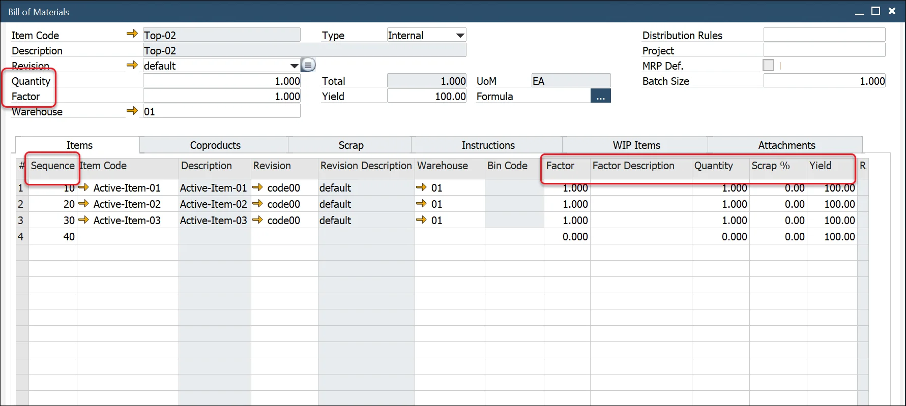
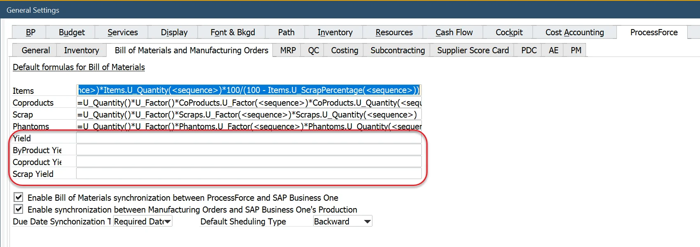
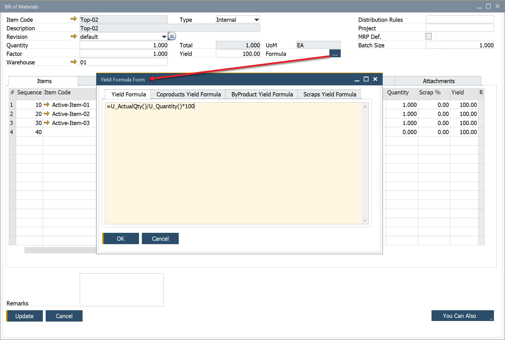
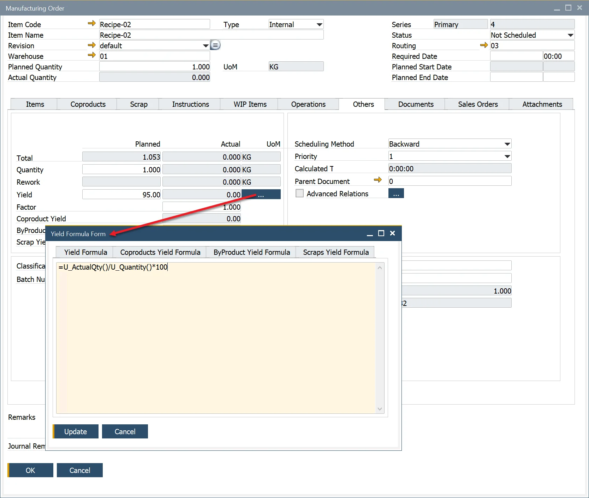

# Formula

## Overview

Formulas are a very flexible but straightforward method of calculating the quantity relationship between an item and its parent.

A default formula is installed within the General Settings/ProcessForce/Bill of Materials and Manufacturing Tab.

This default formula can be changed to meet the user's needs and will be used when entering the Bill of Materials.

If user-defined fields are added to the form, these can also be used within the formula.

All the expressions as per Microsoft Excel formulas can be used.

Values from other Tabs can be used within a formula to calculate a value. For example, a specific Item within the Bill of Materials has a 10% Scrap Percentage. A Scrap item master is added to the Scraps Tab. The amount of scrap produced will be the difference between the Item Result and the Item Quantity.

---



### Default formulas

Items:

```sql
=U_Quantity()*U_Factor()*Items.U_Factor(<sequence>)*Items.U_Quantity(<sequence>)*100/(100 - Items.U_ScrapPercentage(<sequence>))
```

Coproducts:

```sql
=U_Quantity()*U_Factor()*CoProducts.U_Factor(<sequence>)*CoProducts.U_Quantity(<sequence>)
```

Phantom:

```sql
=U_Quantity()*U_Factor()*Phantoms.U_Factor(<sequence>)*Phantoms.U_Quantity(<sequence>)
```

## Formula Nomenclature

| Yield Type |                            Default Description                            |                                                                                    Default Formula                                                                                    |
| ---------- | ------------------------------------------------------------------------- | ------------------------------------------------------------------------------------------------------------------------------------------------------------------------------------- |
|   Yield    |     Item Parent Actual Quantity / Item Parent Planned Quantity \* 100     |                                                                           =U_ActualQty()/U_Quantity()\*100                                                                            |
| CoProduct  | Total CoProduct Actual Quantity / Total CoProduct Planned Quantity \* 100 |                                            =Coproducts.U_ActualQty.Sum()/if(Coproducts.U_Result.Sum()=0;1;Coproducts.U_Result.Sum())\*100                                             |
| ByProduct  | Total ByProduct Actual Quantity / Total ByProduct Planned Quantity \* 100 | =Scraps.U_ActualQty.Sum(equals(Scraps.U_Type();"Usefull"))/if(Scraps.U_Result.Sum(equals(Scraps.U_Type();"Usefull"))=0;1;Scraps.U_Result.Sum(equals(Scraps.U_Type();"Usefull")))\*100 |
|   Scrap    |     Total Scrap Actual Quantity / Total Scrap Planned Quantity \* 100     |                                                  =Scraps.U_ActualQty.Sum()/if(Scraps.U_Result.Sum()=0;1;Scraps.U_Result.Sum())\*100                                                   |

|                                                                               Scraps                                                                               |                                                                                 Phantoms                                                                                 |
| ------------------------------------------------------------------------------------------------------------------------------------------------------------------ | ------------------------------------------------------------------------------------------------------------------------------------------------------------------------ |
| Scraps.U_Factor() = Factor Value within Scraps Tab Scraps.U_Quantity() = Quantity Value within Scraps Tab Scraps.U_Results() = Results value within the Scraps Tab | Phantoms.U_Factor() = Factor Value within Phantoms Tab Phantoms.U_Quantity() = Factor Value within Phantoms Tab Phantoms.U_Results() = Results value within Phantoms Tab |

|                                          Other Variables                                          |
| ------------------------------------------------------------------------------------------------- |
| U_Factor() = Factor Value within form Header U_Quantity() = Quantity value within the form Header |



## Formula Functions

The following functions can be used within formulas:

|        Syntax         |                                                                                                                                                          Description                                                                                                                                                           |    As in Excel     |
| --------------------- | ------------------------------------------------------------------------------------------------------------------------------------------------------------------------------------------------------------------------------------------------------------------------------------------------------------------------------ | ------------------ |
|        ABS(x)         |                                                                                                                                                Returns the absolute value of x.                                                                                                                                                | :heavy_check_mark: |
|        ACOS(x)        |                                                                                                                                            Returns the arc cosine of x in radians.                                                                                                                                             | :heavy_check_mark: |
|        ASIN(x)        |                                                                                                                                             Returns the arc sine of x in radians.                                                                                                                                              | :heavy_check_mark: |
|        ATAN(x)        |                                                                                                                                            Returns the arc tangent of x in radians.                                                                                                                                            | :heavy_check_mark: |
|      ATAN2(x;y)       |                                                                                                                                    Returns ATAN(y/x), taking signs of x and y into account.                                                                                                                                    | :heavy_check_mark: |
|   CEILING(x;signif)   |  Returns the nearest multiple of signif that is equal to or larger than x when signif is positive (that is, rounds towards plus infinity). It returns the nearest multiple of signif that is equal to or smaller than x when signif is negative (that is, rounds towards minus infinity). Returns NumError when signif is 0.0.   |       Almost       |
|        COS(x)         |                                                                                                                                          Returns the cosine of x, with x in radians.                                                                                                                                           | :heavy_check_mark: |
|        EXP(x)         |                                                                                                                                   Returns ex, that is, e = 2.71828... raised to the power x.                                                                                                                                   | :heavy_check_mark: |
|    FLOOR(x;signif)    | Returns the nearest multiple of signif that is equal to or smaller than x when signif is positive (that is, rounds towards minus infinity). It returns the nearest multiple of signif that is equal to or greater than x when signif is negative (that is, rounds towards plus infinity). Returns a NumError when signif is 0.0. |       Almost       |
|     IF(e1;e2;e3)      |                                                                                                     Evaluates e1; if e1 is true, evaluates e2 and returns the result; if e1 is false, evaluates e3 and returns the result.                                                                                                     | :heavy_check_mark: |
|         LN(x)         |                                                                                                                                   Returns the natural (base e = 2.71828...) logarithm of x.                                                                                                                                    | :heavy_check_mark: |
|        LOG(x)         |                                                                                                                                              Returns the base ten logarithm of x.                                                                                                                                              | :heavy_check_mark: |
|       LOG10(x)        |                                                                                                                                              Returns the base ten logarithm of x.                                                                                                                                              | :heavy_check_mark: |
|       MOD(x;y)        |                                                                                                             Returns the signed remainder of x by y, that is, x - FLOOR(x/y;1) \* y. Returns NumError if y is 0.0.                                                                                                              | :heavy_check_mark: |
|         PI()          |                                                                                                                       Returns π = 3.14159..., the ratio of the circumference to the diameter of a circle                                                                                                                       | :heavy_check_mark: |
|        RAND()         |                                                                                                                    Returns a pseudo-random number x from a uniform distribution such that 0 &lt;= x &lt; 1                                                                                                                     | :heavy_check_mark: |
|      ROUND(x;d)       |               Returns x rounded to d decimal digits. That is, rounds to the nearest integer when d is 0, to the nearest multiple of 0.1 when d is 1, to the nearest multiple of 10 when d is -1, and so on. In case of a tie, rounds away from zero. First, d is truncated (towards zero) to obtain an integer.                | :heavy_check_mark: |
|        SIN(x)         |                                                                                                                                           Returns the sine of x, with x in radians.                                                                                                                                            | :heavy_check_mark: |
|        SQRT(x)        |                                                                                                                                                 Returns the square root of x.                                                                                                                                                  | :heavy_check_mark: |
|        TAN(x)         |                                                                                                                                          Returns the tangent of x, with x in radians.                                                                                                                                          | :heavy_check_mark: |
| EQUALS(string;string) |                                                                                                                                               Returns true if strings are equal                                                                                                                                                | :heavy_check_mark: |

## Using User-Defined Fields in Formulas

It is possible to incorporate [User-Defined Fields (UDFs)](../../administrator-guide/udfs.md) into formulas.

We can use either header or row UDFs in formulas.

:::note

- Note that the formula result is a numeric value. Therefore User-Defined Fields used in it have to be created with a Type set to Numeric.

- Bill of Materials structure is copied to a specific Manufacturing Order created from this Bill of Materials. Therefore to use UDFs in formulas, it is required to create the same UDFs in the Bill of Materials and Manufacturing Order in the corresponding places, e.g., the same UDFs in headers, the same UDFs in related tables.

:::

## Yield Formulas

To be able to calculate Yield in the Bill Of Material and Manufacturing Order, you have to replace Default formulas in General Settings:

- Items

  ```sql
  =U_Quantity()*U_Factor()*Items.U_Factor(<sequence>)*Items.U_Quantity(<sequence>)*100/(100 - Items.U_ScrapPercentage(<sequence>))*100/Items.U_Yield(<sequence>)
  ```

- CoProducts

  ```sql
  =U_Quantity()*U_Factor()*CoProducts.U_Factor(<sequence>)*CoProducts.U_Quantity(<sequence>)*100/CoProducts.U_Yield(<sequence>)
  ```

- Scrap

  ```sql
  =U_Quantity()*U_Factor()*Scraps.U_Factor(<sequence>)*Scraps.U_Quantity(<sequence>)*100/Scraps.U_Yield(<sequence>)
  ```

- Phantoms

  ```sql
  =U_Quantity()*U_Factor()*Phantoms.U_Factor(<sequence>)*Phantoms.U_Quantity(<sequence>)
  ```

Four new formula fields have been added to calculate the actual yield within the Manufacturing Order:

- Yield – this relates to the actual yield of the parent item.
- CoProduct – this relates to the yield of the coproducts (Coproduct Tab) produced in production.
- ByProduct – this relates to the yield of the ByProducts (Scrap Tab) produced in production.
- Scrap – this relates to the yield of the Scrap (Scrap Tab) produced in production.



As with standard formula behavior, the standard formula is copied to the Bills of Materials form and can be displayed by clicking the yellow button.

The formula can be modified for a specific Bill of Materials if required.



The formulas from the Yield Formula form are also copied to the Manufacturing Order and can be modified if required.


