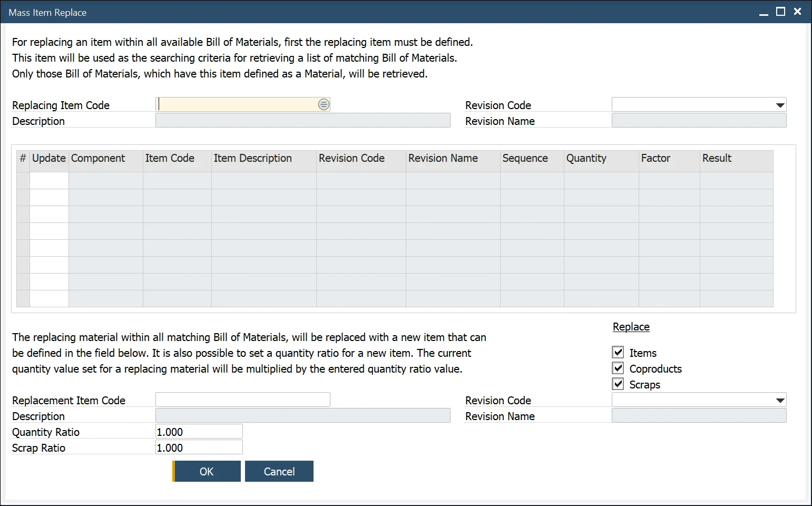

# Mass Item Replacement

:::info Path
    Production → Bill of Materials → Mass Item Replacement
:::

This form allows the user to quickly search, change, and replace one Item with another.

The user selects the Item that needs to be replaced chooses which Bill of Materials will be updated, checks the update box, and then enter the replacement Item.

It is possible to set a quantity ratio. The current quantity value set for a replacing material will be multiplied by the entered quantity value (which is by default set as 1.000). The same can be done for scrap value using the Scrap Ratio field.

:::info
    For mass changes in the Bill of Materials, check the dedicated AppEngine plugin: Bulk Change.
:::
