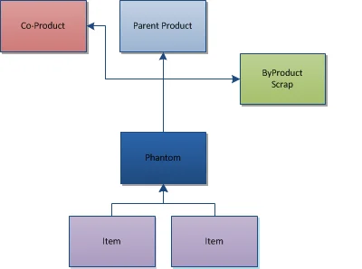

# Overview

The Bill of Materials Form allows users to define the relationship between parent and child Items.

This function supports the following elements:

- Items,
- CoProducts,
- ByProducts,
- Scrap,
- Intermediates (currently called Phantoms),
- Phantoms (future release),
- Make vs. Buy,
- Manual vs. Backflushing,
- Factors, Yield values, and Scrap percentages,
- Quantities,
- UoM,
- Formulas.

